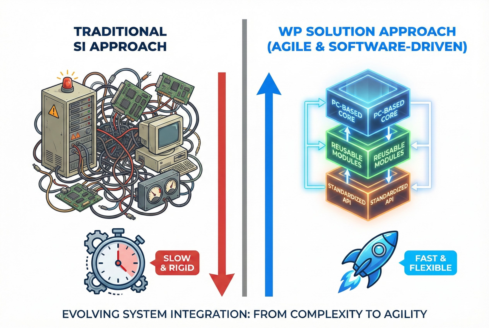

# เชื่อมช่องว่างระหว่าง IT และ OT ด้วยวิศวกรรม

ที่ WP Solution เราไม่ใช่ System Integrator (SI) แบบดั้งเดิมที่แก้ปัญหาด้วยการเพิ่มฮาร์ดแวร์เพียงอย่างเดียว เราคือบริษัทที่ขับเคลื่อนด้วย **"หลักวิศวกรรม (Engineering-Driven)"** โดยมุ่งเน้นการผสานรวมเทคโนโลยีเชิงปฏิบัติการ (OT) หน้างาน เข้ากับเทคโนโลยีสารสนเทศ (IT) สมัยใหม่

ความเชื่อหลักของเราคือ ความยืดหยุ่นของอุตสาหกรรมการผลิตในอนาคต ไม่ได้ขึ้นอยู่กับแค่ตัวคอนโทรลเลอร์ แต่ขึ้นอยู่กับ **"สถาปัตยกรรมซอฟต์แวร์"** ที่ชาญฉลาด

## พันธกิจของเรา: ปลดล็อกศักยภาพด้วย PC-Based Control

โรงงานจำนวนมากถูกจำกัดขีดความสามารถด้วยเครื่องจักรเก่าที่เป็นระบบปิด (Black Box) หรือระบบ PLC แบบเดิมที่ไม่ยืดหยุ่นต่อการเชื่อมต่อข้อมูล พันธกิจของเราคือการทลายข้อจำกัดเหล่านี้ด้วยเทคโนโลยี **PC-Based Control** ขั้นสูง

เราใช้ขุมพลังของ Industrial PC ร่วมกับการเขียนโปรแกรมภาษา C# (.NET), Node-RED และ Web Technologies สมัยใหม่ เพื่อสร้างโซลูชั่นที่ยืดหยุ่นกว่า จัดการข้อมูลได้ดีกว่า และขยายระบบได้ง่ายกว่าวิธีการแบบเดิม

## แนวทางการทำงานแบบ "Agile SI"

เราดำเนินงานด้วยโมเดลที่เน้นประสิทธิภาพสูง แทนที่จะใช้ทีมงานขนาดใหญ่ที่มีโครงสร้างการจัดการหลายชั้น เราใช้ทีมงานขนาดเล็กที่เชี่ยวชาญเฉพาะด้าน (High-Expertise Team) เน้นการลงมือทำที่รวดเร็วและแม่นยำ

**สิ่งที่คุณจะได้รับจากแนวทางนี้:**

* **คุยตรงกับคนออกแบบระบบ (Direct Access):** คุณจะได้สื่อสารปัญหาโดยตรงกับ Technical Architect ที่เป็นคนออกแบบระบบให้คุณ ลดความคลาดเคลื่อนของข้อมูล
* **โซลูชั่นที่เป็นมาตรฐาน (Standardized Solutions):** เราไม่ได้เริ่มเขียนโค้ดใหม่จากศูนย์ในทุกโปรเจกต์ แต่เราพัฒนา "โมดูลมาตรฐาน" ที่ผ่านการทดสอบแล้ว (เช่น PC-Based HMI Framework หรือ IIoT Connectors) มาปรับใช้ ทำให้ระบบมีความเสถียรและติดตั้งได้รวดเร็ว
* **เน้นแก้ปัญหาที่จุดเจ็บปวด (Pain Points):** เรามุ่งเน้นการแก้ปัญหาหน้างานจริงด้วยความแม่นยำทางวิศวกรรม หลีกเลี่ยงความซับซ้อนที่ไม่จำเป็น

## DNA ทางเทคนิคของเรา

เรามีความเชี่ยวชาญใน Tech Stack ที่ออกแบบมาสำหรับงานอุตสาหกรรมโดยเฉพาะ:
* **Core Control & HMI:** ใช้ C# (.NET/WPF) สำหรับแอปพลิเคชัน PC-based ที่ต้องการประสิทธิภาพสูง
* **Connectivity & IoT:** ใช้ Node-RED และ MQTT สำหรับการเชื่อมต่อข้อมูลที่ลื่นไหล
* **Visualization:** ใช้ Vue.js สำหรับสร้าง Web Dashboard ที่ทันสมัยและตอบสนองไว
* **Hardware Integration:** ความเข้าใจลึกซึ้งในการเชื่อมต่อกับ PLC แบรนด์หลัก (Mitsubishi, Omron), Motion Controllers, และระบบ Machine Vision

---
**มองหาพาร์ทเนอร์ที่คุยภาษาภาษาทางวิศวกรรม?**
ติดต่อทีมเทคนิคของเราโดยตรงเพื่อปรึกษาปัญหาหน้างานของคุณ