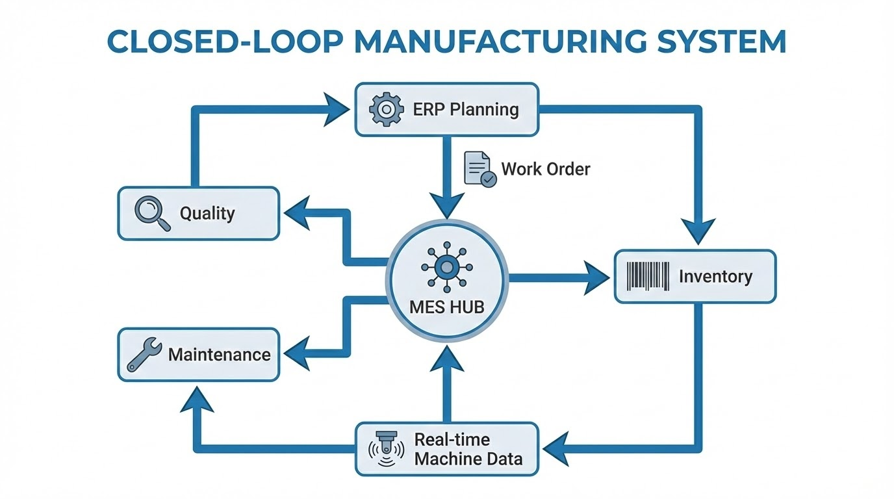

# บทนำ: MES คือ "ระบบปฏิบัติการ" (OS) ของโรงงาน

ในโลกของ Industrial Automation เราไม่ได้มอง MES (Manufacturing Execution System) เป็นเพียงซอฟต์แวร์เก็บข้อมูล แต่ตามมาตรฐาน **ISA-95** มันคือ **"ระบบปฏิบัติการ" (Operating System)** ที่ทำหน้าที่ควบคุมและประสานงาน (Orchestration) ระหว่างแผนงานจากระดับบริหาร (ERP) ลงสู่หน้างานจริง (Shop Floor)

หากเปรียบโรงงานเป็นร่างกาย ERP คือสมองที่วางแผน แต่ **MES คือระบบประสาท** ที่คอยสั่งการแขนขา (เครื่องจักร/พนักงาน) และรับความรู้สึกจากเซนเซอร์ (IoT) กลับมาประมวลผลทันที

---

## สถาปัตยกรรมการทำงานของ MES

เพื่อให้เห็นภาพการทำงานที่เชื่อมโยงกันของทั้ง 4 ส่วน ลองดู Diagram ด้านล่างนี้ครับ:

*ภาพแสดงความเชื่อมโยงของระบบ MES ที่ทำหน้าที่เป็นตัวกลางระหว่าง ERP และเครื่องจักรหน้างาน*

---

## 1. Production Management: จากกระดาษสู่ Digital Work Order

ปัญหาใหญ่ของโรงงานทั่วไปคือ "Information Lag" หรือการที่ข้อมูลการผลิตเดินทางช้ากว่าตัวชิ้นงาน MES เข้ามาแก้ปัญหานี้ด้วยการทำ **Digital Transformation**:

* **Digital Work Order:** ยกเลิกใบสั่งงานกระดาษ (Paper Traveler) แล้วใช้การส่งคำสั่งตรงจาก ERP เข้าสู่หน้าจอ HMI หรือ Tablet หน้าเครื่องจักร
* **Real-time Dispatching:** ระบบสามารถจัดลำดับความสำคัญของงาน (Priority) ได้อัตโนมัติ

## 2. Quality Management: ดักจับของเสียแบบ Proactive

การรอตรวจ QC ตอนจบกะคือการ "วัวหายล้อมคอก" MES ช่วยให้เราทำ **In-Process Inspection** ได้:

* **Quality Interlock:** หากเครื่องจักรส่งค่าพารามิเตอร์ที่ผิดปกติ (เช่น อุณหภูมิเกิน Spec) MES สามารถสั่ง Interlock หยุดเครื่องจักรผ่าน PLC ได้ทันที
* **Digital Traceability:** เก็บข้อมูล **Birth Certificate** ของสินค้าทุกชิ้น ทำให้รู้ว่าชิ้นงานนี้ผลิตโดยใคร และใช้วัตถุดิบล็อตอะไร

## 3. Maintenance Management: ซ่อมก่อนพังด้วย Data

MES เปลี่ยนจาก "Breakdown Maintenance" เป็น **Condition-Based Maintenance**:

* **Cycle-Based Alerts:** แจ้งเตือนซ่อมบำรุงตามจำนวนรอบการทำงานจริง (Actual Cycle) ที่ดึงมาจาก PLC 
* **OEE Real-time Monitoring:** วิเคราะห์ค่าประสิทธิภาพเพื่อหาว่าคอขวดที่แท้จริง (Bottleneck) คืออะไร

## 4. Inventory Management: คุมเข้ม WIP (Work-In-Process)

ERP ส่วนใหญ่มองไม่เห็นสิ่งที่เกิดขึ้นในไลน์ผลิต แต่ MES เห็นทุกฝีก้าว:

* **WIP Tracking:** ติดตามสถานะชิ้นงาน "นาทีต่อนาที" ทำให้รู้ว่ามีเงินจมอยู่ในไลน์เท่าไหร่
* **Material Validation:** ระบบจะบังคับให้สแกนบาร์โค้ดวัตถุดิบก่อนเข้าเครื่อง เพื่อป้องกันการใช้วัตถุดิบผิดรุ่น (Poka-Yoke)

---

## สรุป: การสร้างระบบนิเวศแบบ Closed-Loop

การมีฟังก์ชัน MES ครบทั้ง 4 ด้าน ไม่ใช่แค่เรื่องของการติดตั้งซอฟต์แวร์ แต่คือการสร้าง **Closed-Loop Manufacturing** ที่ข้อมูลทุกอย่างเชื่อมถึงกัน ทั้งสถานะเครื่องจักร, ค่าความแม่นยำจากเซนเซอร์, และยอดสต็อกวัตถุดิบ

การทำงานที่สอดประสานกันเช่นนี้คือหัวใจสำคัญที่จะช่วยให้โรงงานของคุณ **ลดต้นทุน ลดความเสี่ยง และเพิ่มกำไร** ได้อย่างยั่งยืนครับ

---

**ในบทความหน้า:** เราจะมาดูสิ่งที่เจ้าของโรงงานกังวลที่สุด... **"เริ่มต้นทำระบบ MES ฉบับงบไม่บานปลาย"** ต้องเตรียมตัวอย่างไรให้เจ็บตัวน้อยที่สุด ห้ามพลาดครับ!

**สนใจพัฒนาระบบ MES หรือเชื่อมต่อ IoT ในโรงงาน?**
ปรึกษาทีม Engineer ของเราได้ที่ Line: [wisit.p](https://line.me/ti/p/~wisit.p)
