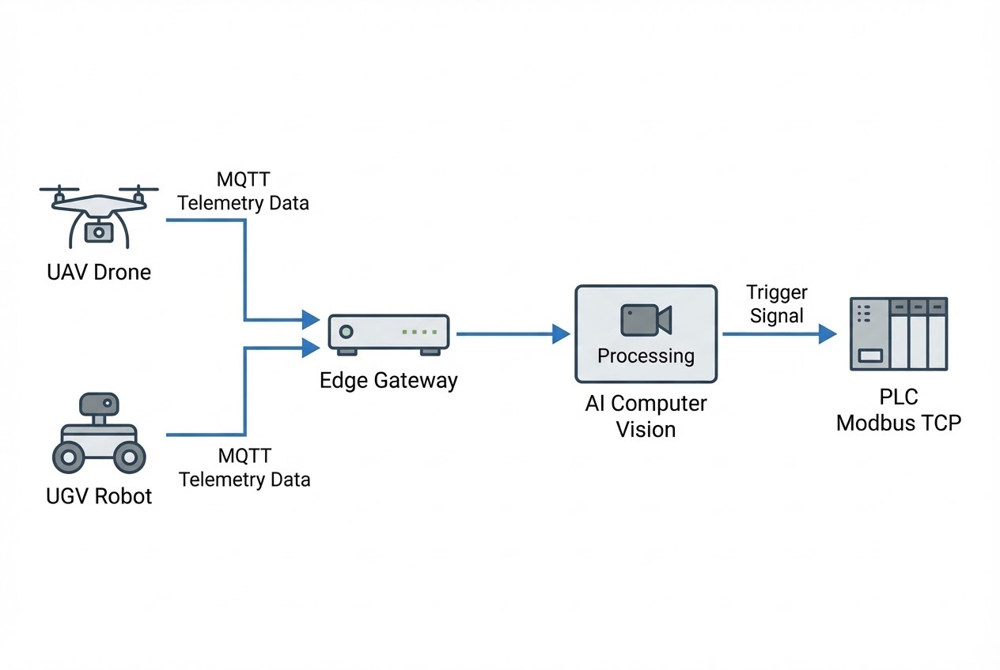

# บทนำ
ปัจจุบันภาคการเกษตรทั่วโลกกำลังเผชิญกับความท้าทายครั้งใหญ่คือ **"ปัญหาการขาดแคลนแรงงาน"** ซึ่งเป็นผลพวงมาจากการขยายตัวของสังคมเมือง (Urbanization) ข้อมูลระบุว่าผลผลิตทางการเกษตรทั่วโลกลดลงถึง 2,000 ล้านตันต่อปีอันเนื่องมาจากปัญหานี้ นอกจากนี้ การทำเกษตรแบบดั้งเดิมยังต้องพึ่งพาแรงงานคนในการทำงานซ้ำๆ (Repetitive Tasks) ที่เหนื่อยล้า ซึ่งมักนำไปสู่ Human Error และต้นทุนที่บานปลาย

เพื่อแก้ปัญหา (Pain Point) เหล่านี้ เทคโนโลยี **"โดรนและหุ่นยนต์การเกษตร"** จึงเข้ามาเป็นโซลูชันสำคัญที่พลิกโฉมหน้าไร่นา จากการใช้แรงงานคนอย่างหนักไปสู่ระบบอัตโนมัติอัจฉริยะ วันนี้เราจะมาเจาะลึกกันว่า ในมุมมองของ System Architecture หุ่นยนต์เหล่านี้ทำงานประสานกันอย่างไร

## ทฤษฎีและเทคโนโลยีเบื้องหลัง (Core Concept)
เทคโนโลยีหุ่นยนต์ในฟาร์มถูกแบ่งออกเป็น 2 กลุ่มหลัก ซึ่งแต่ละกลุ่มมี Tech Stack เบื้องหลังที่น่าสนใจต่างกัน:

### 1. อากาศยานไร้คนขับ (UAVs/Drones): นักสำรวจและผู้ดูแลทางอากาศ
โดรนการเกษตรไม่ได้มีหน้าที่แค่บินถ่ายภาพ แต่คือ "Edge Node" ที่เคลื่อนที่ได้:
* **การบินสำรวจและประเมินสุขภาพพืช:** โดรนจะติดตั้งกล้อง Multispectral Camera บินสำรวจและประมวลผลเป็นดัชนี NDVI ข้อมูล Telemetry และภาพถ่ายจะถูกส่งผ่านเครือข่าย 4G/5G เข้าสู่ **MQTT Broker** เพื่อให้ระบบส่วนกลางวิเคราะห์จุดที่เกิดโรค
* **การบินพ่นยาแม่นยำ (Precision Spraying):** โดรนสามารถรับพิกัดเป้าหมาย (Waypoints) จากระบบส่วนกลาง แล้วบินไปฉีดพ่นสารเคมีเฉพาะจุด ซึ่งช่วยลดเวลาการทำงานได้ถึง 80% ลดการใช้น้ำ 90% และประหยัดสารเคมีได้ถึง 50%

### 2. หุ่นยนต์ภาคพื้นดิน (UGVs): ขุมพลังที่ไม่มีวันเหน็ดเหนื่อย
หุ่นยนต์ภาคพื้นดินมักใช้ระบบ **ROS (Robot Operating System)** ทำงานร่วมกับ **PLC** ในการควบคุมกลไกทางกายภาพ:
* **หุ่นยนต์เก็บเกี่ยวผลไม้ (Harvesting Robots):** ใช้กล้องอุตสาหกรรมร่วมกับ Machine Vision เพื่อหาพิกัด 3D ของผลไม้ ส่งข้อมูลให้แขนกล (Robot Arm) ทำการหยิบจับอย่างทะนุถนอมตลอด 24 ชั่วโมง
* **หุ่นยนต์กำจัดวัชพืช (Weeding Robots):** ใช้ AI แบบ Real-time Inference (เช่น โมเดล YOLO) คัดแยกพืชผลออกจากวัชพืช แล้วสั่งการระบบหัวฉีดเฉพาะจุด (Spot Spraying) หรือกลไกถอนราก 
* **รถแทรกเตอร์ไร้คนขับ (Autonomous Tractors):** วิ่งตามเส้นทางที่กำหนดด้วยระบบ GPS แบบ RTK (Real-Time Kinematic) ระดับเซนติเมตร ร่วมกับเซนเซอร์ LiDAR ป้องกันการชน



## ตัวอย่างการเขียน Code ควบคุมระบบฉีดพ่น (C# & PLC Integration)
ในระบบ Weeding Robot ทั่วไป เมื่อกล้อง Vision ตรวจพบวัชพืช โปรแกรมหลัก (มักเขียนด้วย C# หรือ C++) จะต้องประมวลผล Bounding Box และคำนวณว่าต้องเปิดวาล์วฉีดพ่น (Solenoid Valve) หัวไหน โดยส่งคำสั่งไปยัง PLC หน้างานผ่าน Modbus/TCP

```csharp
// ตัวอย่าง C# .NET สั่งงาน PLC ให้เปิดหัวฉีด (Spray Valve) เมื่อ AI เจอวัชพืช
using System;
using System.Net.Sockets;
using Modbus.Device;

public class SpotSprayingController
{
    private string plcIp = "192.168.1.50";
    
    public void ProcessVisionDetection(string label, double confidence, int boxX)
    {
        // กรองเฉพาะเป้าหมายที่เป็น "วัชพืช" และความแม่นยำสูงกว่า 80%
        if (label == "Weed" && confidence > 0.80)
        {
            // คำนวณหาหัวฉีดที่ตรงกับตำแหน่ง X ของวัชพืชในภาพ
            ushort nozzleCoilAddress = CalculateNozzleAddress(boxX);
            
            // สั่งเปิดหัวฉีดผ่าน Modbus TCP ไปยัง PLC
            TriggerSprayValve(nozzleCoilAddress);
        }
    }

    private void TriggerSprayValve(ushort coilAddress)
    {
        using (TcpClient client = new TcpClient(plcIp, 502))
        {
            ModbusIpMaster master = ModbusIpMaster.CreateIp(client);
            // สั่งเปิดวาล์ว (True) ที่ Address ที่กำหนด
            master.WriteSingleCoil(coilAddress, true);
            Console.WriteLine($"Spray triggered at Nozzle Address: {coilAddress}");
        }
    }
    
    private ushort CalculateNozzleAddress(int boxX) { /* Logic เทียบบัญญัติไตรยางศ์ */ return 1; }
}

```

## ตัวอย่างการใช้งานจริงระดับโลก (Global Use Cases)

* 🍓 **Harvest CROO Robotics & FFRobotics:** พัฒนาหุ่นยนต์เก็บสตรอว์เบอร์รีและแอปเปิล ใช้ Machine Vision ประมวลผลภาพเพื่อระบุความสุกของผลไม้ ลดความเสี่ยงผลผลิตเน่าเสียค้างต้น และแก้ปัญหาคนงานขาดแคลนในฤดูเก็บเกี่ยว
* 🌿 **Blue River Technology (See & Spray) & AVO:** เทคโนโลยีหุ่นยนต์ตรวจจับและฉีดพ่นอัจฉริยะ AI จะแยกแยะวัชพืชและสั่งฉีดพ่นสารเคมีแบบเจาะจงจุดเท่านั้น ช่วยลดต้นทุนค่ายาและสารเคมีกำจัดวัชพืชได้มหาศาลถึง 90%
* 🚜 **รถแทรกเตอร์ไร้คนขับ Mahindra E8:** รถแทรกเตอร์ EV เต็มรูปแบบจากอินเดีย ผสาน GPS และเซนเซอร์รอบคัน ไถพรวนและหยอดเมล็ดในพื้นที่ขนาดใหญ่ได้เอง พร้อมหลบหลีกสิ่งกีดขวาง ลดข้อผิดพลาด (Human Error) อย่างเต็มประสิทธิภาพ

> **Pro Tip / ข้อควรระวังจากหน้างาน:**
> ปัญหาปราบเซียนของการทำ **Machine Vision ในพื้นที่การเกษตร** คือ "แสงแดดที่เปลี่ยนแปลงตลอดเวลา" (Glare & Shadows) โมเดล AI ที่เทรนในแล็บมักจะทำงานพังเมื่อเจอแดดเที่ยงวัน เทคนิคของวิศวกรคือการสร้างที่ครอบแสง (Shroud) เพื่อควบคุมแสงหน้ากล้อง และใช้แสงประดิษฐ์ (LED) หรือการใช้กล้อง Infrared ในการทำงานแทนภาพ RGB ปกติ

## สรุป

การนำโดรนและหุ่นยนต์การเกษตรเข้ามาประยุกต์ใช้ ไม่ใช่แค่การเอาเครื่องจักรมาแทนที่คน แต่เป็นการทำ Digital Transformation จากอุตสาหกรรมที่ใช้แรงงานเข้มข้น สู่การขับเคลื่อนด้วยเทคโนโลยี การผสานเซนเซอร์อัจฉริยะ, AI, Computer Vision และ PLC เข้าด้วยกัน จะช่วยลดต้นทุน เพิ่มผลผลิต และยกระดับความยั่งยืนได้อย่างแท้จริง

---

**กำลังมองหาโซลูชันด้าน Machine Vision หรือการเชื่อมต่อหุ่นยนต์เข้ากับ PLC อยู่หรือไม่?**
หากฟาร์มหรือโรงงานของคุณต้องการทีมผู้เชี่ยวชาญในการออกแบบและติดตั้งระบบ Agricultural Robotics หรือ Smart Automation แบบครบวงจร
พูดคุยกับทีมวิศวกรของ WP Solution ได้ที่: wisit.paewkratok@gmail.com | Line: wisit.p