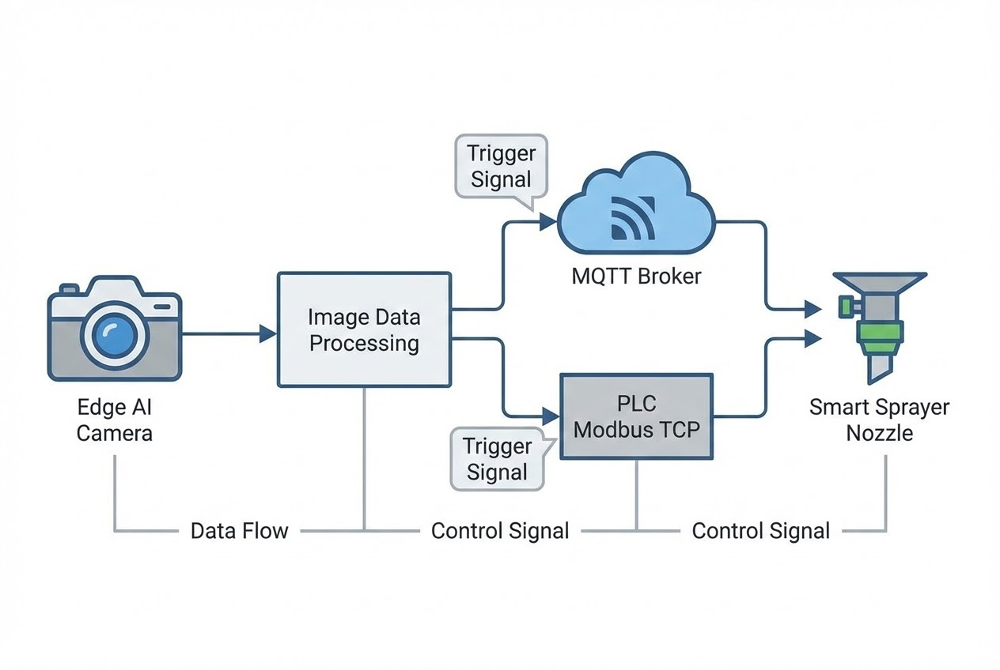

# บทนำ
หนึ่งในความท้าทายที่สร้างความเจ็บปวด (Pain Point) ให้กับธุรกิจการเกษตรมากที่สุดคือ **"ปัญหาโรคและศัตรูพืช"** ข้อมูลจาก FAO ระบุว่าปัญหาเหล่านี้ทำให้ผลผลิตทางการเกษตรทั่วโลกสูญเสียไปมากถึง 40% ในแต่ละปี 

ในอดีต เมื่อเกษตรกรพบการระบาด มักจะใช้วิธีฉีดพ่นสารเคมีแบบ "เหมาเข่ง (Blanket Spraying)" ทั่วทั้งแปลงเพื่อป้องกันไว้ก่อน ซึ่งนำไปสู่ต้นทุนที่บานปลายและปัญหาสารพิษตกค้าง ในยุคเกษตร 4.0 เทคโนโลยี **ปัญญาประดิษฐ์ (AI)** และ **Computer Vision** ได้ก้าวเข้ามาเป็น "สมองกล" ที่ช่วยวิเคราะห์และสั่งการฉีดพ่นสารเคมีเฉพาะจุด (Targeted Spraying) บทความนี้เราจะมาเจาะลึกเบื้องหลังการทำงานทางเทคนิคของระบบนี้กันครับ

## ทฤษฎีที่เกี่ยวข้อง (Concept)
การสร้าง AI สำหรับปกป้องพืชผล อาศัยเทคโนโลยี **Deep Learning** โดยเฉพาะโครงข่ายประสาทเทียมแบบ **CNNs (Convolutional Neural Networks)** ซึ่งมีหน้าที่หลัก 2 ส่วน:
1. **Image Classification & Detection:** โมเดล (เช่น YOLO, ResNet) จะรับภาพจากกล้องหน้างาน เข้ามาสกัดคุณลักษณะ (Feature Extraction) เพื่อหาความผิดปกติของสี พื้นผิว และรูปร่างที่เกิดจากโรคพืชหรือรอยกัดกินของแมลง
2. **Intelligent Spraying Mechanism:** เมื่อ AI ตรวจพบเป้าหมาย (เช่น วัชพืช หรือใบที่ติดโรค) ระบบจะต้องคำนวณพิกัด (Bounding Box) และส่งสัญญาณไปยัง Controller (เช่น PLC หรือ Microcontroller) เพื่อเปิดโซลินอยด์วาล์วฉีดพ่นสารเคมีแบบเจาะจงจุด

## สิ่งที่ต้องเตรียม (Prerequisites) สำหรับ Edge AI System
1. **Hardware:** * กล้องอุตสาหกรรม (Global Shutter เพื่อป้องกันภาพเบลอขณะรถเคลื่อนที่)
   * Edge IPC (Industrial PC) ที่มี GPU สำหรับรัน AI Inference (เช่น NVIDIA Jetson)
   * PLC และ Solenoid Valve สำหรับควบคุมหัวฉีด
2. **Software/Library:** Python, OpenCV, โมเดล AI (เช่น YOLOv8), ไลบรารี paho-mqtt สำหรับเชื่อมต่อ



## ขั้นตอนการทำงาน (Step-by-Step)

### 1. การนำเข้าและประมวลผลภาพ (AI Inference)
บน Edge Node เราจะใช้โมเดล Object Detection ที่ผ่านการเทรนด้วย Dataset ใบพืชที่เป็นโรคและวัชพืชมาแล้ว เพื่อประมวลผลแบบ Real-time 

```python
# ตัวอย่าง Code: Python (Edge AI Inference & MQTT Publish)
import cv2
import json
from ultralytics import YOLO
import paho.mqtt.client as mqtt

# 1. ตั้งค่า MQTT Client สำหรับคุยกับ PLC หรือ Node-RED
mqtt_client = mqtt.Client()
mqtt_client.connect("192.168.1.100", 1883, 60)

# 2. โหลดโมเดล AI ที่เทรนมาเฉพาะกิจ (เช่น แยกวัชพืช vs พืชผล)
model = YOLO('crop_weed_model.pt')

# 3. รับภาพจากกล้อง (Video Stream)
cap = cv2.VideoCapture(0)

while cap.isOpened():
    success, frame = cap.read()
    if success:
        # รัน AI Inference
        results = model(frame)
        
        for result in results:
            boxes = result.boxes
            for box in boxes:
                # ดึงค่า Class ID (สมมติ Class 1 คือ วัชพืช) และความมั่นใจ (Confidence)
                cls_id = int(box.cls[0])
                conf = float(box.conf[0])
                
                if cls_id == 1 and conf > 0.85:
                    # หาพิกัดแกน X เพื่อระบุว่าต้องสั่งเปิดหัวฉีดเบอร์อะไร
                    x_center = float(box.xywh[0][0])
                    nozzle_id = calculate_nozzle(x_center) 
                    
                    # ส่งคำสั่งยิงสเปรย์ผ่าน MQTT
                    payload = {"nozzle": nozzle_id, "action": "SPRAY", "duration_ms": 500}
                    mqtt_client.publish("farm/smart_sprayer/trigger", json.dumps(payload))
                    
        cv2.imshow("AI Crop Protection", results[0].plot())
        if cv2.waitKey(1) & 0xFF == ord("q"):
            break

```

### 2. การรับคำสั่งและควบคุม Hardware (Control Layer)

ข้อมูล JSON จาก MQTT จะถูกส่งไปยัง **Node-RED** หรือโปรแกรม **C# .NET** ที่เชื่อมต่ออยู่กับ PLC ผ่านโปรโตคอล **Modbus TCP** เพื่อสั่งเปิด Relay ของหัวฉีดพ่น (Solenoid Valve) ในเสี้ยววินาที

> **Pro Tip / ข้อควรระวัง:**
> ข้อผิดพลาดที่เจอบ่อยที่สุดในการทำ Machine Vision บนแปลงเกษตรคือ **"สภาพแสงที่ควบคุมไม่ได้ (Uncontrolled Lighting)"** เงาเมฆหรือแสงแดดจ้าสะท้อนใบไม้ มักทำให้ AI ตัดสินใจพลาด วิธีแก้คือการใส่ "กล่องครอบ (Shroud)" ให้กับชุดกล้อง หรือใช้ไฟ LED ส่องสว่างกำลังสูงเพื่อควบคุมสภาพแสงให้คงที่ (Constant Illumination) และควรใช้เทคนิค Data Augmentation ปรับแสงเงาหลายๆ รูปแบบตอนเทรนโมเดล

## ตัวอย่างการใช้งานจริงระดับสากล (Global Use Cases)

* 🚜 **"See & Spray" จาก Blue River Technology (John Deere):** นวัตกรรมเครื่องจักรการเกษตรที่ใช้ Computer Vision ตัดสินใจฉีดพ่นสารเคมีเฉพาะจุดที่พบวัชพืชบนหน้างานจริง ช่วยประหยัดต้นทุนค่าสารเคมีให้กับธุรกิจฟาร์มได้สูงสุดถึง 90%
* 📱 **แอปพลิเคชัน Plantix:** ใช้ AI วิเคราะห์ภาพถ่ายใบพืชจากกล้องสมาร์ทโฟน เพื่อให้เกษตรกรวินิจฉัยโรคได้แบบเรียลไทม์ พร้อมรับคำแนะนำในการรักษา
* 🚁 **โดรนฉีดพ่นอัจฉริยะ (Smart UAV Sprayers):** โดรนติดตั้ง Edge AI บินประเมินพื้นที่และฉีดพ่นเฉพาะพิกัดที่พบเป้าหมาย ลดปัญหาละอองสารเคมีฟุ้งกระจายปนเปื้อนในแหล่งน้ำ

## สรุป

การประยุกต์ใช้ปัญญาประดิษฐ์เพื่อจัดการศัตรูพืช ถือเป็นการทรานส์ฟอร์มจากวิธี "ตั้งรับและคาดเดา" สู่การดูแลแบบ "เชิงรุก" ที่ควบคุมได้ด้วยข้อมูล การผสาน AI เข้ากับสถาปัตยกรรม Edge Computing และระบบ Automation ไม่เพียงช่วยลดต้นทุนการผลิตที่สูญเปล่า แต่ยังยกระดับคุณภาพสินค้าเกษตรให้ปลอดภัยและยั่งยืน

---

**ติดปัญหาเรื่องการพัฒนา AI Vision หรือการเชื่อมต่อกับระบบ PLC?**
หากฟาร์มหรือโรงงานของคุณกำลังมองหาผู้เชี่ยวชาญในการออกแบบและติดตั้งระบบ ปัญญาประดิษฐ์และเซนเซอร์ตรวจจับโรคพืช (AI & Smart Crop Monitoring) แบบครบวงจร
พูดคุยกับทีมวิศวกรของ WP Solution ได้ที่: wisit.paewkratok@gmail.com | Line: wisit.p