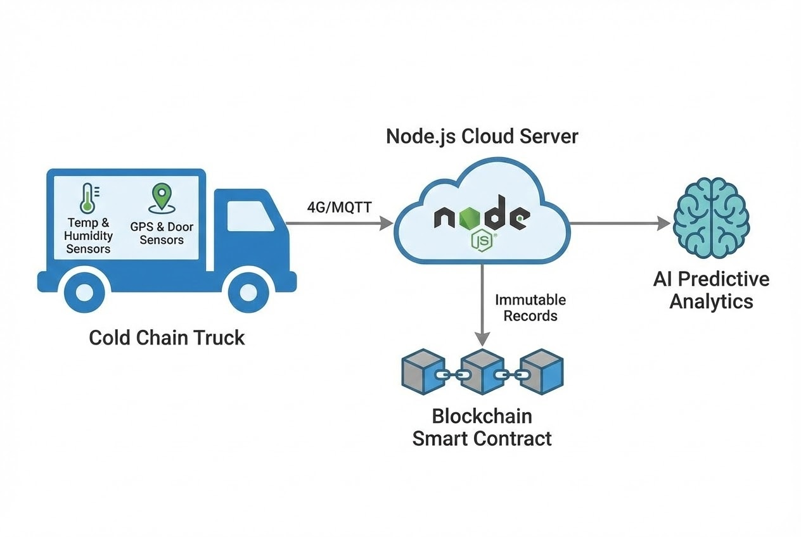

# บทนำ
คุณทราบหรือไม่ว่า ในแต่ละปีผลผลิตทางการเกษตรและอาหารทั่วโลกสูญเสียไปโดยเปล่าประโยชน์มากถึง 1.3 พันล้านตัน ความสูญเสียนี้ไม่ได้เกิดจากการเพาะปลูกที่ไม่ได้ผล แต่ส่วนใหญ่เกิดขึ้นในกระบวนการ **"หลังการเก็บเกี่ยว (Post-Harvest)"** ไม่ว่าจะเป็นการเน่าเสียระหว่างการขนส่ง (Cold Chain Failure) หรือการประเมินความต้องการของตลาดผิดพลาด

ในมุมมองของวิศวกรรมระบบ ปัญหาเหล่านี้คือเรื่องของ **"Data Visibility"** (การขาดความโปร่งใสและมองไม่เห็นข้อมูลระหว่างทาง) การบริหารจัดการห่วงโซ่อุปทานแบบ "จากฟาร์มสู่ผู้บริโภค (Farm to Fork)" จึงต้องอาศัยเทคโนโลยี 3 แกนหลัก ได้แก่ AI, IoT และ Blockchain เข้ามาอุดรอยรั่ว บทความนี้เราจะมาเจาะลึกสถาปัตยกรรมเบื้องหลังกันครับ

## ทฤษฎีและเทคโนโลยีหลัก (Core Technologies)
การเพิ่มประสิทธิภาพห่วงโซ่อุปทานแบบ End-to-End ประกอบด้วยเทคโนโลยี 3 ส่วนที่ทำงานประสานกัน:

1. **Predictive Analytics (AI & Machine Learning):** ทำหน้าที่เป็นสมองกลวิเคราะห์ข้อมูล Big Data จากในอดีต ร่วมกับสภาพอากาศและสภาพดิน เพื่อทำการ "พยากรณ์ผลผลิต (Yield Prediction)" ล่วงหน้า ช่วยให้ผู้จัดการฟาร์มวางแผนจองคิวรถขนส่ง (Logistics) และป้องกันปัญหาสินค้าล้นตลาด
2. **Cold Chain Tracking (IoT & RFID):** การติดตามคุณภาพระหว่างทางด้วยป้าย RFID ที่พาเลท และเซนเซอร์ IoT ควบคุมสภาพแวดล้อม (อุณหภูมิ, ความชื้น, ระดับก๊าซ) ภายในตู้ขนส่ง หากอุณหภูมิเริ่มสูงเกินมาตรฐาน ระบบจะส่งแจ้งเตือน (Alert) แบบ Real-time ทันที
3. **Traceability (Blockchain):** ข้อมูลทั้งหมดตั้งแต่วันปลูก, อุณหภูมิระหว่างขนส่ง, จนถึงวันจัดจำหน่าย จะถูกบันทึกลงในระบบจัดเก็บข้อมูลแบบกระจายศูนย์ (Distributed Ledger) ซึ่งไม่สามารถแก้ไขหรือปลอมแปลงได้ สร้างความน่าเชื่อถือระดับสูงสุดเมื่อผู้บริโภคสแกน QR Code

## ขั้นตอนการทำงานและสถาปัตยกรรม (Step-by-Step Architecture)



### ตัวอย่างการเขียน Code บันทึกข้อมูล Cold Chain ลง Blockchain
ในการทำงานจริง เซนเซอร์ในตู้คอนเทนเนอร์จะส่งค่าอุณหภูมิผ่านโปรโตคอล **MQTT** เข้ามายัง Backend (เช่น Node.js) จากนั้น Backend จะตรวจสอบว่าอุณหภูมิผิดปกติหรือไม่ และทำการ Hashing ข้อมูลเพื่อส่งไปบันทึกลงใน **Smart Contract** (เช่น Ethereum หรือ Hyperledger Fabric) เพื่อเป็นหลักฐานว่าสินค้านี้ถูกจัดเก็บในอุณหภูมิที่เหมาะสมตลอดเส้นทาง

```javascript
// ตัวอย่าง Code: Node.js รับค่า IoT และบันทึกลง Blockchain (Web3.js)
const mqtt = require('mqtt');
const { Web3 } = require('web3'); // Library สำหรับคุยกับ Blockchain

const mqttClient = mqtt.connect('mqtt://broker.hivemq.com');
const web3 = new Web3('[https://mainnet.infura.io/v3/YOUR_INFURA_KEY](https://mainnet.infura.io/v3/YOUR_INFURA_KEY)');
const contractAddress = '0x123456789...'; // ที่อยู่ของ Smart Contract

// ตั้งค่าอุณหภูมิสูงสุดที่ยอมรับได้สำหรับผลไม้เบอร์รี่
const MAX_TEMP = 4.0; 

mqttClient.on('connect', () => {
    // Subscribe รับข้อมูลจากเซนเซอร์ในตู้ขนส่ง
    mqttClient.subscribe('logistics/truck-01/temp');
});

mqttClient.on('message', async (topic, message) => {
    let payload = JSON.parse(message.toString());
    console.log(`[${payload.timestamp}] Truck-01 Temp: ${payload.temperature}°C`);

    // 1. เช็กเงื่อนไข (Rule Engine)
    if (payload.temperature > MAX_TEMP) {
        triggerAlert(payload.truck_id, payload.temperature);
    }

    // 2. บันทึกข้อมูลลง Blockchain เพื่อความโปร่งใส (Traceability)
    try {
        // สร้าง Data Hash
        let dataHash = web3.utils.keccak256(JSON.stringify(payload));
        
        // สมมติฟังก์ชัน logTemperatureRecord บน Smart Contract
        // await contract.methods.logTemperatureRecord(payload.batch_id, dataHash).send({from: adminWallet});
        
        console.log(`✅ Logged to Blockchain! Batch: ${payload.batch_id}, Hash: ${dataHash}`);
    } catch (error) {
        console.error("Blockchain Transaction Failed:", error);
    }
});

function triggerAlert(truckId, temp) {
    // ส่ง Alert แจ้งคนขับ หรือเปิดระบบทำความเย็นสำรอง
    console.warn(`🚨 ALERT! ${truckId} temperature exceeded limit: ${temp}°C`);
}

```

> **Pro Tip / ข้อควรระวังจากหน้างาน:**
> ปัญหาคลาสสิกของระบบ Tracking ระหว่างการขนส่งคือ **"จุดอับสัญญาณ (Blind Spots)"** เมื่อรถขนส่งวิ่งผ่านหุบเขาหรือพื้นที่ห่างไกล สัญญาณ 4G มักจะหายไป การออกแบบ Edge Gateway (ตัวรับส่งสัญญาณบนรถ) จะต้องมีฟีเจอร์ **Data Buffering (Store and Forward)** เพื่อเก็บข้อมูลเซนเซอร์ไว้ในหน่วยความจำชั่วคราว (Local SQLite/Redis) และอัปโหลดข้อมูลที่ค้างอยู่ขึ้น Cloud หรือ Blockchain ทันทีเมื่อกลับเข้ามาในพื้นที่ที่มีสัญญาณ

## ตัวอย่างการนำไปใช้งานจริง (Global Use Cases)

* 🍎 **โปรเจกต์ IBM Food Trust ร่วมกับ Walmart:** ค้าปลีกยักษ์ใหญ่นำเทคโนโลยี Blockchain มาใช้ติดตามเส้นทางของ "มะม่วงฝาน" และ "ผักใบเขียว" จากเดิมที่ต้องใช้เวลาเกือบ 7 วันในการสืบหาต้นตอหากพบการปนเปื้อน เทคโนโลยีนี้ช่วยลดเวลาตรวจสอบย้อนกลับเหลือเพียง **2.2 วินาที** ช่วยรับประกันความปลอดภัยให้ผู้บริโภคได้อย่างรวดเร็ว
* ☕ **GrainChain ระบบติดตามสินค้าเกษตร:** แพลตฟอร์มที่ใช้ AI และ Blockchain ติดตามคุณภาพและกระบวนการขนส่งเมล็ดกาแฟในฮอนดูรัส ช่วยลดการฉ้อโกง ทำให้เกิดความโปร่งใสในการทำธุรกรรม และรับประกันว่าเกษตรกรจะได้รับราคาที่เป็นธรรมตามคุณภาพจริง
* 🍓 **Smart Cold Chain Management:** การจัดการโกดังและตู้ขนส่งผลไม้ตระกูลเบอร์รี่ด้วย AI และ IoT หากระบบทำความเย็นมีปัญหา AI จะวิเคราะห์และสั่งปรับอุณหภูมิอัตโนมัติ หรือแนะนำเส้นทางที่รวดเร็วที่สุดให้กับคนขับ เพื่อรักษาคุณภาพผลผลิตไว้ให้ได้มากที่สุด

## สรุป

การผลักดันธุรกิจเกษตรเข้าสู่ยุค 4.0 อย่างสมบูรณ์แบบนั้น การผลิตให้ได้ปริมาณมากอาจไม่เพียงพอ หากไม่สามารถรักษาคุณภาพจนถึงมือผู้บริโภคได้ การบูรณาการ Predictive Analytics (เพื่อพยากรณ์ผลผลิต), ระบบ IoT/RFID (เพื่อติดตามและรักษาคุณภาพ) และ Blockchain (เพื่อความโปร่งใส) เข้าด้วยกัน จะช่วยยกระดับห่วงโซ่อุปทาน เปลี่ยนความสูญเสียให้เป็นกำไร และสร้างความยั่งยืนให้กับอุตสาหกรรมอาหารได้อย่างแท้จริง

---

**ต้องการที่ปรึกษาด้าน Smart Supply Chain หรือการพัฒนาระบบ IoT Tracking?**
หากธุรกิจหรือฟาร์มของคุณกำลังมองหาผู้เชี่ยวชาญในการออกแบบและติดตั้งระบบประเมินผลผลิตด้วย AI หรือระบบ Blockchain Traceability แบบครบวงจร
พูดคุยกับทีมวิศวกรของ WP Solution ได้ที่: wisit.paewkratok@gmail.com | Line: wisit.p