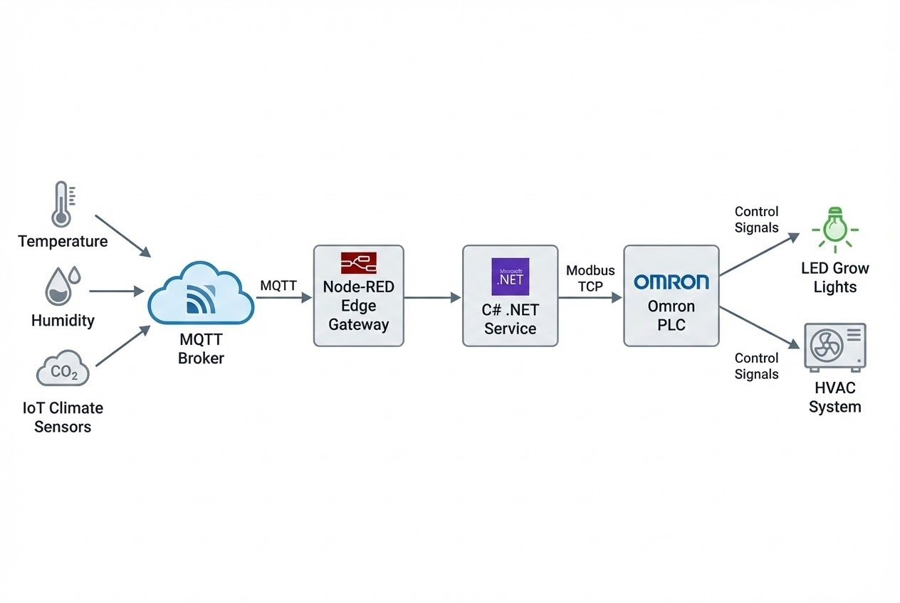

# บทนำ
เมื่อโลกก้าวเข้าสู่ยุคสังคมเมือง (Urbanization) พื้นที่การเกษตรลดลง ในขณะที่ความต้องการอาหารสดใหม่และปลอดภัยพุ่งสูงขึ้น เทคโนโลยี **"เกษตรกรรมแนวตั้งในร่ม (Indoor Vertical Farming)"** จึงเข้ามาเป็นโซลูชันแห่งอนาคต ด้วยการยกฟาร์มมาไว้ใจกลางเมือง ปลูกพืชซ้อนกันเป็นชั้นๆ ในสภาพแวดล้อมปิด (Controlled Environment Agriculture - CEA) 

การทำฟาร์มรูปแบบนี้สามารถลดการใช้น้ำได้ถึง 95-99% ปลอดสารเคมี 100% และให้ผลผลิตสม่ำเสมอตลอด 365 วัน แต่เบื้องหลังความสำเร็จเหล่านี้ ไม่ได้เกิดจากแค่โครงสร้างเหล็กและน้ำ แต่เกิดจากการผสาน **Modern Industrial Stack** เพื่อควบคุมทุกตัวแปรทางธรรมชาติ วันนี้เราจะมาเจาะลึก System Architecture ของระบบนี้กันครับ

## ทฤษฎีที่เกี่ยวข้อง (Concept & Core Technologies)
การสร้าง "ภูมิอากาศระดับจุลภาค (Micro-climate)" ใน Vertical Farm อาศัยขุมพลังเทคโนโลยี 4 ส่วนหลัก ซึ่งทำงานประสานกันผ่านระบบ Network:

1. **Hydroponics / Aeroponics:** ระบบปลูกพืชไร้ดินที่ใช้น้ำหรือละอองหมอกจ่ายสารอาหารโดยตรงที่รากพืช (คุมการจ่ายด้วยปั๊มและ PLC)
2. **LED Grow Lights:** หลอดไฟ LED ที่สามารถปรับ "สเปกตรัมแสง" (แดง/น้ำเงิน) และความเข้มแสงให้ตรงกับระยะการเติบโตของพืช
3. **Smart Sensors (IoT):** เซนเซอร์วัดอุณหภูมิ, ความชื้น, CO2, EC, และ pH ส่งข้อมูลแบบ Real-time 
4. **Automated Climate Control:** ระบบสมองกลที่รับข้อมูลจากเซนเซอร์ มาประมวลผลเพื่อสั่งการแอร์ (HVAC), พัดลมระบายอากาศ, และวาล์วน้ำ

## สิ่งที่ต้องเตรียม (Prerequisites)
หากคุณต้องการพัฒนาระบบควบคุม Vertical Farm ด้วยตัวเอง นี่คือ Stack พื้นฐานที่ต้องใช้:
1. **Hardware:** * เซนเซอร์วัดสภาพแวดล้อม (รองรับโปรโตคอล MQTT หรือ Modbus RTU)
   * อุปกรณ์ควบคุมระดับอุตสาหกรรม (PLC เช่น Mitsubishi, Omron, Siemens) สำหรับคุมโหลดหนักอย่าง ปั๊มน้ำ แอร์ และดิมเมอร์ LED
2. **Software/Gateway:** * **Node-RED:** ทำหน้าที่เป็น Edge Gateway ดึงข้อมูลเซนเซอร์ส่งเข้า Cloud/Local Server
   * **MQTT Broker:** (เช่น Mosquitto) สำหรับเป็นท่อส่งข้อมูลหลัก
   * **C# (.NET):** เขียน Worker Service รับข้อมูลและรัน Logic ตัดสินใจ (AI/Rule-based)

## ขั้นตอนการทำงาน (Step-by-Step Architecture)



### 1. การส่งข้อมูลแวดล้อมผ่าน MQTT
เซนเซอร์ตามชั้นปลูกต่างๆ จะส่งค่าสภาพแวดล้อมเป็น Payload JSON ผ่าน MQTT Topic `farm/zone1/climate` เพื่อให้ระบบส่วนกลางนำไปประมวลผล

```json
// ตัวอย่าง MQTT Payload จากเซนเซอร์
{
  "zone_id": "Z1_RACK_A",
  "temperature_c": 24.5,
  "humidity_percent": 75.0,
  "co2_ppm": 800,
  "timestamp": "2024-11-10T10:00:00Z"
}

```

### 2. เขียน C# .NET ควบคุม LED และ HVAC ผ่าน PLC

เมื่อระบบ Backend (.NET) ได้รับข้อมูลจาก MQTT หากพบว่าระดับ CO2 ต่ำเกินไป หรือต้องการปรับความสว่าง LED โปรแกรมจะส่งคำสั่งไปยัง PLC หน้างานผ่าน **Modbus/TCP**

```csharp
// ตัวอย่าง Code: C# ควบคุมการทำงานของ Vertical Farm ผ่าน Modbus TCP
using System;
using System.Net.Sockets;
using Modbus.Device;

public class VerticalFarmController
{
    private string plcIp = "192.168.1.100";
    private int port = 502;

    public void AdjustEnvironment(double currentTemp, int currentCo2)
    {
        try 
        {
            using (TcpClient client = new TcpClient(plcIp, port))
            {
                ModbusIpMaster master = ModbusIpMaster.CreateIp(client);
                
                // 1. ตรวจสอบอุณหภูมิ ถ้าเกิน 26 องศา สั่งเปิดแอร์และพัดลมระบายอากาศ (Coil Address 20)
                if (currentTemp > 26.0)
                {
                    master.WriteSingleCoil(20, true); 
                    Console.WriteLine("HVAC & Exhaust Fans: ON");
                }

                // 2. ตรวจสอบ CO2 ถ้าน้อยกว่า 600 ppm สั่งเปิดวาล์ว CO2 (Coil Address 21)
                if (currentCo2 < 600)
                {
                    master.WriteSingleCoil(21, true);
                    Console.WriteLine("CO2 Injection: ON");
                }
                
                // 3. ปรับความสว่าง LED (สมมติส่งค่า Analog 0-100% ไปที่ Register 100)
                ushort ledIntensity = 85; // ปรับแสงที่ 85%
                master.WriteSingleRegister(100, ledIntensity);
            }
        }
        catch (Exception ex) 
        {
            Console.WriteLine($"PLC Connection Error: {ex.Message}");
        }
    }
}

```

## ตัวอย่างการใช้งานระดับสากล (Global Use Cases)

* 🇺🇸 **AeroFarms (สหรัฐอเมริกา):** พลิกโฉมโรงงานเหล็กเก่าเป็นฟาร์มแนวตั้ง ใช้ระบบ Aeroponics ลดการใช้น้ำ 95% และมีระบบคอมพิวเตอร์คุม LED/สารอาหาร ให้ผลผลิตมากกว่าปลูกบนดินถึง 390 เท่า
* 🇬🇧 **Jones Food Company (อังกฤษ):** ฟาร์มแนวตั้งใหญ่ที่สุดในยุโรป ปลูกพืชซ้อนกัน 17 ชั้น ปลอดสารเคมี 100% และคุมสภาพแวดล้อมด้วยระบบอัตโนมัติเต็มรูปแบบ
* 🇸🇬 **Sky Greens (สิงคโปร์):** ใช้โครงสร้างแบบหอคอยเพื่อสู้กับข้อจำกัดด้านพื้นที่ ผลิตผักใบเขียวป้อนคนในเมืองได้ถึง 0.5 ตัน/วัน

> **Pro Tip / ข้อควรระวังจากหน้างาน:**
> ปัญหาคลาสสิกของ Indoor Farm คือ **"ความชื้นสะสม (Humidity Buildup)"** พืชในระบบปิดจะคายน้ำตลอดเวลา หากออกแบบระบบแอร์ (HVAC) โดยคำนวณเฉพาะ "ความร้อนจากหลอด LED" แต่ลืมคำนวณ "Latent Heat จากการคายน้ำของพืช" จะทำให้เกิดเชื้อราลุกลามล้างบางทั้งฟาร์มได้ การทำ Dehumidification (ระบบดูดความชื้น) เป็นหัวใจสำคัญที่ห้ามมองข้ามเด็ดขาด!

## สรุป

เกษตรกรรมแนวตั้งในร่ม ไม่ใช่แค่ฉากในภาพยนตร์ไซไฟ แต่คือโรงงานผลิตอาหารที่เกิดขึ้นจริง การผสมผสานวิศวกรรม IoT, C# .NET, และ PLC อุตสาหกรรมเข้าด้วยกัน ช่วยให้ธุรกิจสามารถควบคุมทุกตัวแปร ตัดความเสี่ยงจากสภาพอากาศ และคืนกำไรได้อย่างยั่งยืนในระยะยาว

---

**ติดปัญหาเรื่อง Coding หรือการทำ System Integration ในระบบ Smart Farm?**
หากธุรกิจของคุณกำลังมองหาผู้เชี่ยวชาญในการออกแบบและติดตั้งระบบ Indoor Vertical Farming & Automated Climate Control พูดคุยกับทีม Dev ของเราได้ที่ Line: wisit.p
