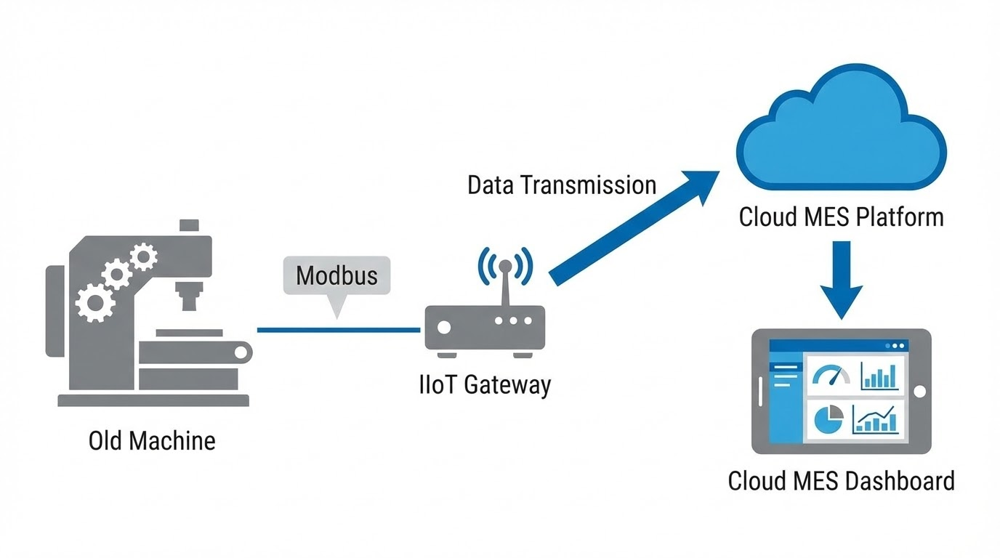

# อยากทำ Smart Factory แต่กลัวแพง?

"อยากทำ Smart Factory แต่กลัวแพง", "กลัวลงทุนไปแล้วพนักงานไม่ใช้", "เครื่องจักรเก่าจะทำได้เหรอ?"... นี่คือคำถามยอดฮิตที่ทำให้เจ้าของโรงงานหลายท่านถอดใจตั้งแต่ยังไม่เริ่ม 

ในอดีต การ **ติดตั้ง MES โรงงาน** อาจต้องใช้งบประมาณหลักล้านและใช้เวลาติดตั้งเป็นปี แต่ในยุคปัจจุบัน เทคโนโลยีเปลี่ยนไปแล้วครับ! จริงๆ แล้วคุณสามารถเริ่มระบบ MES ได้ด้วยงบประมาณหลักหมื่น และเห็นผลลัพธ์ได้ภายใน 1 เดือน

บทความนี้จะมาเผยเคล็ดลับการ **"Start Small"** เริ่มต้นทำระบบ MES อย่างไรให้คุ้มค่า และขยายผลได้จริงครับ

---

## 1. Start Small (PoC): อย่าเพิ่ง "เทหมดหน้าตัก"
กฎเหล็กของการทำระบบ IT ในโรงงานยุคใหม่คือ **"Think Big, Start Small, Scale Fast"**

แทนที่จะทุ่มเงินมหาศาลวางระบบทั้งโรงงาน ให้เริ่มจากทำ **PoC (Proof of Concept)** โดยเลือกจาก:
* **1 ไลน์ผลิตที่มีปัญหาที่สุด:** เลือกจุดที่เป็น "คอขวด" (Bottleneck) 
* **1 เครื่องจักรหลัก:** เริ่มแค่เครื่องเดียวเพื่อวัดค่า **OEE** (Overall Equipment Effectiveness)

## 2. Hardware ไม่ต้องแพง: เทคนิค Retrofit เครื่องจักรเก่า
เครื่องจักรเก่าอายุ 20-30 ปี ก็ต่อระบบได้ด้วยวิธีที่เรียกว่า **"Retrofit"**:

* **ใช้ IIoT Gateway:** พระเอกของงาน คือกล่องตัวกลาง (หลักพัน-หมื่นต้นๆ) ที่ดึงข้อมูลจาก PLC แล้วส่งขึ้นระบบ MES ได้ทันทีโดยไม่ต้องแก้โปรแกรมเครื่องเดิม
* **ใช้ Sensor เสริม:** ถ้าเครื่องไม่มี PLC เราสามารถติด Sensor ภายนอก เช่น เซนเซอร์นับจำนวน หรือ CT วัดกระแสไฟ เพื่อดูสถานะได้ง่ายๆ

## 3. Software ทางเลือก: Modular & Subscription
ลืมภาพซอฟต์แวร์ราคาแพงที่ต้องซื้อขาด (Perpetual License) ไปได้เลย เทรนด์สมัยใหม่คือ:
* **Cloud-based / Subscription:** จ่ายรายเดือน/ปี ตามการใช้งานจริง ไม่ต้องลงทุน Server เอง
* **Modular MES:** เลือกซื้อเฉพาะฟังก์ชันที่ใช้ เช่น เริ่มจากโมดูล OEE ก่อน แล้วค่อยขยายไปโมดูล Inventory ภายหลัง

## 4. วัดผลให้ชัด: ตั้ง KPI ระยะสั้น 1 เดือน
เมื่อติดตั้งระบบเล็กๆ เสร็จแล้ว ต้องพิสูจน์ความคุ้มค่า (ROI) ทันที:
* **Downtime Tracking:** เวลาเครื่องหยุดลดลงไหม? 
* **Data Visibility:** จากที่เคยรู้ยอดผลิตตอนจบวัน ตอนนี้รู้แบบ **Real-time** ช่วยให้แก้ปัญหาหน้างานได้ทันท่วงที

> **Pro Tip จาก Senior Engineer:**
> อย่ารอให้ "พร้อม" 100% เพราะความพร้อมไม่มีอยู่จริง การเริ่มเก็บ Data เล็กๆ ในวันนี้ คือพื้นฐานของการทำ AI และ Machine Learning ในอนาคต

---

# สรุป
การเริ่มต้นจากจุดเล็กๆ ด้วย **IIoT Gateway** และ Software แบบ **Modular** คือทางลัดที่คุ้มค่าที่สุดสำหรับโรงงานไทยในยุคนี้ครับ

**ติดปัญหาเรื่องการเลือก Hardware หรืออยากวางแผนระบบ MES?** พูดคุยกับทีมงานเราได้ที่ Line: **wisit.p**
