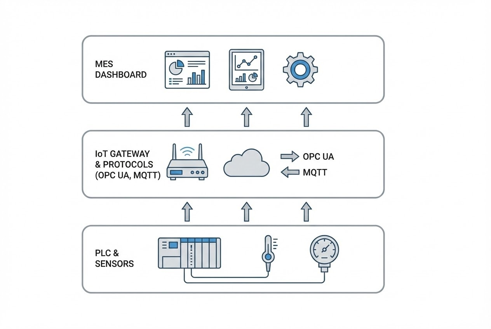

# Intro: MES ราคาหลักล้าน จะไร้ค่า...ถ้าข้อมูลยังมาจาก "กระดาษ"

คุณมีระบบ MES (Manufacturing Execution System) ที่หน้าตาสวยงาม มีฟังก์ชันครบครัน แต่พนักงานหน้าไลน์ผลิตยังต้องเดินจดเลขมิเตอร์ หรือคีย์ยอดผลิตใส่คอมพิวเตอร์ทุกชั่วโมงอยู่หรือเปล่า? ถ้าใช่... คุณกำลังขับรถสปอร์ตแต่ใช้เชื้อเพลิงถ่านหินครับ

หัวใจของ **Smart Factory** ไม่ใช่แค่ซอฟต์แวร์ แต่คือ **"ข้อมูลที่ถูกต้อง 100% (Data Integrity)"** และข้อมูลที่แม่นยำที่สุดต้องไม่ผ่านมือคน แต่ต้องมาจาก "เครื่องจักร" โดยตรง บทความนี้จะพาคุณเจาะลึกเทคนิคการสร้าง "สะพาน" เชื่อมต่อระหว่างเครื่องจักร (Layer 1-2) ขึ้นสู่ระบบ MES (Layer 3)

## 1. The Gap: ช่องว่างระหว่าง OT และ IT

ตามมาตรฐาน **ISA-95** เรามีกำแพงกั้นกลางระหว่าง 2 โลก:
* **โลก OT (Operational Technology):** คือโลกของเครื่องจักร, Sensor, และ PLC ที่คุยกันเป็น Millisecond เน้นความเสถียร
* **โลก IT (Information Technology):** คือโลกของ MES และ ERP ที่คุยกันเรื่อง Database, API และ Business Logic

ความท้าทายคือเครื่องจักรพูดภาษาไฟฟ้า (เช่น 4-20mA หรือ Register Address) แต่ MES พูดภาษาข้อมูล (เช่น JSON, SQL) เราจึงต้องมี "ล่าม" หรือโปรโตคอลมาตรฐานมาช่วยครับ

## 2. Protocol Wars: เลือกภาษาไหนไปคุยกับเครื่องจักรดี?

ในวงการอุตสาหกรรม มี 3 โปรโตคอลยอดฮิตที่ใช้ดึงข้อมูลขึ้น MES:

### A. Modbus TCP (The Grandfather)
* **ลักษณะ:** ใช้ระบบ Register Address (เช่น 40001 = Temperature)
* **ข้อดี:** ง่าย, เครื่องจักรเกือบทุกรุ่นรองรับ
* **ข้อเสีย:** ไม่บอกบริบท (Context) ได้มาแค่ตัวเลขดิบๆ และความปลอดภัยต่ำ

### B. OPC UA (The Modern Standard)
* **ลักษณะ:** มาตรฐานทองคำของ Industry 4.0
* **จุดเด่น:** **Self-Describing** ข้อมูลมาพร้อมบริบท (บอกชื่อค่า, หน่วย, สถานะ) และมีความปลอดภัยสูง (Encryption) ในตัว

### C. MQTT (The IoT Speedster)
* **ลักษณะ:** แบบ Publish/Subscribe ที่เบาและเร็วมาก
* **จุดเด่น:** กิน Bandwidth น้อย เหมาะกับอุปกรณ์จำนวนมาก หรือการส่งข้อมูลขึ้น Cloud MES

## 3. The Architecture: วางระบบอย่างไรให้เวิร์ค?

### Case 1: เครื่องจักรใหม่ (Smart Machine)
เครื่องจักรที่มี PLC รุ่นใหม่ (เช่น Siemens S7-1500, Mitsubishi iQ-R) มักจะมี **OPC UA Server** ฝังมาในตัว เราสามารถให้ MES ต่อสาย LAN เข้าไปดึงค่า Status, Cycle Time, หรือ Alarm Code ได้ทันที

### Case 2: เครื่องจักรเก่า (Legacy Machine / Retrofit)
เครื่องจักรยุค 90 ที่ไม่มี Port LAN เราจะใช้วิธี **"Retrofit"** ผ่าน **IIoT Gateway**:
1.  **Hardwire:** จั๊มสายจาก Tower Light หรือ Relay เข้า IO Module
2.  **Conversion:** Gateway แปลงสัญญาณไฟฟ้าเป็น Digital แล้วส่งต่อด้วย MQTT/OPC UA
3.  **Sensor Overlay:** ติด Sensor แยก (เช่น วัดการสั่นสะเทือน) โดยไม่ยุ่งกับระบบเดิม

## 4. Why Real-time? (ทำไมต้องลงทุนทำขนาดนี้)

* **Eliminate Human Error:** ตัดปัญหาพนักงานจดเลขผิด หรือเมคตัวเลข
* **Micro-Stops Detection:** MES จับการหยุดเครื่องได้ทุกวินาที แม้เพียง 30 วินาทีที่คนมักมองข้าม
* **Faster Response:** เมื่อเครื่อง Alarm ข้อมูลจะแจ้งเตือนช่างผ่าน Line ทันที (Real-time Alert)

> **Pro Tip จากหน้างาน:**
> การเชื่อมต่อที่ดีไม่ควรไปรบกวน Scan Time ของ PLC เดิม แนะนำให้ใช้การอ่านแบบ Read-Only หรือแยก Network ระหว่างเครื่องจักรและระบบ IT ออกจากกันด้วย VLAN เพื่อความปลอดภัย

# สรุป
การเชื่อมต่อเครื่องจักรคือ "กระดูกสันหลัง" ของโรงงานอัจฉริยะ หากปราศจากข้อมูลอัตโนมัติ MES ก็เป็นได้แค่สมุดจดบันทึกราคาแพง ไม่ว่าเครื่องจักรจะเก่าหรือใหม่ เรามีโซลูชันที่ดึงข้อมูลออกมาได้เสมอ

---

**ติดปัญหาเรื่องการเชื่อมต่อเครื่องจักร หรือต้องการทำ Data Architecture?**
พูดคุยกับทีมวิศวกรของเราได้ที่ Line: **wisit.p**
