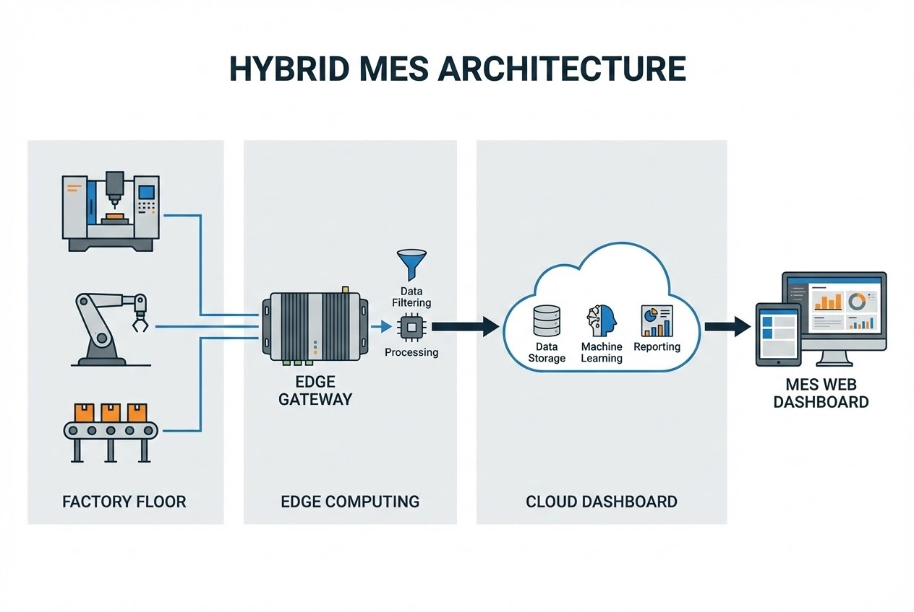

# ทางแยกที่ผู้บริหารต้องเลือก

เมื่อตัดสินใจจะทำระบบ Smart Factory หรือติดตั้ง **MES (Manufacturing Execution System)** คำถามแรกๆ ที่ฝ่าย IT และเจ้าของกิจการต้องถกเถียงกันคือ *"เราควรตั้ง Server เองในโรงงาน (On-Premise) หรือเอาข้อมูลขึ้น Cloud ดี?"*

ในอดีต ระบบ MES มักจะเป็นแบบ On-Premise ทั้งหมด แต่ด้วยเทคโนโลยี IIoT และ Internet ที่เร็วขึ้น Cloud MES จึงกลายเป็นทางเลือกที่มาแรง บทความนี้ในฐานะที่ปรึกษาด้าน Industrial Tech จะพาคุณไปกางตารางเปรียบเทียบกันใน 4 มิติสำคัญครับ

## Round 1: Cost (เรื่องเงินๆ ทองๆ)

ความแตกต่างที่ชัดเจนที่สุดคือรูปแบบการจ่ายเงิน (Business Model):

* **On-Premise (จ่ายก้อนใหญ่):** ลงทุนแบบ **CAPEX** จ่ายเงินก้อนโตเพื่อซื้อ Hardware (Server), License ต่างๆ และค่า Software แบบซื้อขาด เหมาะกับโรงงานที่มีงบประมาณก้อนใหญ่และต้องการตัดค่าเสื่อมราคา
* **Cloud (จ่ายตามจริง):** รูปแบบ **Subscription (SaaS)** หรือ **OPEX** จ่ายรายเดือน/รายปีตามการใช้งานจริง ไม่ต้องลงทุน Hardware แพงๆ ช่วยลดความเสี่ยงในช่วงเริ่มต้น

> **คำแนะนำ:** หากคุณกำลังทำโครงการนำร่อง (Pilot Project) หรือเป็น SME -> **Cloud** ตอบโจทย์กว่า แต่ถ้าเป็นโรงงานขนาดใหญ่ที่มี Data Center เดิมอยู่แล้ว -> **On-Premise** อาจคุ้มค่ากว่าในระยะยาว

## Round 2: Maintenance (ภาระการดูแลรักษา)

* **On-Premise:** "คุณคือเจ้าของ คุณต้องดูแลเอง" ทีม IT ต้องคอยอัปเดต Patch, ดูแลระบบระบายความร้อน, และทำ Backup เองทั้งหมด
* **Cloud:** "ผู้ให้บริการดูแลให้" ไม่ว่าจะเป็น AWS, Azure หรือ Vendor จะดูแลเรื่องความปลอดภัยและการอัปเดตเวอร์ชันให้อัตโนมัติ ทีมงานโรงงานมีหน้าที่แค่ "ใช้งาน"

## Round 3: Latency & Stability (ความเร็วและความเสถียร)

นี่คือจุดตายที่โรงงานต้องระวังที่สุด:

* **On-Premise:** ชนะขาดเรื่องความเร็ว (Latency) เพราะ Server อยู่ในวง LAN เดียวกัน การส่งคำสั่งหยุดเครื่องจักรหรือเก็บค่าระดับ Millisecond ทำได้เสถียรกว่ามาก ไม่ต้องกลัวเน็ตล่ม
* **Cloud:** ต้องพึ่งพาอินเทอร์เน็ต แม้จะเร็วแค่ไหนก็ยังมีความหน่วง (Latency) การส่งข้อมูล Real-time ระดับวินาทีขึ้น Cloud อาจเกิดความล่าช้าได้ในบางจังหวะ

## Round 4: Security (ความปลอดภัยของข้อมูล)

* **On-Premise:** ให้ความรู้สึกอุ่นใจเพราะข้อมูลอยู่ในรั้วโรงงาน (Physical Control) เหมาะกับอุตสาหกรรมที่หวงสูตรการผลิต แต่ต้องระวังเรื่อง Ransomware หากระบบ Security ภายในไม่แข็งแรงพอ
* **Cloud:** มีมาตรฐาน Cybersecurity ระดับโลก (Encryption/Authentication) ที่สูงกว่ามาตรฐาน IT โรงงานทั่วไป แต่ความกังวลมักอยู่ที่ข้อกฎหมายด้าน Data Privacy

---

## The Hybrid Solution: ทางสายกลางที่ลงตัวที่สุด

สำหรับโรงงานยุคใหม่ เรามักแนะนำ **Hybrid Architecture** โดยใช้ **Edge Computing** เข้ามาช่วย:

1.  **หน้างาน (Edge/On-Prem):** ติดตั้ง Edge Gateway ไว้หน้างานเพื่อเก็บข้อมูลจาก PLC และประมวลผลคำสั่งที่ต้องการความไวสูง เพื่อให้ไลน์ผลิตไม่สะดุดแม้เน็ตตัด
2.  **ส่วนกลาง (Cloud):** ส่งเฉพาะข้อมูลสรุป (Summary Data) ขึ้น Cloud เพื่อให้ผู้บริหารดู Dashboard ผ่านมือถือได้จากทุกที่

## บทสรุป: Checklist ตัดสินใจ

**เลือก On-Premise ถ้า...**
* ✅ อินเทอร์เน็ตในพื้นที่ไม่เสถียร
* ✅ มีกฎข้อบังคับห้ามนำข้อมูลออกนอกโรงงานเคร่งครัด
* ✅ ต้องควบคุมเครื่องจักรแบบ Real-time (Low Latency)

**เลือก Cloud ถ้า...**
* ✅ ต้องการเริ่มเร็ว งบลงทุนก้อนแรกจำกัด
* ✅ ต้องการดู Dashboard จากนอกโรงงานได้ง่ายๆ
* ✅ ไม่มีทีม IT เฉพาะทางสำหรับดูแล Server

---

**เลือกไม่ถูก? หรืออยากออกแบบระบบ Hybrid?**
ปรึกษา **WP Solution** เรามีทีมผู้เชี่ยวชาญพร้อมวิเคราะห์โครงสร้างพื้นฐานเดิมของคุณ และออกแบบ System Architecture ที่เหมาะสมที่สุด เพื่อให้โรงงานของคุณเสถียรและคุ้มค่าที่สุด
ติดต่อเรา: **wisit.paewkratok@gmail.com** | Line: **wisit.p**