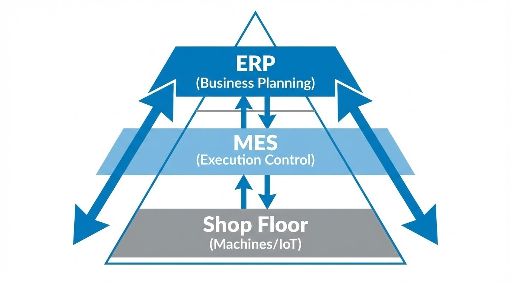

# บทนำ: ลงทุน ERP ไปหลายล้าน ทำไมหน้างานยังวุ่นวาย?

เคยสงสัยไหมครับ? โรงงานหลายแห่งลงทุนระบบ ERP (Enterprise Resource Planning) ราคาแพงไประดับสิบล้าน แต่ทำไมผู้จัดการโรงงานยังต้องวิ่งวุ่นแก้ปัญหาหน้างาน? ทำไมยอดสต็อกในคอมพิวเตอร์กับของจริงไม่เคยตรงกัน? และทำไมฝ่ายผลิตยังต้องนั่งกรอกข้อมูลลงกระดาษทุกจบกะ?

คำตอบสั้นๆ ที่ผมมักจะบอกลูกค้าเสมอคือ **"ERP คือแผนที่ แต่ MES คือเข็มทิศหน้างาน"**

ในบทความนี้ เราจะมาไขข้อข้องใจตามมาตรฐานสากลว่า ทำไมลำพังแค่ ERP ถึงไม่เพียงพอสำหรับโรงงานที่ต้องการก้าวสู่การเป็น **Smart Factory** อย่างเต็มตัว

---

## 1. ใครเป็นใครในโครงสร้างโรงงาน? (Understanding ISA-95)

เพื่อให้เห็นภาพชัดเจน เราต้องเข้าใจบทบาทของทั้งสองระบบตามมาตรฐาน **ISA-95** ซึ่งเป็นหัวใจของการวางระบบ Industrial Automation ครับ

### 🔵 ERP: นักวางแผนระดับองค์กร (Level 4)
ERP คือ "สมองส่วนบริหาร" เน้นภาพรวมธุรกิจ เช่น การเงิน, บัญชี, การจัดซื้อ และการรับออเดอร์
* **โจทย์ของ ERP:** "เดือนหน้าต้องซื้อวัตถุดิบเท่าไหร่?", "ต้นทุนการผลิตไตรมาสนี้เป็นอย่างไร?"
* **กรอบเวลา:** มองเป็น รายเดือน / รายสัปดาห์ / รายวัน (Batch Processing)

### 🟢 MES: ผู้คุมกฎหน้างานผลิต (Level 3)
MES (Manufacturing Execution System) คือ "ระบบปฏิบัติการหน้างาน" ที่อยู่ตรงกลางระหว่าง ERP กับเครื่องจักร (PLC/Sensors)
* **โจทย์ของ MES:** "ตอนนี้เครื่องจักรตัวไหนว่าง?", "ออเดอร์ #789 ผลิตถึงขั้นตอนไหนแล้ว?", "ทำไม OEE ของกะนี้ถึงตก?"
* **กรอบเวลา:** **Real-time** (วินาที / นาที)

---

## 2. The Missing Gap: ช่องว่างที่ ERP มองไม่เห็น

หลายคนเข้าใจผิดว่า "ใน ERP ก็มีโมดูล Production นี่นา ทำไมต้องซื้อ MES เพิ่ม?" 

ในฐานะ System Architect ผมขอสรุปความต่างให้เห็นภาพชัดๆ ดังนี้ครับ:

| หัวข้อเปรียบเทียบ | ERP (ระบบบริหาร) | MES (ระบบผลิต) |
| :--- | :--- | :--- |
| **เป้าหมายหลัก** | วางแผนทรัพยากรและการเงิน | ควบคุมประสิทธิภาพการผลิตจริง |
| **ความถี่ข้อมูล** | อัปเดตรายวัน/รายกะ (Batch) | อัปเดตทันที (Real-Time) |
| **ความละเอียด** | ระดับออเดอร์ / ภาพรวม | ระดับชิ้นงาน / สถานะเครื่องจักร |
| **การเชื่อมต่อ** | คนคีย์ข้อมูล (Manual Input) | เชื่อมต่อเครื่องจักร/IoT โดยตรง |
| **ผู้ใช้งานหลัก** | บัญชี, จัดซื้อ, ผู้บริหาร | ฝ่ายผลิต, QC, Maintenance |

> **Pro Tip จากหน้างาน:**
> จุดตายของ ERP คือมันไม่ได้ถูกออกแบบมาให้คุยกับเครื่องจักรโดยตรง ERP จะรู้ว่าเกิดปัญหาขึ้นก็ต่อเมื่อ "จบวัน" แล้วมีคนคีย์ข้อมูลลงไป ซึ่งตอนนั้นของเสีย (Scrap) อาจจะเต็มโรงงานไปแล้วครับ

---

## 3. ทำไมต้องใช้คู่กัน? (The Power of Integration)

การใช้ ERP ร่วมกับ MES คือสูตรสำเร็จของโรงงานยุค 4.0 โดยทำงานเกื้อหนุนกันแบบ Bi-directional ดังนี้:

1.  **ERP ส่งโจทย์ (Downstream):** ส่งใบสั่งผลิต (Work Order) และรายการวัตถุดิบ (BOM) ลงมาให้ MES
2.  **MES ลงมือทำ (Execution):** รับคำสั่งมาแตกเป็นแผนรายนาที จ่ายงานให้เครื่องจักรผ่านโปรโตคอลอย่าง MQTT หรือ OPC UA และควบคุมคุณภาพหน้างานทันที
3.  **MES รายงานผล (Upstream):** ส่งยอดผลิตจริง (Actual Consumption) และข้อมูลของเสียกลับไปให้ ERP เพื่อคำนวณต้นทุนให้แม่นยำ 100%

---

## สรุป: ขาดตัวใดตัวหนึ่งได้ไหม?

* **มีแต่ ERP:** โรงงานของคุณจะเป็น "กล่องดำ" (Black Box) คุณรู้ยอดเงินแต่ไม่รู้ประสิทธิภาพจริงหน้างาน
* **มีแต่ MES:** คุณผลิตเก่งมาก แต่ขาดการเชื่อมโยงกับฝ่ายจัดซื้อและบัญชี ทำให้จัดการกระแสเงินสดและสต็อกได้ยาก

หากโรงงานของคุณต้องการความแม่นยำระดับ Real-time, ต้องการลดของเสีย (Scrap), หรือต้องการทำระบบตรวจสอบย้อนกลับ (Traceability) การมี **MES เข้ามาเสริมทัพ ERP คือ "ความจำเป็น" ไม่ใช่ทางเลือกอีกต่อไปครับ**

ในบทความหน้า เราจะเจาะลึกกันว่า **"4 หัวใจสำคัญของ MES"** ที่จะช่วยให้โรงงานคุณลดต้นทุนได้จริง มีอะไรบ้าง รอติดตามนะครับ!

---

**ต้องการที่ปรึกษาการวางระบบ MES หรือเชื่อมต่อ ERP เข้ากับเครื่องจักร?**
พูดคุยกับทีม Engineer ของเราได้ที่ Line: [wisit.p](https://line.me/ti/p/~wisit.p) หรือ Email: wisit.paewkratok@gmail.com