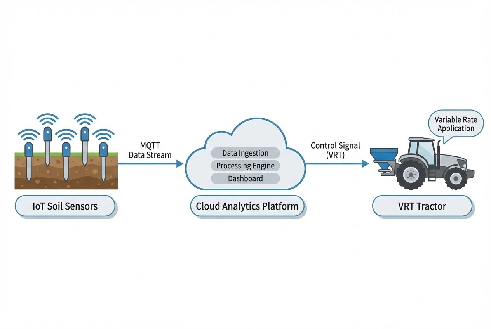

# บทนำ
การทำเกษตรแบบดั้งเดิมมักอาศัย "ความรู้สึก" (Intuition) และประสบการณ์ที่ส่งต่อกันมาในการตัดสินใจดูแลพืชผล ซึ่งนำไปสู่วิธีการจัดการแบบ "เหมาเข่ง" หรือการให้ปุ๋ย ให้น้ำ และฉีดพ่นยาฆ่าแมลงในปริมาณที่เท่ากันทั่วทั้งแปลงปลูก ทว่าในความเป็นจริง สภาพดินและความสมบูรณ์ของพืชในแต่ละจุดนั้นมีความแตกต่างกันอย่างสิ้นเชิง การจัดการแบบเดิมจึงทำให้เกิดปัญหาต้นทุนบานปลายจากการใช้ทรัพยากรเกินความจำเป็น (Over-application) และยังก่อให้เกิดปัญหาสารเคมีตกค้างที่ส่งผลกระทบต่อสิ่งแวดล้อม

ในยุคที่ธุรกิจการเกษตรต้องเผชิญกับความท้าทายทั้งด้านต้นทุนที่สูงขึ้น สภาพอากาศที่แปรปรวน และปัญหาขาดแคลนแรงงาน แนวคิด **"ฟาร์มแม่นยำ (Precision Agriculture)"** หรือการทำเกษตรแบบเจาะจงด้วยข้อมูล (Data-Driven Farming) จึงกลายมาเป็นทางรอดสำคัญ โดยมีหัวใจหลักคือการ *"ทำในสิ่งที่ถูกต้อง ในตำแหน่งที่ถูกต้อง และในเวลาที่เหมาะสม"* ผ่านการขับเคลื่อนด้วยเทคโนโลยีขั้นสูง

## ทฤษฎีและองค์ประกอบหลัก (Core Concepts)

### Data-Driven Farming: เปลี่ยนความรู้สึก เป็นการตัดสินใจด้วยข้อมูล
การทำเกษตรที่ขับเคลื่อนด้วยข้อมูล คือการยกระดับฟาร์มให้สามารถปรับแต่งการดูแลพืชผลได้ลึกถึงระดับพื้นที่ย่อย (Site-specific crop management) โดยอาศัยเทคโนโลยีหลัก 3 ส่วน ได้แก่:

1. **เซนเซอร์ IoT ในแปลงปลูก (IoT Field Sensors):** อุปกรณ์ IoT จะถูกติดตั้งกระจายทั่วแปลงเกษตรเพื่อตรวจวัดข้อมูลแบบเรียลไทม์ เช่น ความชื้นในดิน อุณหภูมิ และระดับธาตุอาหาร (NPK) ทำให้ทราบได้ทันทีว่าพืชจุดไหนกำลังขาดน้ำ หรือเสี่ยงต่อการเกิดโรค
2. **ระบบสารสนเทศภูมิศาสตร์และดาวเทียม (GIS & GPS):** เทคโนโลยี GIS ช่วยสร้างแผนที่แปลงปลูกความละเอียดสูง ซ้อนทับข้อมูลชนิดของดินและความชื้น เมื่อทำงานร่วมกับ GPS บนรถแทรกเตอร์หรือโดรน จะทำให้เครื่องจักรระบุพิกัดได้อย่างแม่นยำ
3. **การวิเคราะห์ข้อมูลขนาดใหญ่ (Big Data Analytics):** ข้อมูลมหาศาลจากเซนเซอร์และภาพถ่ายดาวเทียมจะถูกนำมาประมวลผลด้วย AI และ Machine Learning เพื่อสร้างโมเดลพยากรณ์ผลผลิต และแนะนำช่วงเวลาเก็บเกี่ยวที่เหมาะสมที่สุด



### เทคโนโลยีแบบแปรผัน (Variable Rate Technology - VRT)
Pain point ใหญ่ของเกษตรกรคือค่าปุ๋ยและสารเคมี นวัตกรรมที่จะเข้ามาแก้ปัญหานี้คือ **VRT** ซึ่งเป็นระบบที่ทำงานร่วมกับแผนที่ความต้องการสั่งจ่าย (Prescription Maps) เพื่อสั่งการให้เครื่องจักรหรือระบบชลประทาน ปรับอัตราการปล่อยเมล็ดพันธุ์ ปุ๋ย หรือยาฆ่าแมลง แบบอัตโนมัติตามความต้องการของพื้นที่ในแต่ละตารางเมตร

> องค์การอาหารและเกษตรแห่งสหประชาชาติ (FAO) ระบุว่า การทำฟาร์มแม่นยำสามารถเพิ่มผลผลิตได้ 15-20% ในขณะที่ช่วยลดต้นทุนปัจจัยการผลิตลงได้สูงสุดถึง 30%

## รูปแบบข้อมูลในมุมมอง System Architecture (Code Snippet)
เพื่อให้เห็นภาพการทำงานเบื้องหลังระบบ Precision Agriculture นี่คือตัวอย่างรูปแบบข้อมูล (Data Payload) ที่ Edge Node (เช่น NodeMCU/ESP32) ตามจุดต่างๆ ในฟาร์ม อ่านค่าจากเซนเซอร์และส่งเข้าสู่ระบบ Centralized Server ผ่านโปรโตคอล **MQTT** ก่อนนำไปวิเคราะห์เพื่อสั่งการ VRT:

```json
// ตัวอย่าง MQTT Payload จาก IoT Sensor ในแปลงปลูก (Topic: farm/zone-A/soil-node-01)
{
  "device_id": "SN-A-001",
  "timestamp": "2024-08-15T08:30:00Z",
  "location": {
    "lat": 14.8821,
    "lng": 102.0215
  },
  "sensors": {
    "soil_moisture_percent": 24.5,
    "soil_temperature_c": 28.2,
    "npk_levels": {
      "nitrogen": 45,
      "phosphorus": 20,
      "potassium": 30
    }
  },
  "status": "active"
}

```

*ระบบ Backend (เช่น Node.js) จะ Subscribe ข้อมูลชุดนี้ บันทึกลง Database และหากค่า `soil_moisture_percent` ต่ำกว่าเกณฑ์ในพิกัดนั้น ระบบจะส่ง Command กลับไปเปิดโซลินอยด์วาล์วน้ำเฉพาะโซน A ทันที*

## ตัวอย่างการใช้งานจริง (Global Use Cases)

* 🌾 **ฟาร์มข้าวอัจฉริยะในประเทศไทย:** นำเทคโนโลยีเซนเซอร์ IoT โดรน และภาพถ่ายดาวเทียมมาใช้ประเมินแปลงนาข้าว เพื่อเพิ่มประสิทธิภาพการใช้น้ำและการให้ปุ๋ย ผลลัพธ์คือลดปริมาณการใช้น้ำลงได้อย่างมหาศาล พร้อมเพิ่มผลผลิตข้าวได้อย่างเป็นรูปธรรม
* 🍇 **การจัดการไร่องุ่นด้วยความแม่นยำสูงในออสเตรเลีย:** ไร่องุ่นใช้เซนเซอร์ตรวจวัดความชื้นในดินและสภาพภูมิอากาศ วิเคราะห์หาจุดคุ้มทุนในการให้น้ำและจังหวะเวลาเก็บเกี่ยวที่สมบูรณ์แบบที่สุด ช่วยเพิ่มคุณภาพไวน์ ลดการใช้น้ำ และดันกำไรให้สูงขึ้น
* 🚜 **ระบบจ่ายปุ๋ยแม่นยำ Vodafone (VPFA):** โซลูชันที่ผสาน GPS เข้ากับรถแทรกเตอร์พ่นปุ๋ย ทำงานผ่านเครือข่าย M2M ให้เกษตรกรติดตามและปรับลดอัตราการพ่นได้อย่างแม่นยำตามความต้องการจริงของพืช สกัดกั้นปัญหาการใช้ปุ๋ยสิ้นเปลือง

> **Pro Tip / ข้อควรระวังจากหน้างาน:**
> ในการพัฒนาระบบฟาร์มแม่นยำ ปัญหาที่พบบ่อยที่สุดคือ **"ความเสถียรของ Network"** ในพื้นที่เปิดโล่งกว้าง การใช้ Wi-Fi มักไม่ตอบโจทย์ ควรพิจารณาใช้สถาปัตยกรรมเครือข่ายแบบ **LoRaWAN** หรือ **NB-IoT** สำหรับ Sensor Node ที่กระจายตัวอยู่ไกลๆ และออกแบบให้ Edge Node สามารถเก็บข้อมูลชั่วคราว (Data Logging) ไว้ในตัวได้กรณีที่สัญญาณขาดหาย เพื่อไม่ให้ข้อมูลสูญหาย

## สรุป

การทำฟาร์มแม่นยำ (Precision Agriculture) ไม่ใช่แค่เทรนด์ทางเทคโนโลยี แต่เป็นยุทธศาสตร์ทางธุรกิจที่สำคัญในการเปลี่ยนผ่านจากเกษตรกรรมแบบดั้งเดิมที่คาดเดาไม่ได้ สู่การทำฟาร์มยุค 4.0 ที่ควบคุมได้ด้วย Data การผสาน IoT, GIS และระบบ VRT เข้าด้วยกัน ช่วยให้ธุรกิจเกษตรสามารถลดต้นทุน เพิ่มผลผลิต ป้องกันความเสี่ยง และสร้างความยั่งยืนไปพร้อมๆ กัน

---

**ต้องการที่ปรึกษาด้าน Precision Agriculture & Smart Farming?**
หากธุรกิจฟาร์มของคุณกำลังมองหาผู้เชี่ยวชาญในการออกแบบระบบ IoT, การจัดการ Data Analytics หรือ System Integration แบบครบวงจร
พูดคุยกับทีมวิศวกรของ WP Solution ได้ที่: wisit.paewkratok@gmail.com | Line: wisit.p