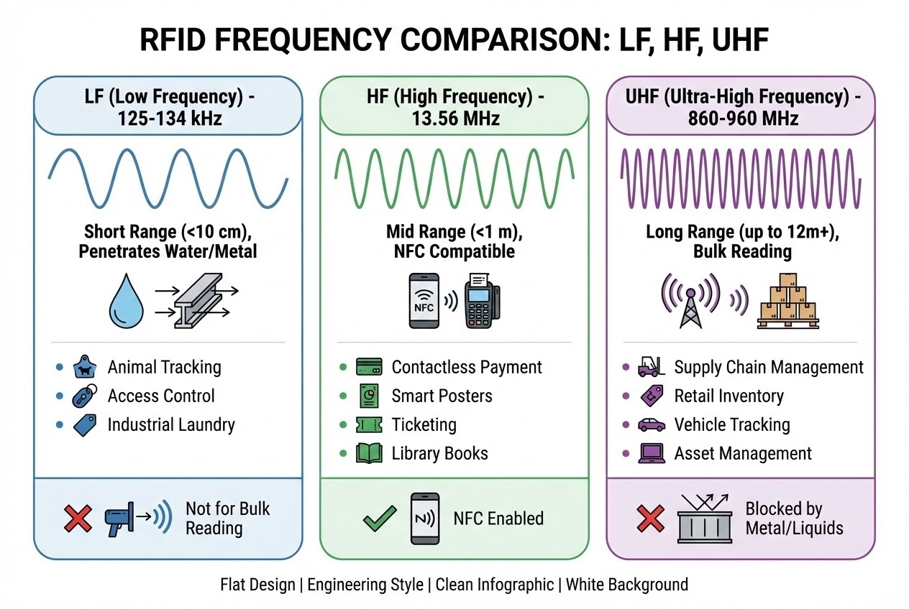

# บทนำ
คุณเคยสงสัยไหมครับว่า ทำไมคีย์การ์ดเข้าห้องพักโรงแรมถึงต้องนำไปแตะใกล้ๆ ประตูถึงจะทำงานได้ แต่ระบบจัดการคลังสินค้ายุคใหม่กลับสามารถสแกนกล่องสินค้าบนรถโฟล์คลิฟต์ทั้งพาเลทได้ทันทีจากระยะไกล? 

ความลับที่อยู่เบื้องหลังความสามารถที่แตกต่างกันอย่างสุดขั้วนี้ คือเรื่องของ **"ประเภทคลื่นความถี่วิทยุ"** ในโลกของ RFID การเลือกลงทุนฮาร์ดแวร์อาจกลายเป็นการตำน้ำพริกละลายแม่น้ำทันที หากคุณเลือกใช้คลื่นความถี่ที่ไม่สอดคล้องกับสภาพแวดล้อมทางกายภาพ วันนี้เราจะมาเจาะลึก 3 คลื่นความถี่หลักกันครับ

---

## ทฤษฎีที่เกี่ยวข้อง (Concept): 3 คลื่นความถี่หลัก



### 1. คลื่นความถี่ต่ำ (LF - Low Frequency): ปรมาจารย์ด้านทะลุทะลวงอุปสรรค
* **ย่านความถี่:** 125 kHz ถึง 134.2 kHz
* **ลักษณะเด่น:** ระยะการอ่านสั้นมาก (ไม่กี่เซนติเมตร) อาศัยการเหนี่ยวนำของสนามแม่เหล็ก
* **จุดแข็งทางฟิสิกส์:** ในขณะที่คลื่นความถี่สูงมักมีปัญหากับน้ำหรือโลหะ คลื่น LF กลับเจาะทะลุผ่านวัสดุที่เป็นอุปสรรคได้อย่างมีประสิทธิภาพ
* **การใช้งาน:** ฝังไมโครชิปในสัตว์เลี้ยง, คีย์การ์ดเข้าออกอาคาร, ระบบ Immobilizer ในรถยนต์

> *"แท็กเหล่านี้สามารถอ่านได้แม้จะติดอยู่กับวัตถุที่มีส่วนประกอบของน้ำ เนื้อเยื่อของสัตว์ โลหะ ไม้ และของเหลว พวกมันเหมาะสมอย่างยิ่งสำหรับการใช้งานในระยะประชิด"*

### 2. คลื่นความถี่สูง (HF - High Frequency): ผู้คุมกฎความปลอดภัยและ NFC
* **ย่านความถี่:** 13.56 MHz
* **ลักษณะเด่น:** ระยะการอ่านสูงสุดประมาณ 1 เมตร ถ่ายโอนข้อมูลได้เร็วกว่า LF และรองรับชิปที่มีหน่วยความจำใหญ่กว่า
* **จุดแข็งทางฟิสิกส์:** เป็นรากฐานของเทคโนโลยี NFC (Near Field Communication) ทำงานรอบวัตถุของเหลวได้ดีกว่า UHF 
* **การใช้งาน:** แตะจ่ายเงินสมาร์ทโฟน, สมาร์ทการ์ด, หนังสือห้องสมุด, พาสปอร์ต, ติดตามยาในเวชภัณฑ์

### 3. คลื่นความถี่สูงพิเศษ (UHF - Ultra-High Frequency): ซูเปอร์สตาร์แห่งซัพพลายเชน 4.0
* **ย่านความถี่:** 860 ถึง 960 MHz (แบบ Passive)
* **ลักษณะเด่น:** ระยะการอ่านไกลมาก 10 - 25 เมตร ส่งข้อมูลรวดเร็ว และอ่านแท็กพร้อมกันได้หลายร้อยชิ้น (Bulk reading)
* **จุดอ่อนทางฟิสิกส์:** ถูกดูดซับโดย **"น้ำ"** ได้ง่าย และเกิดการสะท้อนเมื่อเจอ **"โลหะ"**
* **การใช้งาน:** ระบบจัดการคลังสินค้า (WMS), สายพานโลจิสติกส์แบบ Non-line-of-sight

---

## สิ่งที่ต้องเตรียม (Prerequisites)
หากคุณกำลังจะพัฒนาระบบ Smart Warehouse ด้วยเทคโนโลยี UHF
1. **Hardware:** UHF RFID Reader (เช่น Impinj, Zebra) และเสาอากาศแบบ Circular Polarized เพื่อกวาดอ่านแท็กได้หลายทิศทาง
2. **Software:** C# (.NET) หรือ Node.js สำหรับเชื่อมต่อผ่าน LLRP Protocol หรือ TCP/IP API ของเครื่องอ่าน
3. **Tags:** เลือกแท็กให้ตรงกับ Product (หากสินค้าเป็นโลหะ ต้องใช้ Anti-metal tag)

---

## ขั้นตอนการทำงาน (Step-by-Step)

ในสภาพแวดล้อมคลังสินค้าที่ใช้คลื่น UHF การตั้งค่าเครื่องอ่านเพื่อทำ Bulk Reading ถือเป็นหัวใจสำคัญ เราต้องคอยจัดการไม่ให้เกิดการอ่านซ้ำซ้อนจนล้นระบบ (Buffer Overflow)

```csharp
// Code ตัวอย่าง (C#): การตั้งค่า UHF Reader สำหรับการอ่านพาเลทสินค้าแบบ Bulk Reading
public void StartWarehouseInventory(string readerIpAddress) {
    UHFReader reader = new UHFReader();
    reader.Connect(readerIpAddress);

    // 1. ตั้งค่า Session เพื่อป้องกันการอ่านแท็กเดิมซ้ำๆ (ลดภาระ Network)
    // Session 1: แท็กที่ถูกอ่านแล้วจะเปลี่ยนสถานะ และจะไม่ตอบกลับชั่วคราว
    reader.SetSession(Session.Session1); 

    // 2. ตั้งค่าการค้นหาแท็กแบบคู่ (Dual Target: A และ B) เพื่อกวาดให้เกลี้ยง
    reader.SetSearchMode(SearchMode.DualTarget);

    // 3. ปรับกำลังส่ง (Tx Power) ให้เหมาะสมกับระยะประตู Gate
    reader.SetTxPower(30.0); // 30 dBm สำหรับระยะไกล (ระวังคลื่นทะลุกำแพงไปอ่านห้องอื่น)

    // เริ่มสแกน
    reader.TagsReported += OnPalletScanned;
    reader.StartInventory();
}

private void OnPalletScanned(object sender, TagReportEventArgs e) {
    Console.WriteLine($"[UHF] Scanned {e.Tags.Count} tags simultaneously on the forklift!");
}

```

> **Pro Tip / ข้อควรระวัง:**
> ปัญหาคลาสสิกของคนทำระบบคลังสินค้าคือ **"การสะท้อนคลื่น" (Multipath Reflection)** เมื่อคลื่น UHF ไปตกกระทบชั้นวางเหล็ก (Rack) คลื่นจะชิ่งไปมา ทำให้คุณอาจจะไปอ่านแท็กของพาเลทที่วางอยู่ข้างหลังติดมาด้วย วิธีแก้คือการปรับองศาเสาอากาศให้คว่ำลงเล็กน้อย และทำ Software Filtering ค่า RSSI

---

## สรุป

การเลือกใช้คลื่นความถี่ RFID ก็เหมือนกับการเลือกยานพาหนะให้เหมาะกับสภาพเส้นทาง ไม่มีคลื่นความถี่ใดที่ "ดีที่สุดในทุกสถานการณ์"

* ต้องการทะลุทะลวงระยะประชิด ➡️ **LF**
* เน้นความปลอดภัยและ NFC ➡️ **HF**
* เน้นอ่านทีละเยอะๆ ไกลๆ ในโกดัง ➡️ **UHF**

ลองกลับไปมองธุรกิจของคุณดูสิครับว่า มี "ตัวการร้าย" อย่างน้ำหรือโลหะซ่อนอยู่ตรงไหน ที่อาจทำให้ระบบ RFID ของคุณทำงานได้ไม่เต็มประสิทธิภาพบ้าง?

---

**ติดปัญหาเรื่องการออกแบบ System Architecture หรือต้องการทีมช่วยปรับจูน RFID Reader?**
พูดคุยกับทีม Engineer ของเราได้ที่ Line: [wisit.p](https://line.me/ti/p/~wisit.p)