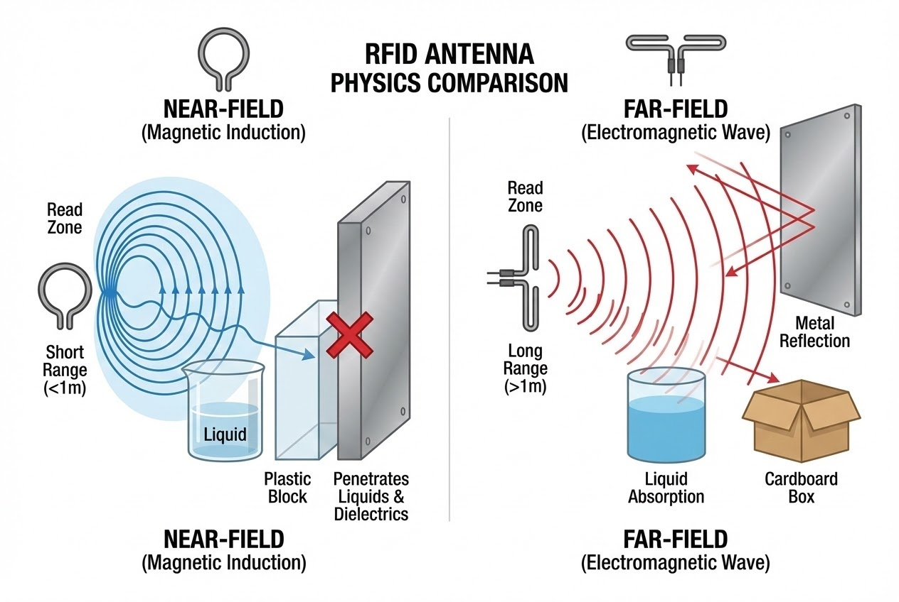

# บทนำ
คุณเคยลงทุนติดตั้งระบบ RFID โดยคาดหวังผลลัพธ์ที่รวดเร็วและแม่นยำ แต่กลับพบปัญหาเครื่องอ่านดึงข้อมูลแท็กสินค้าจากห้องข้างๆ มาด้วย (Stray Reads) หรือสแกนสินค้าประเภทของเหลวและโลหะไม่ติดเลยหรือไม่? 

ปัญหาชวนปวดหัวเหล่านี้มักไม่ได้เกิดจากตัวเครื่องอ่าน (Reader) หรือซอฟต์แวร์ แต่เกิดจากการเลือก **"เสาอากาศ" (Antenna)** ที่ไม่สัมพันธ์กับหลักฟิสิกส์ของสภาพแวดล้อม เคล็ดลับสำคัญในการออกแบบสถาปัตยกรรม RFID ให้ทำงานได้ไร้ที่ติ คือการเข้าใจความแตกต่างระหว่างคลื่นแบบ **"Near-field"** และ **"Far-field"** ครับ

## ทฤษฎีที่เกี่ยวข้อง (Concept)
เรามาดู 4 ปัจจัยหลักในการเลือกเสาอากาศทั้งสองแบบให้เหมาะกับหน้างานกันครับ

### 1. ระยะการอ่าน (Read Range): ต้องการความใกล้ชิด หรือการครอบคลุมพื้นที่?
* **Far-field:** ถูกออกแบบมาเพื่อการสื่อสารระยะไกล โดยกระจายคลื่นแม่เหล็กไฟฟ้าออกไปในอากาศ อ่านแท็ก UHF ได้ไกลตั้งแต่ 1 เมตร ถึง 10 เมตร เหมาะสำหรับการกวาดอ่านแท็กจำนวนมากพร้อมกันในพื้นที่กว้าง
* **Near-field:** อาศัยหลักการเหนี่ยวนำของสนามแม่เหล็ก (Magnetic coupling) มีระยะทำงานสั้นมาก จำกัดอยู่ที่ไม่เกิน 30 เซนติเมตร (บางรุ่นแค่ 0-7.5 ซม.)

> **วิเคราะห์:** หากต้องการให้รถโฟล์คลิฟต์ขับผ่านประตูแล้วสแกนทั้งพาเลท เลือก Far-field แต่ถ้าให้พนักงานวางสแกนทีละชิ้นบนโต๊ะ Near-field จะทำงานได้ดีกว่า

### 2. การจัดการคลื่นรบกวน (Stray Reads): ควบคุมขอบเขต หรือเหวี่ยงแห?
* **Far-field:** จุดแข็งคือ Zone coverage ที่ใหญ่ แต่มักเจอปัญหาอ่าน "แท็กที่ไม่ต้องการ" (Stray reads) ที่อยู่บริเวณใกล้เคียงเข้ามาด้วย
* **Near-field:** คลื่นจำกัดอยู่แค่บนพื้นผิวหน้าเสาอากาศ (Confined read zone) ป้องกันข้อมูลขยะจากแท็กชิ้นอื่นได้อย่างเด็ดขาด เหมาะกับสภาพแวดล้อมที่วางสินค้าอัดแน่นติดๆ กัน (High-density)

### 3. ปฏิกิริยาต่อวัสดุ (Material Impact): จัดการของเหลวและโลหะ
คลื่นวิทยุมีจุดอ่อนเมื่อเจอโลหะ (สะท้อนคลื่น) และของเหลว (ดูดซับคลื่น) 



* *"The range of UHF tags is much greater, sometimes on the order of several meters, but the reader tends to be less effective in the presence of obstacles, liquids, and metals."*

สำหรับเสาอากาศ **Near-field** พลังงานที่ส่งผ่านสนามแม่เหล็กจะมีความสามารถในการเจาะทะลุของเหลวและโลหะส่วนใหญ่ได้ดีกว่าอย่างเห็นได้ชัด หากคุณต้องนับสต็อกขวดยา (ของเหลว) หรือกล่องที่มีฟอยล์โลหะ Near-field คือทางออก

### 4. จับคู่ฮาร์ดแวร์ให้ตรงกับอุตสาหกรรม (Application Match)
* **ใช้งาน Far-field:** เหมาะกับการติดตั้งเป็นประตูสแกน (Portals) จุดรับส่งสินค้า (Dock doors) หรือสายพานลำเลียง ตัวอย่างรุ่นที่นิยม: *Times-7 A6034* หรือ *Impinj Threshold*
* **ใช้งาน Near-field:** เหมาะกับจุดชำระเงิน (POS), งานติดตามเครื่องประดับ, หรือตู้เก็บเอกสาร ตัวอย่างรุ่นที่นิยม: *Impinj Matchbox* หรือ *Times-7 A1115*

## ขั้นตอนการทำงานสำหรับ Developer (Code Snippet)

ในกรณีที่คุณจำเป็นต้องใช้เสาอากาศแบบ Far-field แต่เจอปัญหาอ่านขยะ (Stray Reads) ติดมาด้วย เราสามารถแก้ปัญหาที่ฝั่ง Software ได้โดยการกรองค่าความแรงของสัญญาณ (RSSI) ครับ

```csharp
// Code ตัวอย่าง: การกรอง Tag ขยะ (Stray Reads) ด้วยค่า RSSI ใน C#
public void ProcessScannedTags(List<Tag> scannedTags) {
    // กำหนดค่า Threshold (ยิ่งติดลบน้อย ยิ่งอยู่ใกล้เสาอากาศ)
    // ค่า -60 dBm หมายถึงแท็กต้องอยู่ใกล้พอสมควรถึงจะรับเข้าระบบ
    double rssiThreshold = -60.0; 

    foreach (var tag in scannedTags) {
        if (tag.PeakRSSI >= rssiThreshold) {
            Console.WriteLine($"✅ Valid Tag: {tag.EPC} (RSSI: {tag.PeakRSSI})");
            // บันทึกเข้า Database หรือส่งเข้า ERP
        } else {
            // สัญญาณอ่อนเกินไป คาดว่าเป็น Tag จากบริเวณอื่น
            Console.WriteLine($"❌ Stray Read Filtered: {tag.EPC} (RSSI: {tag.PeakRSSI})");
        }
    }
}

```

> **Pro Tip / ข้อควรระวัง:**
> การใช้ Software Filter ด้วย RSSI เป็นเพียงการแก้ปัญหาปลายทาง หากสภาพแวดล้อมมีการสะท้อนของคลื่นสูง (Multipath Reflection) ค่า RSSI อาจแกว่งได้ การเลือกประเภทเสาอากาศ (Near/Far) และปรับลดกำลังส่ง (Tx Power) ที่ตัว Reader ให้พอดีกับระยะที่ต้องการอ่าน คือการแก้ปัญหาที่ยั่งยืนที่สุด

## สรุป

การตัดสินใจเลือกระหว่างเสาอากาศ Near-field และ Far-field ไม่ใช่เรื่องของการหาว่าเทคโนโลยีไหน "ดีกว่ากัน" แต่คือการหาเทคโนโลยีที่ **"สอดคล้องกับพฤติกรรมทางกายภาพ"** ของธุรกิจคุณมากที่สุด

เมื่อคุณเข้าใจความลับของคลื่นวิทยุเหล่านี้แล้ว ลองกลับไปทบทวนดูครับว่า จุดติดตั้ง RFID ในคลังสินค้าของคุณตอนนี้ กำลังใช้เสาอากาศที่สะท้อนศักยภาพที่แท้จริงของระบบออกมาแล้วหรือยัง?

---

**ติดปัญหาเรื่องการออกแบบสถาปัตยกรรม Hardware หรือการเขียนโค้ดคุม RFID?**
พูดคุยกับทีม Engineer ของเราได้ที่ Line: [wisit.p](https://line.me/ti/p/~wisit.p)

