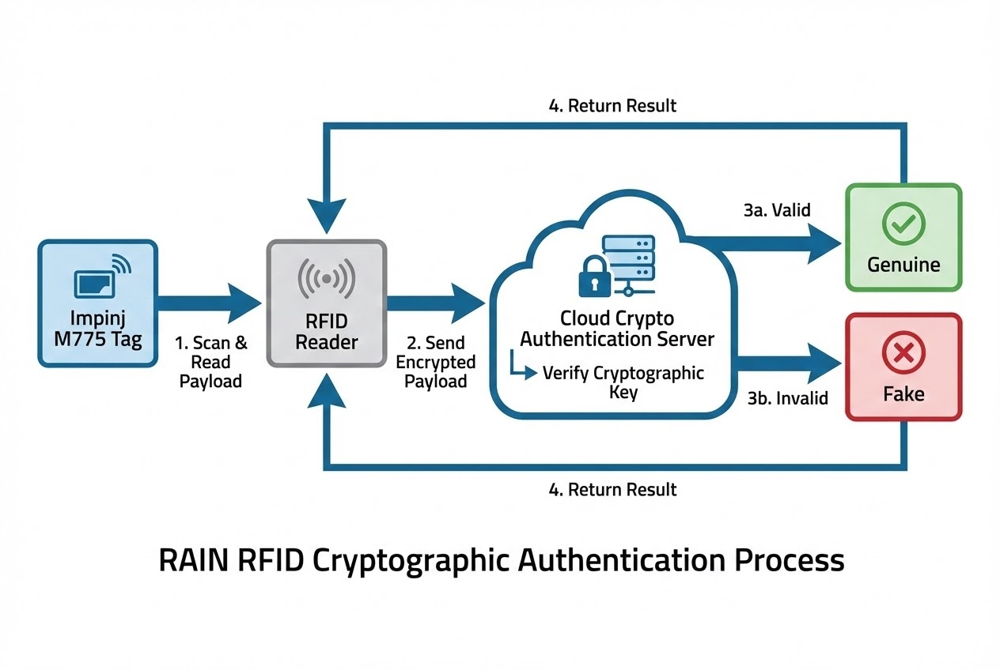

# บทนำ
ความไว้วางใจคือหัวใจสำคัญของทุกแบรนด์ แต่เมื่อ "สินค้าปลอม" หลุดรอดไปถึงมือลูกค้า มันไม่เพียงแต่ทำลายมูลค่าและภาพลักษณ์ของแบรนด์ แต่ยังอาจก่อให้เกิดอันตรายต่อผู้บริโภคในชีวิตจริงได้ ไม่ว่าจะเป็นกระเป๋าแบรนด์เนมหรู อะไหล่รถยนต์ที่ไม่ได้มาตรฐาน หรือแม้แต่ยาและเวชภัณฑ์ปลอม 

คำถามคือ ในยุคที่มิจฉาชีพสามารถผลิตของก๊อปปี้ได้แนบเนียนจนตาเปล่าแทบแยกไม่ออก แบรนด์ชั้นนำระดับโลกเขาใช้อาวุธลับอะไรในการรับมือ? คำตอบที่กำลังเปลี่ยนเกมการตรวจสอบในปัจจุบันนี้คือ **"RAIN RFID"** ครับ เรามาดูกันว่าเทคโนโลยีไร้สายจิ๋วนี้ ช่วยปกป้องแบรนด์ของคุณจากสินค้าปลอมแปลงในระดับวิศวกรรมได้อย่างไร

---

## ทฤษฎีที่เกี่ยวข้อง (Concept): สถาปัตยกรรมการตรวจสอบสิทธิ์

### 1. รหัสประจำตัวเฉพาะที่เปรียบเสมือน "ลายนิ้วมือดิจิทัล" (TID)
เทคโนโลยีบาร์โค้ดแบบเดิมนั้นมีข้อจำกัดตรงที่สามารถถูกถ่ายเอกสาร หรือทำซ้ำเพื่อนำไปแปะบนสินค้าปลอมได้ง่ายมาก แต่แท็ก RAIN RFID ถูกสร้างขึ้นมาด้วยสถาปัตยกรรมที่เหนือกว่า ชิป RFID จะมีหมายเลขระบุตัวตนเฉพาะจากโรงงานผู้ผลิต (Tag ID หรือ TID) ที่ **ไม่สามารถดัดแปลงแก้ไขได้**

* **บทวิเคราะห์:** การนำข้อมูล TID มาจับคู่กับรหัสสินค้าเฉพาะตัว (Serial Number/EPC) ในฐานข้อมูล ทำให้การจะโคลน (Clone) แท็กให้มีรหัสฮาร์ดแวร์ตรงกับของแท้จากโรงงาน กลายเป็นเรื่องที่แทบจะเป็นไปไม่ได้สำหรับกลุ่มมิจฉาชีพ

### 2. การตรวจสอบสิทธิ์ด้วยการเข้ารหัสขั้นสูง (Cryptographic Authentication)
นอกเหนือจากรหัส TID พื้นฐานแล้ว ปัจจุบันเทคโนโลยี RAIN RFID ยังก้าวไปสู่การใช้ระบบ "กุญแจเข้ารหัส" (Cryptographic key) ตัวอย่างเช่นชิปตระกูล **Impinj M775** ซึ่งโปรแกรมกุญแจเข้ารหัสไว้ตั้งแต่กระบวนการผลิต 

* **บทวิเคราะห์:** เมื่อเครื่องอ่าน (Reader) ทำการสแกน มันจะส่ง "คำขอตรวจสอบสิทธิ์" ไปยังระบบคลาวด์ เพื่อยืนยันความถูกต้องแบบเรียลไทม์ นี่คือการยกระดับจากการตรวจสอบทางกายภาพไปสู่การรักษาความปลอดภัยทางไซเบอร์ที่ทรงพลัง



### 3. การติดตามย้อนกลับและล้อมกรอบซัพพลายเออร์นอกคอก
บ่อยครั้งที่สินค้าปลอมไม่ได้มาจากไหนไกล แต่มาจากจุดบอดในห่วงโซ่อุปทาน (Supply Chain) การนำ RAIN RFID มาใช้ติดตามสินค้าตั้งแต่จุดเริ่มต้นการผลิตไปจนถึงจุดขาย (End-to-End) ช่วยสร้างความโปร่งใสแบบ 100% แบรนด์สามารถควบคุมปริมาณแท็กที่ออกให้ซัพพลายเออร์ และเช็คได้ทันทีว่ารอยรั่วของการปลอมแปลงเกิดขึ้นที่จุดไหน

### 4. การสแกนแบบกลุ่มที่ทะลุทะลวงทุกข้อจำกัด (Automated Bulk Authentication)
หากใช้พนักงานเปิดกล่องสแกนบาร์โค้ดทีละชิ้น ย่อมทำให้กระบวนการขนส่งหยุดชะงัก แต่ RAIN RFID สามารถอ่านข้อมูลและตรวจสอบสิทธิ์สินค้าได้สูงสุดถึง 1,000 ชิ้นต่อวินาที โดยไม่ต้องอาศัยแนวสายตา (Non-line-of-sight) 

> *"ด้วยเทคโนโลยี RAIN RFID ล่าสุด บริษัทต่างๆ สามารถตรวจสอบความถูกต้องของสินค้าได้โดยอัตโนมัติแบบเรียลไทม์ในทุกขั้นตอนตลอดห่วงโซ่อุปทาน"*

---

## ขั้นตอนการทำงาน (Code Snippet สำหรับ Developer)

ในการพัฒนาระบบเพื่อตรวจสอบสินค้า (Authentication) ด้วยระบบ Cryptographic เราสามารถเขียน Software ให้ทำงานร่วมกับ Cloud Service ทันทีที่แท็กถูกสแกนผ่าน Gate

```csharp
// Code ตัวอย่าง: การส่งคำขอตรวจสอบสิทธิ์ (Cryptographic Authentication) ด้วย C#
public async Task<AuthenticationResult> AuthenticateTagCryptoAsync(RFIDTag tag) {
    // 1. อ่าน Cryptographic Payload แบบพิเศษจากแท็ก (เช่น ชิป Impinj M775)
    string cryptoPayload = tag.GetCryptographicPayload();

    // 2. ส่งข้อมูลไปตรวจสอบที่ Cloud Authentication Service ของแบรนด์
    var request = new AuthRequest {
        Epc = tag.EPC,
        CryptoMessage = cryptoPayload,
        ReaderLocation = "Warehouse_Gate_A",
        Timestamp = DateTime.UtcNow
    };

    // รอรับผลการตรวจสอบจาก Cloud
    var response = await _cloudAuthClient.VerifyAuthenticityAsync(request);

    // 3. แจ้งเตือนและดำเนินการ
    if (!response.IsGenuine) {
        Console.WriteLine($"🚨 [WARNING] พบสินค้าต้องสงสัย (Counterfeit Detected)! EPC: {tag.EPC}");
        TriggerAlarmSystem(); // สั่งให้ไฟไซเรนหน้าเกตทำงาน
    } else {
        Console.WriteLine($"✅ [VERIFIED] สินค้าของแท้ EPC: {tag.EPC}");
    }

    return response;
}

```

> **Pro Tip / ข้อควรระวัง:**
> การออกแบบระบบที่ต้องยิง API ขึ้น Cloud ทุกครั้งที่สแกนเจอแท็ก อาจทำให้เกิดปัญหา Network Latency ในกรณีที่มีการสแกนพาเลททีละหลายร้อยชิ้น (Bulk Reading) ดังนั้น System Integrator ควรพิจารณาทำระบบ Edge Computing หรือ Message Queue (เช่น RabbitMQ / Kafka) เพื่อรับข้อมูลไว้ก่อน แล้วทยอยส่งตรวจสอบ เพื่อไม่ให้คอขวดไปตกอยู่ที่ระบบ Network

---

## สรุป

ในโลกการแข่งขันยุคใหม่ RAIN RFID ไม่ได้เป็นเพียงแค่เครื่องมือในการนับสต็อกสินค้าในโกดังอีกต่อไป แต่มันได้สยายปีกกลายมาเป็น **"เกราะป้องกัน"** ที่ทรงพลังที่สุดในการคุ้มครองทรัพย์สินทางปัญญาและภาพลักษณ์ของแบรนด์

ด้วยการผสานรหัสฮาร์ดแวร์เฉพาะตัว (TID), การเข้ารหัสบนคลาวด์ขั้นสูง, และความรวดเร็วในการประมวลผล ทำให้การลอกเลียนแบบสินค้ามีความซับซ้อนและมีต้นทุนความเสี่ยงที่สูงเกินกว่ามิจฉาชีพจะตามทัน

---

**ต้องการที่ปรึกษาด้านการวางระบบ RAIN RFID เพื่อป้องกันสินค้าปลอม หรือเชื่อมต่อข้อมูลเข้าคลาวด์?**
พูดคุยกับทีม Engineer ของเราได้ที่ Line: [wisit.p](https://line.me/ti/p/~wisit.p)
