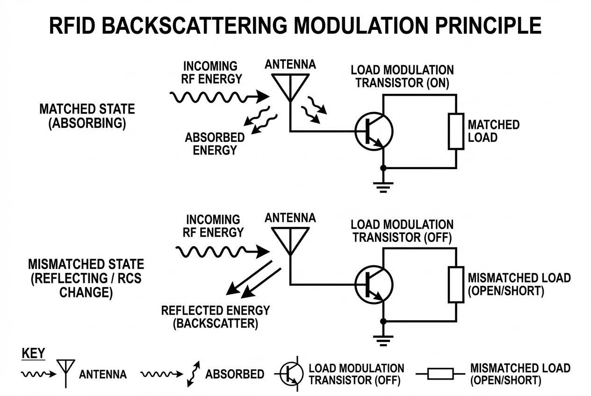

# บทนำ
คุณเคยสงสัยหรือไม่ว่า อุปกรณ์แผ่นบางๆ ที่ไม่มีแม้แต่แบตเตอรี่อย่างแท็ก UHF RFID สามารถ "พูดคุย" และส่งข้อมูลกลับไปยังเครื่องอ่านที่อยู่ห่างออกไปหลายเมตรได้อย่างไร? 

ความลับไม่ได้อยู่ที่การมีตัวส่งสัญญาณวิทยุอันทรงพลังซ่อนอยู่ แต่อยู่ที่กลเม็ดทางฟิสิกส์อันแยบยล นั่นคือการสลับสถานะตัวเองระหว่างการเป็น "ผู้ดูดซับพลังงาน" และ "ผู้สะท้อนพลังงาน" แบบไปมาในระดับเสี้ยววินาที กระบวนการที่ดูเหมือนเวทมนตร์นี้ แท้จริงแล้วคือสถาปัตยกรรมทางวิศวกรรมที่เรียกว่า **"Backscattering Modulation" (การมอดูเลตแบบกระเจิงกลับ)** วันนี้เราจะมาเจาะลึกกลไกการเปลี่ยนผ่านสถานะทางพลังงานนี้กันครับ

## ทฤษฎีที่เกี่ยวข้อง (Concept)

### 1. สถานะดูดซับ: เปิดประตูรับพลังงาน (The Matched State)
ในขั้นตอนแรกของการสื่อสารที่เรียกว่า "การเชื่อมต่อขาไป" (Forward link) เครื่องอ่านจะทำหน้าที่ส่งคลื่นพาหะ (Carrier frequency) ออกมาเพื่อจ่ายพลังงานให้กับแท็ก ในจังหวะนี้ แท็กมีหน้าที่เดียวคือต้อง "กลืนกิน" พลังงานที่ลอยอยู่ในอากาศให้ได้มากที่สุด

เพื่อให้การดูดซับพลังงานสมบูรณ์แบบที่สุด แท็กจะถูกตั้งค่าให้อยู่ในสถานะ **"การจับคู่อิมพีแดนซ์เชิงซ้อน" (Conjugate impedance matching)** ซึ่งหมายความว่า ความต้านทานภายในของตัวชิป (Load) จะถูกปรับให้เข้ากับความต้านทานของเสาอากาศ (Antenna) อย่างพอดีเป๊ะ ทำให้ไม่มีคลื่นนิ่ง (Standing waves) เกิดขึ้น พลังงานทั้งหมดจึงไหลเข้าสู่แท็กโดยไม่มีการสะท้อนกลับ เสมือนการเปิดประตูบ้านรับลมอย่างเต็มที่

### 2. สถานะสะท้อนกลับ: สร้างเสียงสะท้อน (The Mismatched State)
เมื่อแท็กได้รับพลังงานจนวงจรตื่นขึ้นและพร้อมที่จะส่งข้อมูลกลับ (Return link) หากแท็กต้องการส่งข้อมูลที่เป็นตรรกะ "0" วงจรอิเล็กทรอนิกส์ภายในแท็กจะทำการเปลี่ยนแปลงหรือ "มอดูเลต" ค่าอิมพีแดนซ์โหลด ($Z_l$) ของเสาอากาศอย่างจงใจ

> "วงจรอิเล็กทรอนิกส์ของแท็กจะทำการมอดูเลตค่าอิมพีแดนซ์โหลดของเสาอากาศแท็ก... นำไปสู่การเกิดคลื่นนิ่ง และส่งผลให้เกิดพื้นที่หน้าตัดเรดาร์ (RCS) ที่มีประสิทธิภาพค่าใหม่ขึ้นมา"

การทำเช่นนี้ทำให้เกิดความ **"ไม่เข้ากัน" (Mismatch)** เมื่อความสมดุลถูกทำลาย ประตูที่เคยเปิดรับพลังงานจะถูกปิดกั้น พลังงานคลื่นแม่เหล็กไฟฟ้าจึงถูกบังคับให้สะท้อนกลับออกไปในอากาศ เหมือนกับการที่เราเอาแผ่นกระจกไปขวางทางแสงนั่นเอง

### 3. สวิตช์แห่งความลับ: ทรานซิสเตอร์มอดูเลตโหลด
ตัวการสำคัญที่ทำให้เกิดการเปลี่ยนสถานะไปมานี้คือ **"ทรานซิสเตอร์มอดูเลตโหลด" (Load modulation transistor)** ที่ทำงานเหมือนสวิตช์เปิด-ปิด เมื่อสวิตช์นี้ทำงาน มันจะสลับค่าความต้านทานของวงจร ทำให้เกิดการเปลี่ยนแปลงสิ่งที่เรียกว่า **"พื้นที่หน้าตัดเรดาร์" (Radar Cross Section - RCS)** ความแตกต่างระหว่างพื้นที่หน้าตัดตอนที่ดูดซับพลังงาน กับตอนที่สะท้อนพลังงาน เรียกว่าค่าความแปรปรวน $\Delta RCS$ ซึ่งทำให้กำลังของคลื่นที่สะท้อนกลับไปมีความแรงสลับขึ้นลง (Amplitude Modulation) จนเครื่องอ่านถอดรหัสออกมาเป็น 0 และ 1 ได้



## สิ่งที่ต้องเตรียม (Prerequisites)
หากต้องการเขียนโปรแกรมเพื่อดึงค่าความแรงของคลื่นที่สะท้อนกลับมา (RSSI) หรือค่า Phase Angle เพื่อวิเคราะห์พฤติกรรมของแท็ก:
1. **Hardware:** UHF RFID Reader ที่รองรับการอ่านค่า Low-Level (เช่น Impinj Speedway)
2. **Software:** .NET Framework / .NET Core, Octane SDK (สำหรับ Impinj)

## ขั้นตอนการทำงาน (Step-by-Step)

การอ่านค่าสัญญาณที่สะท้อนกลับมา (Backscatter) ในเชิง Software เราสามารถดึงค่า **Phase Angle** และ **Peak RSSI** เพื่อดูความแรงของ $\Delta RCS$ ได้ นี่คือตัวอย่างการดึงข้อมูลด้วย C# ผ่าน Impinj Octane SDK:

```csharp
using Impinj.OctaneSdk;
using System;

public class RFIDBackscatterReader {
    public void StartReading() {
        ImpinjReader reader = new ImpinjReader();
        reader.Connect("192.168.1.100"); // ใส่ IP ของ Reader

        // เปิดใช้งานการอ่านค่า Low-Level Metrics ที่เกี่ยวข้องกับสัญญาณวิทยุ
        FeatureSet features = reader.QueryFeatureSet();
        Settings settings = reader.QueryDefaultSettings();
        
        // สั่งให้ Report ข้อมูล Phase Angle และ RSSI ที่สะท้อนกลับมา
        settings.Report.IncludePhaseAngle = true;
        settings.Report.IncludePeakRssi = true;

        reader.ApplySettings(settings);
        reader.TagsReported += OnTagsReported;
        reader.Start();
    }

    private void OnTagsReported(ImpinjReader sender, TagReport report) {
        foreach (Tag tag in report) {
            Console.WriteLine($"EPC: {tag.Epc}");
            // RSSI บ่งบอกถึงความแรงของคลื่นที่แท็กสะท้อน (Backscatter) กลับมา
            Console.WriteLine($"Peak RSSI (dBm): {tag.PeakRssiInDbm}");
            // Phase Angle สามารถใช้คำนวณระยะทางหรือทิศทางการเคลื่อนที่ได้
            Console.WriteLine($"Phase Angle (radians): {tag.PhaseAngleInRadians}");
            Console.WriteLine("-------------------------");
        }
    }
}

```

> **Pro Tip / ข้อควรระวัง:**
> **การสูญเสียพลังงานในอากาศ (Path Loss)**
> เนื่องจากแท็กอาศัยพลังงานจากการกระเจิงคลื่นกลับ (Backscatter) พลังงานที่เครื่องอ่านได้รับจะแปรผกผันกับ **"ระยะทางยกกำลังสี่" ()** ตามสมการ Radar Equation ไม่ใช่แค่ยกกำลังสองเหมือนการสื่อสารวิทยุแบบปกติ (Active Radio) นี่คือเหตุผลที่ว่าทำไมระยะการอ่านของแท็ก Passive จึงถูกจำกัดอยู่อย่างมากเมื่อเทียบกับแบบ Active!

## สรุป

กลไกการเปลี่ยนสถานะจากการดูดซับเป็นสะท้อนพลังงาน คือข้อพิสูจน์ถึงความงดงามของการประยุกต์ใช้กฎทางฟิสิกส์พื้นฐานให้กลายเป็นเทคโนโลยีระดับโลก การเปลี่ยนคลื่นวิทยุรอบตัวให้กลายเป็นทั้ง "แหล่งจ่ายไฟ" และ "พาหนะส่งข้อมูล" ช่วยให้เราติดตามสิ่งของนับพันล้านชิ้นได้ในราคาที่จับต้องได้

ในอนาคต หากเราสามารถประยุกต์ใช้หลักการเปลี่ยนสถานะอิมพีแดนซ์นี้กับคลื่นวิทยุหรือสัญญาณ Wi-Fi ที่ล่องลอยอยู่เต็มเมืองหลวง (Ambient Backscatter) เราจะสามารถสร้างเครือข่ายเซ็นเซอร์อัจฉริยะ (IoT) ระดับมวลชน โดยที่ไม่ต้องกังวลเรื่องการชาร์จไฟหรือเปลี่ยนแบตเตอรี่อีกต่อไปเลยครับ

---

**ติดปัญหาเรื่อง Coding, System Architecture หรือระบบ Automation?**
พูดคุยกับทีม Dev ของ WP Solution ได้ที่ Line: wisit.p