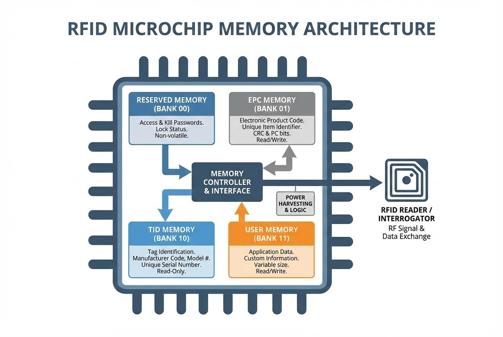

# บทนำ
คุณเคยสงสัยไหมครับว่า สติกเกอร์ใบเล็กๆ ที่แปะอยู่บนกล่องสินค้าหรือป้ายติดเสื้อผ้า สามารถเก็บข้อมูลมหาศาลและสื่อสารกับระบบคอมพิวเตอร์ได้อย่างรวดเร็วได้อย่างไร? ความลับทั้งหมดนี้ซ่อนอยู่ภายใต้ไมโครชิปขนาดจิ๋วที่เป็นส่วนประกอบหลักของ "แท็ก RFID"

วันนี้เราจะมาเจาะลึกและทำความเข้าใจโครงสร้างหน่วยความจำภายในชิป RFID หรือที่เรียกว่า **"Memory Banks"** ซึ่งถูกแบ่งพื้นที่ออกเป็น 4 ส่วนหลักอย่างเป็นระบบ เพื่อรองรับการทำงานตั้งแต่การระบุตัวตนขั้นพื้นฐาน ไปจนถึงการรักษาความปลอดภัยขั้นสูง

> *"ภายในชิป RFID จะมีหน่วยความจำ 4 ส่วน หรือที่เรียกว่า Memory Banks ได้แก่ EPC (Electronic Product Code), TID (Tag Identifier), User Memory และ Reserved Memory"*

---

## ทฤษฎีที่เกี่ยวข้อง (Concept): โครงสร้าง 4 Memory Banks



### 1. EPC (Electronic Product Code): รหัสประจำตัวที่เปลี่ยนแปลงได้
หน่วยความจำส่วนแรกและถือเป็นหัวใจหลัก คือพื้นที่สำหรับเก็บรหัสเฉพาะที่สามารถ **"เขียนทับได้"** เพื่อใช้ระบุตัวตนของวัตถุ นอกเหนือจากส่วนที่เก็บรหัสสินค้าแล้ว ภายในบล็อกหน่วยความจำ EPC ยังประกอบไปด้วยข้อมูลการตรวจสอบความถูกต้อง (CRC-16) และข้อมูลควบคุมโปรโตคอล (Protocol Control) อีกด้วย
* **บทวิเคราะห์:** EPC ถูกออกแบบมาเพื่อทลายข้อจำกัดของบาร์โค้ดแบบเดิม แทนที่จะระบุได้แค่ "หมวดหมู่สินค้า" EPC สามารถตั้งค่าให้ระบุ "ตัวตนเฉพาะ" ของสินค้าแต่ละชิ้น (Serial Number) ได้อย่างแม่นยำ

### 2. TID (Tag Identifier): ลายนิ้วมือดิจิทัลจากโรงงาน
หาก EPC คือชื่อที่เราตั้งให้กับสินค้า TID ก็เปรียบเสมือน **"ลายนิ้วมือ"** ของตัวแท็กชิ้นนั้น TID คือพื้นที่เก็บรหัสประจำตัวเฉพาะซึ่งโรงงานผู้ผลิตชิปกำหนดมาให้ และ **ไม่สามารถแก้ไขได้**
* **บทวิเคราะห์:** การมีอยู่ของ TID ถือเป็นกุญแจสำคัญในการต่อกรกับปัญหาการปลอมแปลงสินค้า (Anti-counterfeiting) ผู้ไม่หวังดีอาจคัดลอก EPC ได้ แต่ไม่มีทางโคลนรหัส TID ให้ตรงกับชิปของแท้จากโรงงานได้อย่างแน่นอน

### 3. User Memory: พื้นที่เก็บข้อมูลแบบกำหนดเอง
ชิปหลายรุ่นจะมาพร้อมกับพื้นที่หน่วยความจำเสริม ที่ผู้ใช้งานสามารถบันทึกข้อมูลเพิ่มเติมลงไปบนแท็กได้ ขนาดความจุจะแตกต่างกันตามสเปกของชิป
* **บทวิเคราะห์:** User Memory ทำให้แท็ก RFID ก้าวข้ามจากการเป็นแค่ป้ายชื่อ กลายเป็น **"ฐานข้อมูลเคลื่อนที่"** เราสามารถบันทึกวันหมดอายุ, ล็อตการผลิต หรือประวัติการตรวจสอบย้อนหลังลงไปบนตัวสินค้าได้โดยตรง ช่วยให้การทำงานแบบออฟไลน์เป็นไปได้

### 4. Reserved Memory: พื้นที่สงวนเพื่อความปลอดภัย
พื้นที่ส่วนนี้มีความสำคัญอย่างยิ่งในด้านการรักษาความปลอดภัย ถูกใช้สำหรับเก็บรหัสผ่านที่สำคัญ ได้แก่ **Access Password** (รหัสผ่านอนุญาตเข้าถึง) และ **Kill Password** (รหัสผ่านสั่งทำลายแท็ก)
* **บทวิเคราะห์:** ในโลกที่ Privacy เป็นเรื่องสำคัญ พื้นที่ Reserved Memory ช่วยให้ธุรกิจสั่ง "ปิดตาย" (Kill) แท็กอย่างถาวรเมื่อสินค้าถึงมือผู้บริโภคแล้ว เพื่อให้มั่นใจว่าจะไม่มีใครแอบติดตามสินค้านั้นได้อีกต่อไป

---

## การประยุกต์ใช้งานด้วย Code (Step-by-Step)

ในมุมมองของนักพัฒนา (Developer) การสั่งงานให้ RFID Reader ไปอ่านข้อมูลใน Memory Bank ต่างๆ จะมีวิธีการเข้าถึงที่แตกต่างกัน โดยปกติ Reader จะถูกตั้งค่าให้อ่านเฉพาะ EPC เป็นค่าเริ่มต้น (เพื่อความรวดเร็ว) แต่ถ้าเราต้องการอ่าน TID หรือ User Memory เราต้องส่งคำสั่งแบบเฉพาะเจาะจง (Read Access)

```csharp
// Code ตัวอย่าง: การสั่งอ่านค่า TID Bank ด้วย C# (Pseudo-code)
public void ReadTagTID(string epcTarget) {
    // 1. ระบุเป้าหมายแท็กที่ต้องการอ่าน (ใช้ EPC เป็นตัวกรอง)
    TagFilter filter = new TagFilter(epcTarget);
    
    // 2. กำหนด Memory Bank ที่ต้องการเข้าถึง (Bank 2 คือ TID)
    // Bank 0 = Reserved, Bank 1 = EPC, Bank 2 = TID, Bank 3 = User
    ReadAccessParams readParams = new ReadAccessParams();
    readParams.MemoryBank = MemoryBank.TID; 
    readParams.WordPointer = 0; // เริ่มอ่านที่ตำแหน่งแรก
    readParams.WordCount = 6;   // จำนวน Word ที่ต้องการอ่าน

    // 3. สั่ง Execute คำสั่ง
    ReadResult result = RFIDReader.ExecuteReadAccess(filter, readParams);
    
    if(result.Success) {
        Console.WriteLine($"✅ TID for EPC {epcTarget} is: {result.DataHex}");
    }
}

```

> **Pro Tip / ข้อควรระวัง:**
> **การอ่าน TID หรือ User Memory ใช้เวลาประมวลผลนานกว่า EPC มาก** หากคุณต้องทำระบบสแกนสินค้าแบบ High-Speed (เช่น รถโฟล์คลิฟต์วิ่งผ่านเกต) แนะนำให้อ่านเฉพาะ EPC เท่านั้น แล้วค่อยนำ EPC ไปค้นหาข้อมูลล็อตหรือวันหมดอายุใน Database แทนการอ่าน User Memory โดยตรงจากตัวแท็ก

---

## สรุป

สถาปัตยกรรมหน่วยความจำทั้ง 4 ส่วนในชิป RFID ไม่ได้เป็นเพียงแค่กลไกการเก็บข้อมูลทางอิเล็กทรอนิกส์เท่านั้น แต่มันคือโครงสร้างพื้นฐานอันชาญฉลาดที่ตอบโจทย์ความเร็ว ความถูกต้อง และความปลอดภัยสูงสุด

เมื่อชิปขนาดจิ๋วเหล่านี้สามารถทำหน้าที่เป็นทั้งป้ายระบุตัวตน ฐานข้อมูลเคลื่อนที่ และกุญแจนิรภัยในตัวเอง... คุณคิดว่าธุรกิจของคุณพร้อมหรือยังที่จะประยุกต์ใช้มันเพื่อสร้างข้อได้เปรียบทางการแข่งขัน?

---

**ติดปัญหาเรื่องการเขียนโปรแกรมจัดการ Memory Banks หรือระบบ Security ของ RFID?**
พูดคุยกับทีม Dev ของเราได้ที่ Line: [wisit.p](https://line.me/ti/p/~wisit.p)

