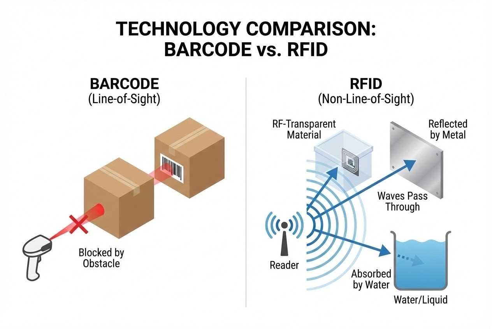

# บทนำ
คุณเคยสงสัยไหมเวลาเห็นกระบวนการจัดการคลังสินค้ายุคใหม่ ที่พนักงานเพียงแค่เข็นรถผ่านประตูเกต (RFID Gate) ข้อมูลของสินค้าหลายร้อยชิ้นที่อัดแน่นอยู่ในกล่องกระดาษก็ถูกบันทึกเข้าสู่ระบบอย่างถูกต้องแม่นยำในพริบตาเดียว ทั้งๆ ที่มองไม่เห็นแม้แต่ป้ายฉลาก? 

ในขณะที่ระบบบาร์โค้ดแบบเดิม เราต้องมานั่งพลิกกล่องหาสติกเกอร์เพื่อยิงสแกนแสงเลเซอร์ให้ตรงจุด วันนี้เราจะมาเจาะลึกความลับทางฟิสิกส์ที่อยู่เบื้องหลังความมหัศจรรย์ของ RFID ที่เปลี่ยนกล่องกระดาษทึบๆ ให้กลายเป็น "วัตถุโปร่งใส" ในโลกของข้อมูลกันครับ

## ทฤษฎีที่เกี่ยวข้อง (Concept)

### 1. เปลี่ยนจาก "แสง" เป็น "คลื่นแม่เหล็กไฟฟ้า"
เหตุผลพื้นฐานที่สุดที่ทำให้ RFID ทะลุทะลวงสิ่งกีดขวางได้ คือความแตกต่างของตัวกลางที่ใช้ในการสื่อสาร 
* **Barcode (แสง):** แสงไม่สามารถเดินทางทะลุผ่านวัตถุอย่างกำแพง หรือกล่องกระดาษได้ เครื่องสแกนจึงต้องมองเห็นภาพบาร์โค้ดโดยตรง
* **RFID (คลื่นแม่เหล็กไฟฟ้า):** ใช้คลื่นวิทยุ (Radio Frequency) ในการส่งและรับข้อมูล ซึ่งมีคุณสมบัติทางฟิสิกส์ที่แตกต่างจากแสงอย่างสิ้นเชิง ทำให้มีอิสระในการเดินทางมากกว่าเทคโนโลยีที่พึ่งพาการมองเห็น

### 2. เมื่อกล่องกระดาษกลายเป็น "วัสดุโปร่งคลื่น" (RF-Transparent)
ในโลกของคลื่นวิทยุ วัสดุที่คลื่นสามารถเดินทางผ่านไปได้โดยไม่สูญเสียพลังงานมากนัก เรียกว่า **วัสดุโปร่งคลื่น (Lucent materials)** วัสดุทั่วไปที่เราใช้บรรจุหีบห่อ เช่น กระดาษ, พลาสติก, ผ้า, ไม้ ล้วนจัดอยู่ในกลุ่มนี้ ทำให้คลื่นวิทยุเดินทางเข้าไปกระตุ้นชิป RFID ด้านในได้สบายๆ

### 3. อิสระแห่งการอ่านแบบ Non-Line-of-Sight
นี่คือคุณสมบัติที่ทรงพลังที่สุดของ RFID:
> *"เนื่องจากสัญญาณอยู่ในรูปแบบของคลื่นแม่เหล็กไฟฟ้า จึงไม่จำเป็นต้องมีแนวสายตาโดยตรง (Line-of-Sight) เพื่ออ่านข้อมูลบนแท็ก นี่คือข้อได้เปรียบที่สำคัญหลักของ RFID"*



## สิ่งที่ต้องเตรียมในการพัฒนาระบบ (Prerequisites)
หากคุณกำลังจะเขียนโปรแกรมดึงข้อมูลจาก RFID Reader เพื่อทำระบบ Smart Warehouse คุณจะต้องเตรียม:
1. **Hardware:** UHF RFID Reader (เช่น Impinj, Zebra) และ Antenna ที่มี Gain เหมาะสมกับระยะ
2. **Software/Library:** C# (.NET Core) หรือ Node.js สำหรับเชื่อมต่อผ่าน LLRP Protocol หรือ TCP/IP

## ขั้นตอนการทำงาน (Step-by-Step)

ในการประยุกต์ใช้ความสามารถ Non-Line-of-Sight เรามักจะตั้งค่า Reader ให้อ่านข้อมูลรัวๆ (Continuous Inventory) เพื่อกวาดแท็กทั้งหมดที่ซ่อนอยู่ในกล่อง 

```csharp
// Code ตัวอย่าง: การใช้ C# สั่งงาน RFID Reader เบื้องต้น (Pseudo-code)
public void StartInventory(string readerIpAddress) {
    // 1. เชื่อมต่อกับ RFID Reader ผ่าน TCP/IP
    RFIDReader reader = new RFIDReader();
    reader.Connect(readerIpAddress);

    // 2. ตั้งค่า Tx Power (กำลังส่ง) ให้แรงพอที่จะทะลุกล่องกระดาษ
    reader.SetTxPower(30.0); // ตั้งค่ากำลังส่งที่ 30 dBm (สูงสุด)

    // 3. เริ่มการสแกนแบบ Non-Line-of-Sight
    reader.TagsReported += OnTagsReported; // Event รับข้อมูล
    reader.StartInventory();
    
    Console.WriteLine("Started scanning through boxes...");
}

private void OnTagsReported(object sender, TagReportEventArgs e) {
    foreach (var tag in e.Tags) {
         Console.WriteLine($"Found Tag EPC: {tag.EPC} - No line of sight needed!");
    }
}

```

> **Pro Tip / ข้อควรระวัง (คริปโตไนต์ของคลื่นวิทยุ):**
> แม้คลื่นวิทยุจะทะลุกล่องกระดาษได้ แต่มันมีอุปสรรคทางฟิสิกส์ 2 ประการที่ System Integrator พลาดบ่อยมาก:
> 1. **วัสดุทึบคลื่น (Opaque materials):** โลหะ จะทำหน้าที่สะท้อนหรือปิดกั้นคลื่น (Detuning) *วิธีแก้:* ต้องใช้ Anti-Metal Tag ที่มีฉนวนกั้นพิเศษ
> 2. **วัสดุดูดซับคลื่น (Absorptive materials):** ของเหลว หรือวัสดุความชื้นสูง จะดูดซับพลังงานคลื่นวิทยุ ทำให้สัญญาณสั้นลง *วิธีแก้:* ใช้ Flag Tag ที่ยื่นแท็กออกมาจากตัวของเหลว หรือปรับองศาเสาอากาศให้เหมาะสม
> 
> 

## สรุป

การเปลี่ยนจาก "แสง" มาเป็น "คลื่นวิทยุ" คือกุญแจสำคัญที่ทำให้ระบบ RFID สามารถมองทะลุกล่องกระดาษได้อย่างน่าทึ่ง การก้าวข้ามข้อจำกัดด้านสายตานี้พลิกโฉมการบริหารจัดการห่วงโซ่อุปทาน (Supply Chain) ให้รวดเร็วและเป็นอัตโนมัติ

เมื่อเทคโนโลยีคลื่นวิทยุทำให้เรา "มองเห็น" ข้อมูลจำนวนมหาศาลได้ในระดับเสี้ยววินาที ระบบ Logistics ของคุณก็พร้อมที่จะก้าวเข้าสู่ยุค Industry 4.0 อย่างเต็มตัว

---

**ติดปัญหาเรื่อง Coding คุม RFID Reader หรือ System Design?**
พูดคุยกับทีม Dev ของเราได้ที่ Line: [wisit.p](https://line.me/ti/p/~wisit.p)
