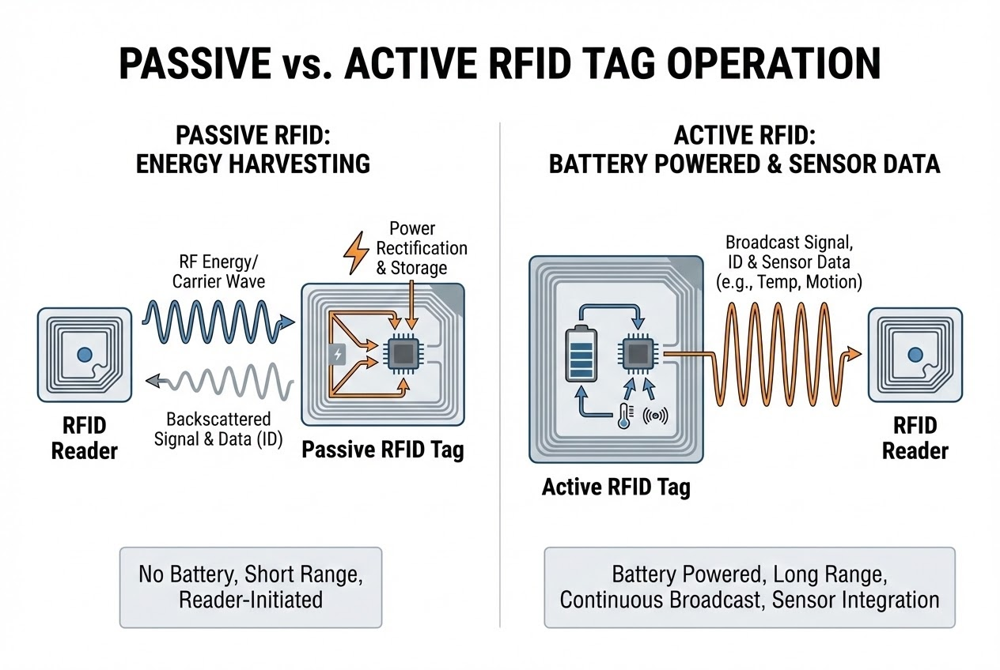

# บทนำ
เรามักคุ้นเคยกับความสะดวกสบายของเทคโนโลยี RFID ไม่ว่าจะเป็นการสแกนบัตรผ่านประตู หรือการนับสต็อกสินค้าคงคลังในเสี้ยววินาที แต่เมื่อลึกลงไปในสถาปัตยกรรมทางวิศวกรรมแล้ว เทคโนโลยีนี้ถูกแบ่งออกเป็นสองโลกที่แตกต่างกันอย่างสิ้นเชิง นั่นคือ **"Passive"** และ **"Active"** การทำความเข้าใจความแตกต่างของทั้งสองระบบนี้ ไม่ใช่แค่เรื่องของการอ่านสเปกชีต (Spec Sheet) แต่เป็นกุญแจสำคัญในการออกแบบ System Architecture เพื่อปลดล็อกศักยภาพสูงสุดและควบคุมต้นทุนของโปรเจกต์คุณ มาเจาะลึก 4 ความแตกต่างสุดขั้วนี้กันครับ

## ทฤษฎีที่เกี่ยวข้อง (Concept): 4 ความแตกต่างหลัก

### 1. แหล่งพลังงานที่เปลี่ยนเกม (The Game-Changing Power Source)
* **Passive Tag:** ถูกออกแบบมา **ไม่มีแบตเตอรี่ในตัว** การทำงานของมันใช้วิธี "เก็บเกี่ยวพลังงาน" (Energy harvesting) จากคลื่นแม่เหล็กไฟฟ้าที่เครื่องอ่าน (Reader) แผ่กระจายออกมา เพื่อกระตุ้นให้วงจรและชิปทำงาน
* **Active Tag:** มี **แบตเตอรี่** ขนาดเล็กฝังอยู่ภายใน คอยหล่อเลี้ยงแผงวงจรและตัวส่งสัญญาณ (Transmitter) ทำให้สามารถสื่อสารได้อย่างอิสระโดยไม่ต้องรอรับพลังงานจากเครื่องอ่าน

### 2. ระยะการอ่านที่แตกต่างกันอย่างสุดขั้ว (The Drastic Difference in Read Range)
ข้อจำกัดด้านพลังงานส่งผลโดยตรงต่อระยะทาง:
* **Passive:** ระยะอ่านจำกัด เริ่มตั้งแต่ไม่กี่เซนติเมตร (LF/HF) ไปจนถึงสูงสุดประมาณ 25-30 เมตร (UHF)
* **Active:** ทลายขีดจำกัดด้วยพลังแบตเตอรี่ กระจายสัญญาณได้ตั้งแต่ 30 เมตร ไปจนถึงระดับ **100 เมตรขึ้นไป** หรือหลายกิโลเมตรในบางเทคโนโลยี

> *"Active tags have their own power supply inside... They have significantly greater read range than passive tags."*



### 3. อายุการใช้งานที่สวนทางกับราคา (The Irony of Lifespan and Cost)
* **Passive:** โครงสร้างเรียบง่าย ต้นทุนต่ำมาก (หลักบาทถึงสิบบาท) และมีอายุการใช้งาน **"แทบจะไร้ขีดจำกัด"** (ตราบใดที่ชิปหรือเสาอากาศไม่ขาด) เพราะไม่มีแบตเตอรี่ให้เสื่อมสภาพ
* **Active:** ชิ้นส่วนซับซ้อน ราคาต่อชิ้นสูง (หลักร้อยถึงพันบาท) และมีอายุการใช้งานจำกัดอยู่ที่ประมาณ **3 ถึง 10 ปี** ตามสเปกของแบตเตอรี่ เมื่อแบตหมดส่วนใหญ่จะต้องทิ้งหรือเปลี่ยนแท็กใหม่

### 4. ขนาดและฟังก์ชันที่แอบซ่อนอยู่ (Size and Hidden Functionalities)
* **Passive:** บีบอัดขนาดได้เล็กเท่าเม็ดข้าว หรือแบนราบเป็นกระดาษสติกเกอร์ (Inlay) แปะบนสินค้าอุปโภคบริโภคได้อย่างแนบเนียน
* **Active:** มีขนาดใหญ่และหนักกว่าเพราะต้องบรรจุแบตเตอรี่ แต่มันชดเชยด้วยการเป็น **"อุปกรณ์ IoT เคลื่อนที่"** สามารถฝัง Sensor วัดอุณหภูมิ, ความชื้น, การสั่นสะเทือน หรือรับส่งพิกัด GPS ได้ในตัว

---

## ขั้นตอนการทำงาน (Step-by-Step) สำหรับ Developer

ในมุมมองของการเขียนโปรแกรม การรับข้อมูลจาก Passive และ Active Tag จะมีความซับซ้อนของ Payload ที่แตกต่างกัน Active Tag มักจะแนบข้อมูล Sensor หรือสถานะแบตเตอรี่มาด้วยเสมอ

```csharp
// Code ตัวอย่าง: การจัดการ Payload จาก Tag ทั้งสองประเภท (C#)
public void ProcessTagData(RFIDTag tag) {
    if (tag.Type == TagType.Passive) {
        // Passive: สนใจแค่ว่า "ใคร" (EPC) เข้ามาในระยะ
        Console.WriteLine($"[Passive Tag] Scanned Item EPC: {tag.EPC}");
        UpdateInventory(tag.EPC);
    } 
    else if (tag.Type == TagType.Active) {
        // Active: ข้อมูลจะมาเป็นชุด (Telemetry) เพราะมี Battery และ Sensor
        ActiveTagPayload payload = tag.GetActivePayload();
        
        Console.WriteLine($"[Active Tag] Asset ID: {payload.EPC}");
        Console.WriteLine($"-> Battery Level: {payload.BatteryPercentage}%");
        Console.WriteLine($"-> Current Temp: {payload.Temperature}°C");

        // แจ้งเตือนหากแบตเตอรี่ใกล้หมด หรืออุณหภูมิเกินกำหนด
        if (payload.BatteryPercentage < 15.0) {
            TriggerMaintenanceAlert(payload.EPC);
        }
    }
}

```

> **Pro Tip / ข้อควรระวัง:**
> หากคุณเลือกใช้ **Active Tag** สำหรับติดตามทรัพย์สิน (Asset Tracking) สิ่งที่ System Integrator มักพลาดคือ **"การจัดการขยะอิเล็กทรอนิกส์ (E-Waste) และรอบการ Maintenance"** คุณต้องเขียน Software ให้แจ้งเตือน Battery Low ล่วงหน้าเสมอ ไม่เช่นนั้นระบบ Logistics จะเกิด "จุดบอด" (Blind Spot) ทันทีที่แบตเตอรี่แท็กหมดกลางทาง

## สรุป

เทคโนโลยีทั้งสองไม่ได้เกิดมาเพื่อแทนที่กัน แต่เกิดมาเพื่อเติมเต็มซึ่งกันและกัน:

* **Passive Tag** ตอบโจทย์เรื่อง "ปริมาณ" สำหรับการติดตามรอยสินค้าจำนวนมหาศาลแบบใช้แล้วทิ้ง (Item-level Tracking)
* **Active Tag** ตอบโจทย์เรื่อง "ผู้เฝ้าระวังอัจฉริยะ" สำหรับทรัพย์สินมูลค่าสูง เช่น ตู้คอนเทนเนอร์ หรือพาเลทหมุนเวียน (High-value Asset Tracking)

คำถามสำคัญคือ... ในยุคที่ธุรกิจแข่งขันกันด้วยข้อมูลแบบเรียลไทม์ คุณเลือกใช้สถาปัตยกรรมที่ถูกต้องและสะท้อนความคุ้มค่า (ROI) ให้กับองค์กรของคุณแล้วหรือยัง?

---

**ติดปัญหาเรื่องการเลือก Hardware หรือ System Architecture สำหรับงาน IoT / RFID?**
พูดคุยกับทีม Dev และ Engineer ของเราได้ที่ Line: [wisit.p](https://line.me/ti/p/~wisit.p)
