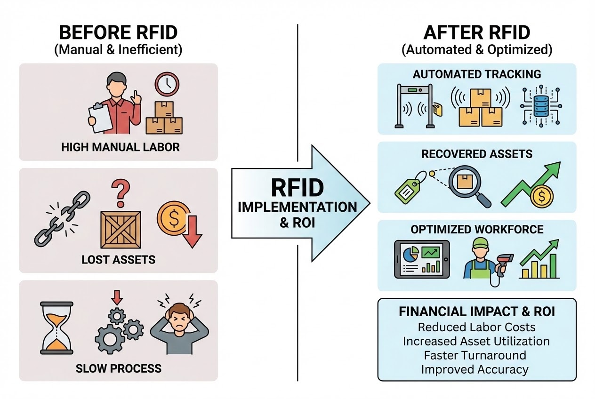

# บทนำ
คุณเคยสงสัยไหมครับว่า รอยรั่วไหลเล็กๆ น้อยๆ ในธุรกิจ เช่น สินค้าสูญหาย การใช้พนักงานเดินหาสต็อก หรือการสั่งซื้ออุปกรณ์ซ้ำซ้อน เมื่อรวมกันหลายๆ ปีแล้วสร้างความเสียหายทางเศรษฐกิจไปเท่าไหร่? 

ในยุคที่หลายบริษัทพยายามลดต้นทุนด้วยการปลดคนหรือลดคุณภาพสินค้า เทคโนโลยีอย่าง **RFID (Radio Frequency Identification)** กลับเสนอทางออกที่ชาญฉลาดกว่า นั่นคือการดึงเอา "ต้นทุนแฝง" เหล่านั้นกลับคืนมาเป็นกำไรสุทธิ วันนี้เราจะมาเจาะลึกกรณีศึกษาจากหลากหลายอุตสาหกรรม เพื่อดูว่าในระยะยาวแล้ว RFID สามารถพลิกโฉมต้นทุนธุรกิจให้ลดลงได้อย่างไรบ้างครับ

---

## 1. พลิกโฉมคลังสินค้า: ลดทั้งคน ลดทั้งรถโฟล์คลิฟต์
หนึ่งในกรณีศึกษาที่เห็นภาพชัดเจนที่สุดคือคลังสินค้าของโรงงานผลิตกระเบื้องแห่งหนึ่ง ซึ่งเคยประสบปัญหาข้อมูลสินค้าไม่ตรงตำแหน่ง จัดเก็บกระจาย และใช้กำลังคนมหาศาล แต่หลังจากเปลี่ยนมาใช้ระบบ RFID แบบเต็มรูปแบบ ผลลัพธ์ที่ได้นั้นน่าทึ่งมาก:

* **✅ ประหยัดค่าใช้จ่ายรวม:** ได้สูงสุดถึง 6,600,000 บาทต่อปี
* **✅ ลดการใช้ทรัพยากร:** ลดพนักงานลง 8 คนต่อกะ (จาก 26 เหลือ 18 คน) และลดรถโฟล์คลิฟต์ 6 คัน ประหยัดค่าใช้จ่ายรายเดือนขั้นต่ำ 500,000 บาท
* **✅ เพิ่มความเร็ว:** ลดระยะเวลาการดำเนินงานตั้งแต่ผลิตจนถึงจัดส่งจาก 46 วัน เหลือ 42 วัน

> **บทวิเคราะห์จาก System Architect:** ตัวเลขนี้ชี้ให้เห็นว่า RFID ไม่ได้เข้ามาแค่เพื่อ "สแกนสินค้า" แต่เข้ามา "รีดไขมัน" (Lean Process) ออกจากกระบวนการทำงาน การนำระบบอัตโนมัติมาใช้ช่วยปลดล็อกคอขวด ทำให้ธุรกิจขยายตัวได้โดยไม่ต้องเพิ่ม Overhead costs



## 2. เปลี่ยนสินทรัพย์ที่สูญหาย ให้กลายเป็นเงินเก็บ
ปัญหาโลกแตกของวงการโลจิสติกส์และโรงพยาบาลคือ "ของหาย" แต่ RFID สามารถอุดรอยรั่วนี้ได้อย่างสมบูรณ์แบบ:

* **โรงพยาบาล Bon Secours:** นำ RFID ติดอุปกรณ์สำคัญ 11,000 ชิ้น เพิ่มอัตราการใช้งานจาก 40% เป็น 90% และประหยัดค่าเช่า/ค่าอุปกรณ์สูญหายได้ถึง **2 ล้านดอลลาร์สหรัฐต่อปี**
* **ผู้ผลิตแผ่นแป้งตอร์ติญ่า:** ประหยัดค่าบรรจุภัณฑ์ไปกว่า **700,000 ดอลลาร์สหรัฐ** โดยใช้ RFID ติดตามลังพลาสติกส่งของให้หมุนเวียนกลับมาใช้ใหม่ได้ครบถ้วน

> **บทวิเคราะห์:** หลายองค์กรแก้ปัญหาของหายด้วยการ "ซื้อของใหม่มาเติม" ซึ่งแก้ที่ปลายเหตุ แต่ RFID มอบ "การมองเห็น" (Visibility) ทำให้ลด Capital Expenditure (CapEx) ลงได้อย่างมหาศาล

## 3. ยกระดับความปลอดภัยในอุตสาหกรรมหนัก
บริษัท **Marathon Oil** นำเทคโนโลยี RFID ไปประยุกต์ใช้กับเครื่องมือขุดเจาะน้ำมัน (Downhole tools) เทคโนโลยีนี้ช่วยลดต้นทุนให้บริษัทได้ถึงปีละ **17 ล้านดอลลาร์สหรัฐ** ควบคู่กับการเพิ่มความปลอดภัย ในอุตสาหกรรมที่เวลาทุกนาทีมีมูลค่าสูงลิบลิ่ว RFID ช่วยให้กระบวนการดำเนินไปอย่างแม่นยำและไร้รอยต่อ

## 4. ปรากฏการณ์เครือข่ายระดับโลก (The Network Effect)
เมื่อผู้เล่นรายใหญ่ขยับ ตัวเลขความคุ้มทุนจะพุ่งทะยานสู่ระดับมหภาค:

> *"Sanford C. Bernstein & Co. ประเมินว่า Wal-Mart สามารถประหยัดเงินได้เกือบ **8.4 พันล้านดอลลาร์สหรัฐต่อปี** เมื่อมีการติดตั้ง RFID อย่างเต็มรูปแบบทั่วทั้งห่วงโซ่อุปทานและในร้านค้า"*

---

## มุมมองทางเทคนิค: การเขียนโปรแกรมตรวจจับสินทรัพย์ (Asset Tracking Logic)

ในฐานะนักพัฒนา เบื้องหลังตัวเลขการประหยัดต้นทุนหลักล้าน คือ Logic การตรวจสอบสถานะสินทรัพย์ (Asset State Machine) ที่ทำงานอยู่บน Middleware ตลอด 24 ชั่วโมง นี่คือตัวอย่างโครงสร้างโค้ดที่ช่วยเซฟเงินให้องค์กรครับ

```csharp
// Code ตัวอย่าง: Logic แจ้งเตือนสินทรัพย์สูญหายหรือถูกลืมทิ้งไว้ (C#)
public void CheckAssetUtilization(List<AssetRecord> assetsInDatabase) {
    DateTime currentTime = DateTime.UtcNow;

    foreach (var asset in assetsInDatabase) {
        // คำนวณเวลาล่าสุดที่เสาอากาศ RFID มองเห็นอุปกรณ์ชิ้นนี้
        TimeSpan timeSinceLastSeen = currentTime - asset.LastSeenTimestamp;

        if (timeSinceLastSeen.TotalDays > 7.0 && asset.Status != AssetStatus.InMaintenance) {
            // หากไม่เห็นอุปกรณ์นี้ในระบบเกิน 7 วัน ให้แจ้งเตือนทันที
            Console.WriteLine($"🚨 [URGENT] Asset Missing: {asset.Name} (EPC: {asset.EPC})");
            Console.WriteLine($"   Last seen at: {asset.LastSeenLocation} on {asset.LastSeenTimestamp}");
            
            // ส่งแจ้งเตือนผ่าน Line Notify หรือ Email ให้ทีมตามหา
            AlertSystem.NotifyManagers($"Investigate missing asset: {asset.Name} to prevent replacement cost.");
            asset.Status = AssetStatus.Missing;
        } 
        else if (asset.Location == "Warehouse_Exit" && !asset.IsAuthorizedToLeave) {
            // ป้องกันการขโมย หรือพนักงานหยิบของออกไปผิด
            TriggerGateAlarm(asset.EPC);
        }
    }
}

```

> **Pro Tip:** การทำ Asset Tracking ที่ดี ซอฟต์แวร์ไม่ควรแค่โชว์ว่า "ของอยู่ที่ไหน" แต่ต้องมีความสามารถในการทำ **Predictive Alert** (เตือนก่อนที่ของจะหายถาวร หรือเตือนเมื่อของถูกวางแช่ทิ้งไว้โดยไม่เกิดมูลค่า) นี่คือหัวใจที่ทำให้ RFID คืนทุนได้จริง

---

## สรุป

แม้การลงทุนในฮาร์ดแวร์ ซอฟต์แวร์ และโครงสร้างพื้นฐานของ RFID ในช่วงแรกจะดูเป็นเรื่องท้าทาย แต่ในระยะยาว เทคโนโลยีนี้เปรียบเสมือนพนักงานมืออาชีพที่ทำงานให้คุณอย่างแม่นยำตลอด 24 ชั่วโมง การลดต้นทุนด้านแรงงาน การนำสินทรัพย์กลับมาใช้ซ้ำ การอุดรอยรั่วจากการสูญหาย คือเส้นทางสู่ความคุ้มทุน (ROI) ที่จับต้องได้จริง

**ธุรกิจของคุณกำลังสูญเสียโอกาสและรายได้ไปมากเท่าไหร่ ในทุกๆ วันที่ยังคงลังเลที่จะเปลี่ยนมาใช้ระบบอัตโนมัติ?**

---

**ต้องการประเมินความคุ้มค่า (ROI) และออกแบบระบบ RFID สำหรับคลังสินค้าของคุณ?**
พูดคุยกับทีม Consultant และ Engineer ของเราได้ที่ Line: [wisit.p](https://line.me/ti/p/~wisit.p)
