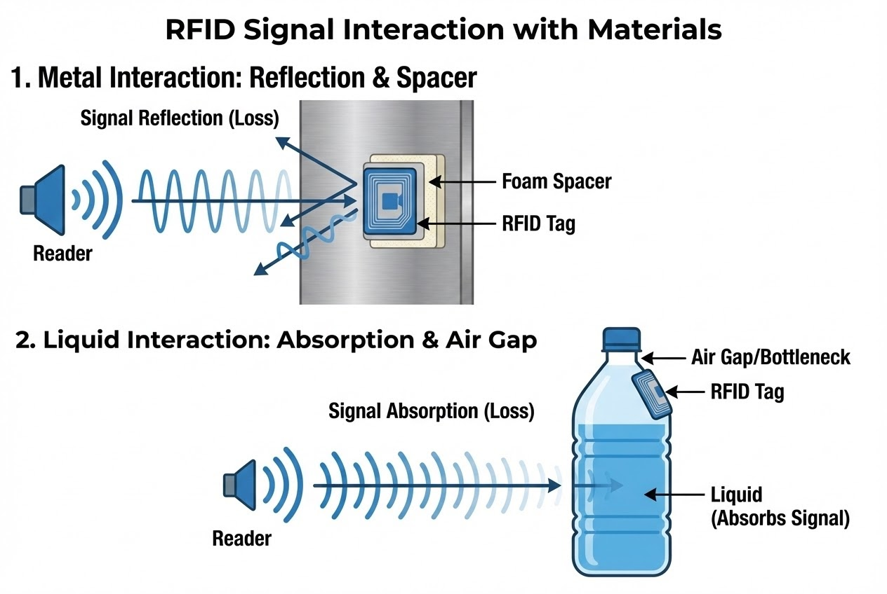

# บทนำ
คุณเคยเจอปัญหาลงทุนติดตั้งระบบ RFID ไปแล้ว แต่พอสแกนสินค้าที่เป็นขวดน้ำ หรือวางพาเลทบนชั้นเหล็ก เครื่องอ่านกลับนิ่งเงียบไหมครับ? 

ความจริงก็คือ คลื่นแม่เหล็กไฟฟ้ามีข้อจำกัดและจะถูกขัดขวางเมื่อเจอกับสภาพแวดล้อมบางประเภท โดยเฉพาะ **"น้ำ"** ที่เป็นตัวดูดซับพลังงานคลื่นวิทยุ และ **"โลหะ"** ที่ทำหน้าที่สะท้อนและบล็อกสัญญาณ ในโลกความเป็นจริงของคลังสินค้า เราไม่สามารถหลีกเลี่ยงวัสดุเหล่านี้ได้ การออกแบบ "ตำแหน่งและวิธีการติดตั้งแท็ก" ให้สอดคล้องกับหลักฟิสิกส์จึงเป็นกุญแจสำคัญที่จะพลิกสถานการณ์ให้ระบบทำงานได้อย่างสมบูรณ์แบบ

## ทฤษฎีที่เกี่ยวข้อง (Concept)
* **โลหะ (Metal):** มีคุณสมบัติสะท้อนคลื่นแม่เหล็กไฟฟ้า (Reflection) หากแปะแท็กแนบสนิท คลื่นจะหักล้างกันเอง (Detuning)
* **น้ำและของเหลว (Liquids):** โครงสร้างโมเลกุลมีขั้วไฟฟ้าสูง จึงดูดซับพลังงานคลื่นวิทยุ (Absorption) โดยเฉพาะย่านความถี่ UHF ทำให้สัญญาณอ่อนแรง



## สิ่งที่ต้องเตรียม (Prerequisites)
1. **Hardware:** * Anti-metal Tags (แท็กที่ออกแบบมาเพื่อติดบนโลหะโดยเฉพาะ)
   * Foam Spacers (แผ่นโฟมรองความหนา 5mm - 2cm)
2. **Software:** C# / Node.js สำหรับเขียนโปรแกรมปรับจูนกำลังส่ง (Tx Power) ของ RFID Reader

## ขั้นตอนการทำงานและเทคนิคติดตั้ง (Step-by-Step)

### 1. 🛡️ เทคนิคจัดการกับพื้นผิว "โลหะ" (Metal)
วิธีแก้ปัญหาคือการสร้างระยะห่าง (Standoff distance) และการเลือกใช้อุปกรณ์ดังนี้:
* **ใช้แผ่นโฟมรอง (Foam Spacers):** ยกแท็กให้ลอยเหนือพื้นผิว 5 มิลลิเมตร ถึง 1-2 เซนติเมตร จะช่วยลดการผิดเพี้ยนของสัญญาณ ยิ่งไปกว่านั้น ระยะห่างที่พอดีจะเปลี่ยนโลหะให้กลายเป็น "จานสะท้อน" ช่วยเพิ่มความแรงให้แท็กได้อีกด้วย
* **การฝังชิปในโลหะ (Dielectric Gap):** หากต้องฝังแท็กลงในเนื้อโลหะ ต้องเว้นช่องว่างแคบๆ ด้วยวัสดุโปร่งคลื่น เช่น สีทา หรือพลาสติก เพื่อให้เส้นแรงแม่เหล็กเล็ดลอดเข้าไปได้
* **หลบโครงสร้างรถยก:** ย้ายตำแหน่งแท็กไปติดที่ "ผนังด้านในของกล่อง" หรือใต้ฝากล่อง เพื่อไม่ให้แท็กไปแนบชิดกับโครงเหล็กของรถโฟล์คลิฟต์ขณะยก

### 2. 💧 เทคนิคจัดการกับ "น้ำและของเหลว" (Liquids)
การออกแบบตำแหน่งติดแท็กต้องอาศัยกลยุทธ์ "หาช่องว่าง" ดังนี้:
* **เล็งไปที่ช่องว่างอากาศ (Air Space):** ติดแท็กบริเวณที่มีอากาศอยู่ เช่น ใกล้กับคอขวด หรือเหนือระดับสายน้ำ (Liquid line) เพื่อให้คลื่นเดินทางเข้าถึงแท็กโดยไม่ถูกน้ำดูดซับ
* **ย้ายแท็กมาไว้ด้านนอกสุด (Facing Outward):** หากจัดเรียงสินค้าเป็นพาเลท คลื่นจะไม่สามารถเจาะทะลุถึงกล่องแกนกลางได้ ให้นำแท็กมาติดที่กล่องด้านนอกสุด หันหน้าเข้าหาเสาอากาศเครื่องอ่านโดยตรง

> **กรณีศึกษา (Use Case):** บริษัท Unilever แก้ปัญหาการอ่านแท็กบนขวดน้ำยาล้างจาน โดยติดแท็กไว้ที่ช่วงบน (Top third) ของขวดซึ่งมีรูปทรงเรียวแคบ พื้นที่ตรงนั้นคือ "ช่องว่างอากาศ" ซึ่งช่วยลดการรบกวนจากของเหลวได้อย่างมีประสิทธิภาพ

### 3. การปรับแต่ง Software ให้เข้ากับวัสดุ (Code Snippet)
นอกจากการจัดวางตำแหน่งแล้ว ในมุมมองของ System Integrator เราสามารถเขียนโปรแกรมปรับจูนเครื่องอ่าน (Reader) ให้สอดคล้องกับพาเลทวัสดุที่กำลังวิ่งผ่านประตู Gate ได้ครับ

```csharp
// Code ตัวอย่าง: การปรับตั้งค่า RFID Reader ให้เหมาะกับประเภทวัสดุ (C#)
public void ConfigureReaderForMaterial(MaterialType material) {
    UHFReader reader = new UHFReader("192.168.1.100");
    reader.Connect();

    if (material == MaterialType.Metal) {
        // โลหะมีการสะท้อนสูง (High Reflection)
        // Pro Tip: ลด TxPower ลงเล็กน้อยเพื่อป้องกันคลื่นสะท้อนกลับมากวนกันเอง (Multipath interference)
        reader.SetTxPower(27.0); 
        reader.SetRxSensitivity(-70.0);
        Console.WriteLine("✅ Applied Metal Profile: Adjusted Tx Power for Reflection");
    } 
    else if (material == MaterialType.Liquid) {
        // ของเหลวดูดซับคลื่น (High Absorption)
        // เร่งกำลังส่ง (TxPower) ขึ้นเพื่อทะลุทะลวง และเปลี่ยน Session
        reader.SetTxPower(31.5); // Max power
        reader.SetSession(Session.Session2); 
        Console.WriteLine("✅ Applied Liquid Profile: Max Tx Power & Session 2 Activated");
    }
}

```

## สรุป

การจะทำให้ระบบ RFID ทำงานได้อย่างเต็มประสิทธิภาพ ไม่ใช่แค่การทุ่มงบประมาณซื้อฮาร์ดแวร์ที่แรงที่สุด แต่คือความเข้าใจถึง **"ปฏิกิริยาทางฟิสิกส์"** ของสินค้าที่เรากำลังติดตาม

ไม่ว่าจะเป็นการหา "ระยะห่างที่พอดี" เพื่อเปลี่ยนการสะท้อนของโลหะให้เป็นประโยชน์ หรือการค้นหา "ช่องว่างอากาศ" เพื่อหลีกเลี่ยงการถูกกลืนสัญญาณจากของเหลว คุณพร้อมหรือยังที่จะลองสำรวจแพ็กเกจจิ้งของคุณ เพื่อค้นหา "จุดยุทธศาสตร์" ที่จะปลดล็อกข้อจำกัดเหล่านี้?

---

**ติดปัญหาการจูนเครื่องอ่าน RFID หรือต้องการคำปรึกษาเรื่องการเลือก Anti-metal Tag?**
พูดคุยกับทีม Engineer ของเราได้ที่ Line: [wisit.p](https://line.me/ti/p/~wisit.p)