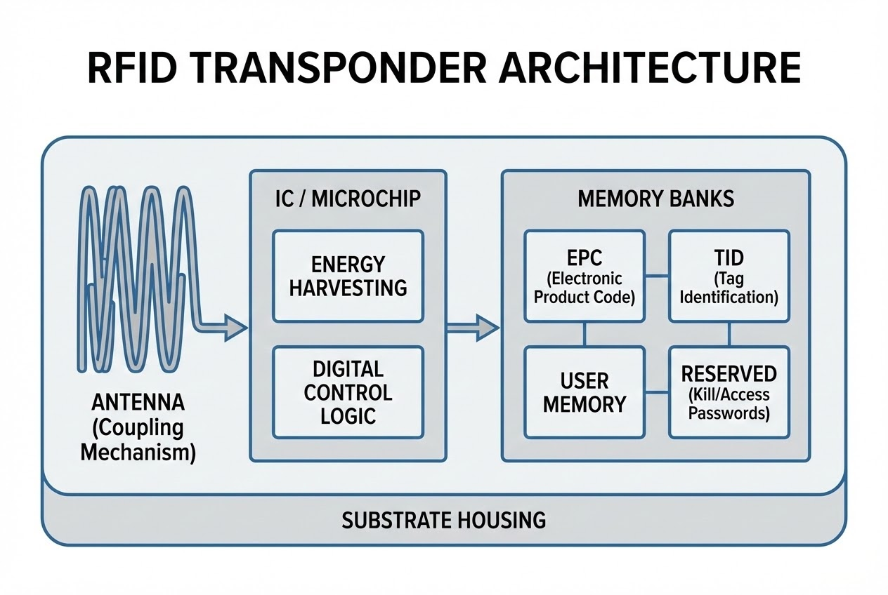

# บทนำ
คุณเคยสงสัยไหมครับว่า สติกเกอร์ใบเล็กๆ หรือแผ่นป้ายพลาสติกบางๆ ที่ติดอยู่บนกล่องสินค้า สามารถเก็บข้อมูลมหาศาลและส่งสัญญาณกลับมายังเครื่องอ่านได้พร้อมกันนับร้อยชิ้นในเสี้ยววินาที โดยที่ **"ไม่ต้องมีแบตเตอรี่"** ได้อย่างไร? 

ความลับของเทคโนโลยีที่เหมือนเวทมนตร์นี้ ไม่ใช่เรื่องบังเอิญครับ แต่มาจากความชาญฉลาดของการออกแบบสถาปัตยกรรมภายในสิ่งที่เราเรียกว่า **"ทรานสปอนเดอร์" (Transponder)** หรือที่คนทั่วไปรู้จักกันในชื่อ "แท็ก RFID" (RFID Tag) นั่นเอง วันนี้เราจะมาแกะกล่องดูโครงสร้างภายในของอุปกรณ์จิ๋วชิ้นนี้กันครับ ว่ามีองค์ประกอบอะไรบ้าง

---

## ทฤษฎีที่เกี่ยวข้อง (Concept): โครงสร้าง 4 ส่วนหลัก



### 1. เสาอากาศ (Antenna): ด่านหน้าผู้รับพลังงานและสื่อสาร
ในกรณีของแท็กแบบ Passive (ไม่มีแบตเตอรี่) เสาอากาศไม่ได้ทำหน้าที่แค่ส่งข้อมูลเท่านั้น แต่ยังทำหน้าที่เป็น **"ตัวดักจับพลังงาน" (Coupling mechanism)** โดยจะคอยรับพลังงานคลื่นแม่เหล็กไฟฟ้าที่เครื่องอ่านส่งมา เพื่อแปลงเป็นกระแสไฟฟ้าสำหรับหล่อเลี้ยงชิ้นส่วนอิเล็กทรอนิกส์อื่นๆ 

> *"An antenna is responsible for transmitting and receiving radio waves between RFID tags and readers. It is an electrical device that converts electric currents into radio waves, and vice versa."*

**บทวิเคราะห์:** ความน่าทึ่งของเสาอากาศ RFID คือการเป็นทั้ง "ปาก" "หู" และ "สายรับประทานอาหาร" ในเวลาเดียวกัน การออกแบบรูปร่างเสาอากาศ (เช่น ขดลวด หรือซิกแซก) คือตัวแปรสำคัญที่ชี้วัดว่าแท็กนั้นจะอ่านได้ไกลและเสถียรแค่ไหน

### 2. วงจรรวมหรือไมโครชิป (Integrated Circuit - IC): สมองกลสั่งการ
ถัดจากเสาอากาศ พลังงานและข้อมูลจะถูกส่งเข้าสู่ "ชิป RFID" ประกอบด้วยหลายส่วนย่อยที่ทำงานร่วมกันอย่างซับซ้อน เช่น:
* **Energy harvesting circuit:** วงจรแปลงคลื่นวิทยุเป็นไฟฟ้ากระแสตรง (DC)
* **Power management unit:** หน่วยรักษาระดับแรงดันไฟฟ้า
* **Digital control logic:** ถอดรหัสสัญญาณและสั่งการให้ใช้การปรับเปลี่ยนค่าความต้านทาน (Load Modulation / Backscatter) เพื่อสะท้อนสัญญาณกลับไป

### 3. โครงสร้างหน่วยความจำ (Memory Architecture): ห้องนิรภัยเก็บข้อมูล
ภายในไมโครชิปยังเป็นที่ตั้งของ "หน่วยความจำ" ซึ่งถูกจัดเป็น 4 โซนหลัก (Memory Banks):
1. **EPC (Electronic Product Code):** ส่วนสำคัญที่สุด ใช้เก็บรหัสประจำตัวสินค้า (เขียนข้อมูลทับได้)
2. **TID (Tag Identifier):** รหัสเฉพาะตัวจากโรงงานผลิตชิป (แก้ไขไม่ได้) เปรียบเสมือนลายนิ้วมือ
3. **User Memory:** พื้นที่เสริมสำหรับบันทึกข้อมูลเพิ่มเติมลงไปบนแท็ก
4. **Reserved Memory:** พื้นที่สงวนใช้สำหรับเก็บรหัสผ่าน (Passwords) ในการสั่งล็อกแท็ก (Lock) หรือทำลายแท็ก (Kill)

### 4. วัสดุฐานรองและโครงสร้างห่อหุ้ม (Substrate / Housing)
ทำหน้าที่ยึดให้เสาอากาศและชิปอยู่ด้วยกัน การเลือกวัสดุห่อหุ้มมีความสำคัญมาก เช่น แผ่นกระดาษ/ฟิล์มบางๆ สำหรับทำฉลาก (Label), แคปซูลแก้ว สำหรับฝังในสัตว์, หรือกรอบพลาสติก/อีพ็อกซีแบบทนทานสูง (Anti-Metal Tag) สำหรับติดบนโลหะเพื่อป้องกันการสะท้อนของคลื่นวิทยุ

---

## ขั้นตอนการทำงาน (Code Snippet สำหรับ Developer)

การเข้าใจโครงสร้างของ Memory Banks ช่วยให้นักพัฒนาสามารถเขียนโปรแกรมดึงข้อมูลออกมาใช้ได้อย่างถูกต้อง ในการเขียนโปรแกรม C# เชื่อมต่อกับ Reader เรามักจะต้องแยกระหว่างการอ่าน EPC พื้นฐาน และการเจาะจงอ่าน TID ครับ

```csharp
// Code ตัวอย่าง (C#): การอ่านข้อมูลจาก Memory Bank ที่แตกต่างกัน
public void ProcessTransponderData(RFIDReader reader) {
    // 1. การอ่านแบบปกติ (Default จะได้ค่าจาก EPC Bank)
    List<Tag> scannedTags = reader.ReadTags();
    
    foreach(var tag in scannedTags) {
        Console.WriteLine($"[Scanned] EPC: {tag.EPC}");
        
        // 2. หากต้องการตรวจสอบของแท้ ต้องสั่งอ่าน TID Bank (Bank 2) เพิ่มเติม
        string tidHex = ReadSpecificMemoryBank(reader, tag.EPC, MemoryBank.TID);
        
        if (!string.IsNullOrEmpty(tidHex)) {
             Console.WriteLine($" -> Factory TID (ลายนิ้วมือดิจิทัล): {tidHex}");
             VerifyProductAuthenticity(tag.EPC, tidHex);
        }
    }
}

// ฟังก์ชันจำลองการเข้าถึง Memory Bank เฉพาะเจาะจง
private string ReadSpecificMemoryBank(RFIDReader reader, string targetEpc, MemoryBank bank) {
    // ต้องใช้ Read Access Command เจาะจงไปที่ EPC นั้นๆ
    var accessCmd = new ReadCommand(targetEpc, bank);
    return reader.ExecuteCommand(accessCmd);
}

```

> **Pro Tip / ข้อควรระวัง:**
> หากคุณใช้ "Anti-Metal Tag" (วัสดุฐานรองทนทานสูง) พึงระลึกไว้เสมอว่าตัวโครงสร้างจะทำให้เสาอากาศมีทิศทาง (Directional) ที่จำกัดกว่าแท็กกระดาษปกติ การทดสอบมุมตกกระทบของคลื่นระหว่าง Reader กับ Transponder ที่หน้างานจริง จึงสำคัญพอๆ กับการเขียนโค้ดเลยครับ

---

## สรุป

สถาปัตยกรรมของทรานสปอนเดอร์ คือการหลอมรวมกันอย่างลงตัวระหว่างฟิสิกส์ของคลื่นแม่เหล็กไฟฟ้าและการประมวลผลข้อมูลดิจิทัลขนาดจิ๋ว สิ่งประดิษฐ์เล็กๆ ที่ไม่มีแม้แต่แบตเตอรี่ในตัวนี้ กำลังเปลี่ยนแปลงวิธีที่เราติดตามและจัดการสรรพสิ่งบนโลกไปอย่างสิ้นเชิง

เมื่อเทคโนโลยีชิปและการออกแบบเสาอากาศพัฒนาไปไกลจนมีขนาดเล็กและราคาถูกลงเรื่อยๆ คุณคิดว่าในอนาคตอันใกล้ จะยังมีสิ่งของใดรอบตัวเราอีกบ้าง ที่จะไม่ถูกฝังสถาปัตยกรรมอัจฉริยะนี้เข้าไป?

---

**ติดปัญหาเรื่องการเลือก Transponder ให้เหมาะกับหน้างาน หรือการเขียนโปรแกรมเชื่อมต่อ?**
พูดคุยกับทีม Dev และ Engineer ของเราได้ที่ Line: [wisit.p](https://line.me/ti/p/~wisit.p)