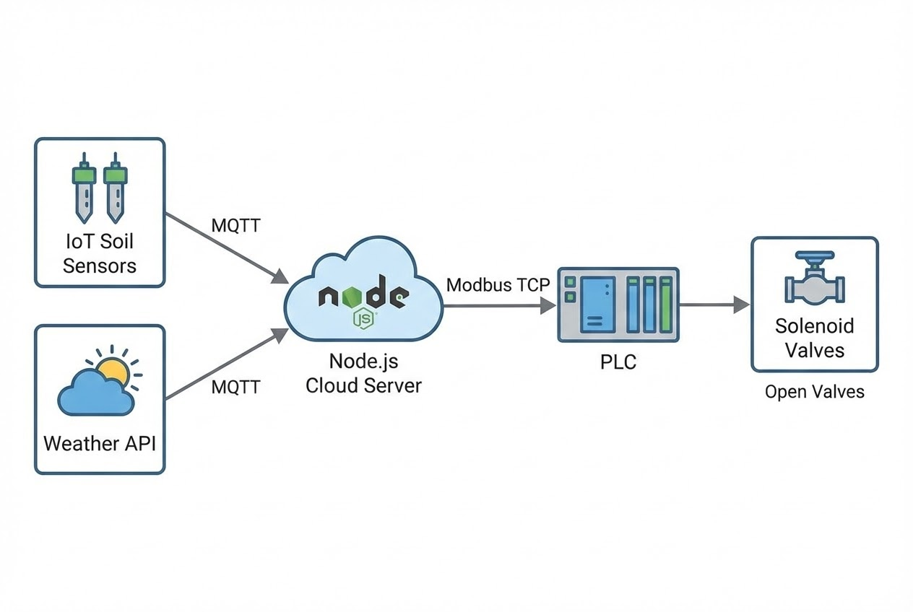

# บทนำ
น้ำคือหัวใจสำคัญของภาคการเกษตร แต่คุณรู้หรือไม่ว่า ปัจจุบันภาคการเกษตรทั่วโลกใช้น้ำจืดคิดเป็นสัดส่วนสูงถึง 70% ของปริมาณการใช้น้ำทั้งหมด ในขณะเดียวกัน ธุรกิจฟาร์มหลายแห่งยังคงใช้วิธีการให้น้ำแบบดั้งเดิม (เช่น การตั้ง Timer รดน้ำตามเวลา หรือกะเกณฑ์ด้วยสัญชาตญาณ) ซึ่งมักนำไปสู่ปัญหา **"การให้น้ำมากเกินไป (Over-irrigation)"** ที่ทำให้เปลืองค่าไฟปั๊มน้ำ รากเน่า และชะล้างปุ๋ยทิ้งไปโดยเปล่าประโยชน์

เพื่อแก้ปัญหา (Pain Point) นี้ **"ระบบชลประทานอัจฉริยะ (Smart Irrigation)"** จึงถูกพัฒนาขึ้น โดยเปลี่ยนการให้น้ำจากแบบ "คาดเดา" สู่การ "คำนวณด้วยข้อมูล (Data-driven)" วันนี้เราจะมาเจาะลึกการออกแบบ System Architecture ที่ผสาน IoT, API พยากรณ์อากาศ และ PLC อุตสาหกรรมเข้าด้วยกันครับ

## ทฤษฎีและองค์ประกอบหลัก (Core Technologies)
Smart Irrigation จะคำนวณและสั่งการจ่ายน้ำเฉพาะเวลาที่พืชต้องการ และในปริมาณที่พอดี ผ่าน 4 องค์ประกอบทางเทคโนโลยี:

1. **IoT Soil Moisture Sensors:** เซนเซอร์วัดความชื้นในดิน (Volumetric Water Content) ทำหน้าที่เป็นเสมือนเครื่องวัดความกระหายน้ำของพืช
2. **Weather API (สถานีพยากรณ์อากาศ):** หากเซนเซอร์บอกว่าดินแห้ง แต่ API แจ้งเตือนว่า "ฝนจะตกในอีก 1 ชั่วโมง" ระบบจะต้องสั่ง "ระงับ" การจ่ายน้ำทันที เพื่อป้องกันน้ำท่วมขัง
3. **Cloud Systems & Analytics:** ศูนย์กลาง (Brain) ที่รวบรวมข้อมูลเซนเซอร์และสภาพอากาศ มาวิเคราะห์หาอัตราการระเหยและการคายน้ำของพืช (Evapotranspiration - ET) 
4. **Actuators (อุปกรณ์สั่งการ):** โซลินอยด์วาล์ว (Solenoid Valve) และปั๊มน้ำ (Water Pump) ที่รับคำสั่งจาก Controller (เช่น PLC) เพื่อเปิด-ปิดน้ำในแต่ละโซนย่อย

## ขั้นตอนการทำงานและสถาปัตยกรรม (Step-by-Step Architecture)



### ตัวอย่างการเขียน Logic ควบคุมด้วย Node.js และ MQTT
ในการทำงานจริง Edge Gateway ที่หน้างานจะส่งค่าความชื้นดินผ่าน **MQTT** มายัง Server (เช่น Node.js) จากนั้น Server จะเช็ก API สภาพอากาศ ก่อนตัดสินใจส่งคำสั่งไปเปิดวาล์วน้ำที่ **PLC** (ผ่าน Modbus TCP หรือ MQTT กลับไปที่ Edge)

```javascript
// ตัวอย่าง Code: Node.js (Smart Irrigation Logic)
const mqtt = require('mqtt');
const axios = require('axios'); // สำหรับ Call Weather API

const client = mqtt.connect('mqtt://broker.hivemq.com');
const SOIL_THRESHOLD = 30.0; // % ความชื้นที่พืชต้องการน้ำ

client.on('connect', () => {
    // Subscribe รับค่าจากเซนเซอร์โซน 1
    client.subscribe('farm/zone1/soil_moisture');
});

client.on('message', async (topic, message) => {
    if (topic === 'farm/zone1/soil_moisture') {
        let currentMoisture = parseFloat(message.toString());
        console.log(`Zone 1 Moisture: ${currentMoisture}%`);

        // ถ้าน้ำน้อยกว่าเกณฑ์ที่ตั้งไว้
        if (currentMoisture < SOIL_THRESHOLD) {
            // เช็กพยากรณ์อากาศล่วงหน้า 3 ชั่วโมง
            let willRain = await checkWeatherForecast();

            if (!willRain) {
                // ถ้าฝนไม่ตก สั่งเปิด Solenoid Valve โซน 1 เป็นเวลา 15 นาที
                let payload = JSON.stringify({ valve_id: 1, status: "ON", timer_mins: 15 });
                client.publish('farm/zone1/valve_control', payload);
                console.log("Triggered: Valve ON (No rain expected)");
            } else {
                console.log("Skipped: Valve OFF (Rain expected shortly)");
            }
        }
    }
});

// ฟังก์ชันจำลองการเรียก API พยากรณ์อากาศ (เช่น OpenWeatherMap)
async function checkWeatherForecast() {
    // ในโปรเจกต์จริง ต้อง Call API เช็ก % โอกาสเกิดฝน (PoP)
    // return axios.get('[https://api.openweathermap.org/data/2.5/forecast](https://api.openweathermap.org/data/2.5/forecast)?...');
    return false; // สมมติว่าฝนไม่ตก
}

```

> **Pro Tip / ข้อควรระวังจากหน้างาน:**
> ในระบบท่อเมนขนาดใหญ่ (Mainline) การสั่งปิดวาล์วไฟฟ้า (Solenoid Valve) อย่างกะทันหัน มักก่อให้เกิดปรากฏการณ์ **Water Hammer (ค้อนน้ำ)** ซึ่งแรงดันที่กระแทกย้อนกลับสามารถทำให้ท่อแตกหรือข้อต่อหลุดได้ วิศวกรควรเขียน Logic ใน PLC ให้ปั๊มน้ำ "ลดรอบการทำงานลง (ผ่าน Inverter/VSD)" ก่อนที่จะสั่งปิดวาล์ว หรือใช้วาล์วชนิดปิดช้า (Slow-closing valve) ควบคู่กันไป

## ตัวอย่างการนำไปใช้งานจริง (Global Use Cases)

* 🇺🇸 **ฟาร์มขนาดใหญ่ในไอดาโฮ สหรัฐอเมริกา:** ในพื้นที่กว่า 2,630 เฮกตาร์ มีระบบสปริงเกลอร์ Center Pivot ถึง 80 จุด การตรวจหารอยรั่วทำได้ยากมาก ฟาร์มจึงนำเทคโนโลยี AI และภาพถ่ายทางอากาศ (Thermal Imaging) มาวิเคราะห์อุณหภูมิความชื้นรายต้น ทำให้ตรวจพบจุดน้ำรั่วหรือจุดแห้งแล้งได้ทันท่วงที
* 🌰 **สวนอัลมอนด์กับการลดน้ำด้วย AI:** มีการติดตั้งระบบ IoT เข้ากับอัลกอริทึม Deep Reinforcement Learning (DRL) ระบบตัดสินใจหารอบการให้น้ำที่เหมาะสมที่สุด จากการทดลองพบว่าประหยัดน้ำได้ถึง 7.8% และลดค่าไฟปั๊มน้ำได้อย่างเป็นรูปธรรม
* 🇪🇺 **โปรเจกต์ QUHOMA ในยุโรป:** ผสานการใช้ Cloud และเซนเซอร์มาบริหารตารางการให้น้ำ โดย AI จะประมวลผลเซนเซอร์รายวันร่วมกับข้อมูลประวัติสภาพอากาศ (Historical Data) เป็นระบบ Fallback หากวันใดเซนเซอร์ออฟไลน์ ระบบก็ยังสั่งจ่ายน้ำต่อได้ไม่สะดุด

## สรุป (Business Impact)

การลงทุนใน Smart Irrigation ช่วยลดการจ่ายน้ำเกินจำเป็น ซึ่งลดค่าไฟปั๊มน้ำได้มหาศาล (บางฟาร์มประหยัดได้ถึง 22-42%) นอกจากนี้ยังช่วยรักษาธาตุอาหารในดิน (Reduced Fertilizer Runoff) และลดความเครียดของพืช (Yield Optimization) เทคโนโลยีนี้จึงไม่ใช่แค่เครื่องมือรักษ์โลก แต่เป็น "กลยุทธ์ลดต้นทุน" ที่ทรงพลังที่สุดในยุคนี้

---

**ติดปัญหาเรื่องการเขียน Logic ควบคุมปั๊มน้ำ หรือการสื่อสารข้อมูลระหว่าง IoT กับ PLC?**
หากธุรกิจฟาร์มของคุณกำลังมองหาผู้เชี่ยวชาญในการออกแบบและติดตั้งระบบ Smart Irrigation และ IoT Water Management แบบครบวงจร
พูดคุยกับทีมวิศวกรและ Developer ของเราได้ที่: wisit.paewkratok@gmail.com | Line: wisit.p