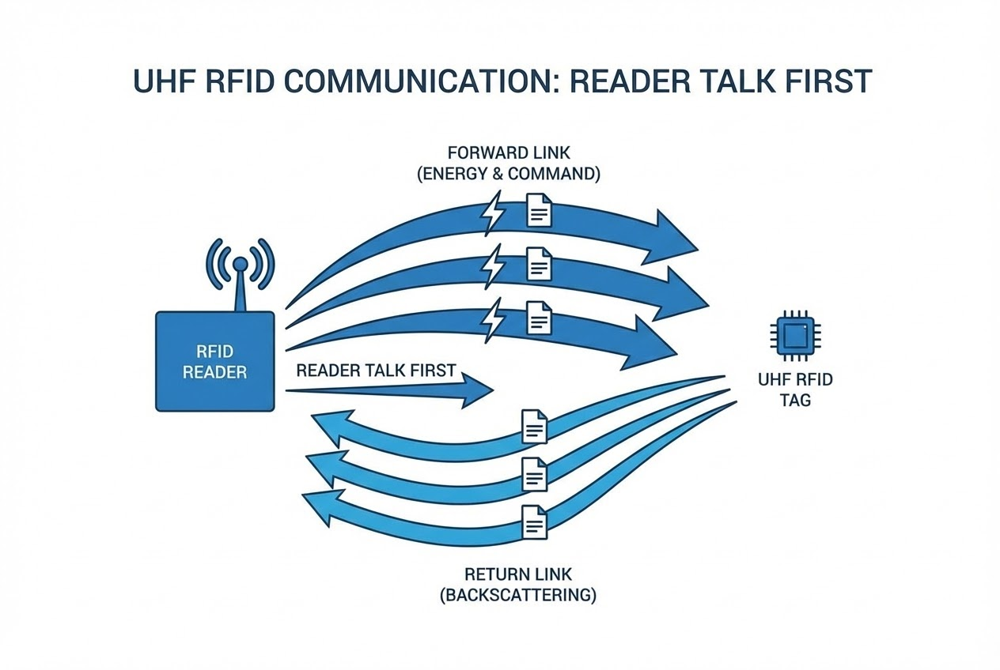

# บทนำ
คุณเคยสงสัยหรือไม่ว่า เวลาพนักงานเข็นพาเลทที่มีสินค้าหลายร้อยชิ้นผ่านประตูคลังสินค้า ข้อมูลทั้งหมดถูกบันทึกเข้าระบบได้อย่างไรในเวลาเพียงเสี้ยววินาทีโดยไม่ต้องเปิดกล่องออกมาดูทีละชิ้น? สิ่งที่ดูเหมือนเวทมนตร์นี้ แท้จริงแล้วคือความชาญฉลาดของการออกแบบฟิสิกส์ทางวิศวกรรม 

ในบทความนี้ เราจะมาเจาะลึก "หลักการทำงานและการสื่อสาร" ของเทคโนโลยี UHF RFID เพื่อทำความเข้าใจเบื้องหลังการสนทนาระหว่างเครื่องอ่านและป้ายแท็กจิ๋ว ที่กำลังกุมบังเหียนห่วงโซ่อุปทาน (Supply Chain) ระดับโลกกันครับ

## ทฤษฎีที่เกี่ยวข้อง (Concept)

### กฎเหล็กแห่งการสนทนา: "เครื่องอ่านต้องเป็นฝ่ายเริ่มก่อน" (Reader Talk First)
ระบบ RFID ย่านความถี่ UHF และ SHF ส่วนใหญ่ทำงานภายใต้หลักการสื่อสารแบบฮาล์ฟดูเพล็กซ์ (Half-duplex) และใช้กฎเกณฑ์ที่เรียกว่า **"Reader Talk First" (RTF)** หรือเครื่องอ่านต้องเป็นฝ่ายพูดก่อนเสมอ 

ซึ่งหมายความว่ารูปแบบการสื่อสารจะเป็นการสลับกันส่งข้อมูล โดยป้ายแท็กจะไม่มีสิทธิ์ส่งสัญญาณหรือข้อมูลใดๆ ออกมาหากยังไม่ได้รับพลังงานหรือคำสั่งเริ่มต้นจากเครื่องอ่าน การให้เครื่องอ่านเป็นเสมือน "วาทยกร" คอยควบคุมจังหวะว่าใครควรพูดตอนไหน จึงทำให้ระบบสามารถจัดการกับป้ายแท็กจำนวนมหาศาลได้อย่างเป็นระเบียบและลดการชนกันของข้อมูล (Data Collision)

## กลไกการสื่อสาร (Step-by-Step)

การสื่อสารระหว่าง Reader และ Tag แบ่งออกเป็น 2 เฟสหลักๆ ดังนี้:

### 1. Forward Link: ส่งทั้ง "พลังงาน" และ "คำสั่ง"
การสื่อสารในเฟสแรกเรียกว่า **"Forward Link"** (เส้นทางจากเครื่องอ่านไปยังป้ายแท็ก) ในขั้นตอนนี้ เครื่องอ่านจะทำหน้าที่ส่งคลื่นความถี่พาหะ (Carrier frequency) ออกไปเพื่อทำหน้าที่สองอย่างพร้อมกัน คือ:
1. เป็นการจ่ายพลังงานไร้สายให้กับป้ายแท็กแบบไม่มีแบตเตอรี่ (Passive)
2. ปรับผสมสัญญาณ (Modulation) แบบ ASK เพื่อส่งรหัสคำสั่งไปยังแท็ก 

> "เทคโนโลยีป้ายระบุตัวตนด้วยคลื่นความถี่วิทยุ UHF แบบพาสซีฟ... ช่วยให้สามารถระบุตัวตนของวัตถุหรือบุคคลได้โดยอัตโนมัติในระยะไกลสูงสุดถึง 10 เมตร โดยไม่จำเป็นต้องอยู่ในแนวสายตาโดยตรง อาศัยหลักการแลกเปลี่ยนคลื่นวิทยุในรูปแบบเดียวกับเรดาร์"

ในเฟสนี้ แท็กจะถูกออกแบบโครงสร้างมาให้ "ดูดซับ" พลังงานที่ได้รับให้ได้มากที่สุดเพื่อนำไปหล่อเลี้ยงวงจร

### 2. Return Link & Backscattering: ศิลปะแห่งการ "สะท้อนคลื่น"
เมื่อมาถึงเฟสที่สอง หรือ **"Return Link"** ซึ่งแท็กจะต้องส่งข้อมูลตัวตนกลับไป เครื่องอ่านจะเปลี่ยนโหมดมาส่งคลื่นวิทยุเปล่าๆ ออกมาอย่างต่อเนื่องเพื่อเป็นฐานพลังงานให้ 

ส่วนตัวป้ายแท็กนั้น แทนที่จะพยายามสร้างคลื่นวิทยุของตัวเอง (ซึ่งต้องใช้พลังงานสูงมาก) มันกลับเลือกใช้วิธีที่เรียกว่า **"การกระเจิงกลับ" (Backscattering)** โดยวงจรภายในชิปของแท็กจะทำการสับเปลี่ยนค่าความต้านทานของสายอากาศ (Impedance mismatching) อย่างรวดเร็วในลักษณะติด-ดับ (On-off keying) ตามจังหวะข้อมูลตรรกะ 0 หรือ 1 ที่ต้องการส่ง การปรับเปลี่ยนนี้ทำให้ "พื้นที่หน้าตัดเรดาร์" (RCS) ของแท็กเปลี่ยนแปลงไป ส่งผลให้คลื่นวิทยุที่สะท้อนกลับไปยังเครื่องอ่านมีลักษณะกระพริบเปลี่ยนระดับพลังงานตามไปด้วย

*(ภาพประกอบ: `uhf-rfid-communication-principles-diagram.jpg`)*


---

## ตัวอย่างการเชื่อมต่อ RFID Reader พื้นฐาน (C#)

สำหรับ Software Engineer ที่ต้องการคุยกับ RFID Reader มักจะใช้ Protocol อย่าง LLRP (Low Level Reader Protocol) หรือเชื่อมต่อผ่าน TCP Socket ของตัวอุปกรณ์โดยตรง นี่คือตัวอย่างโครงสร้างโค้ดในการสั่งอ่านแท็กเบื้องต้น:

```csharp
using System;
using System.Net.Sockets;
using System.Text;

public class RFIDController {
    private TcpClient _client;
    private NetworkStream _stream;

    public void ConnectReader(string ipAddress, int port) {
        try {
            _client = new TcpClient(ipAddress, port);
            _stream = _client.GetStream();
            Console.WriteLine("เชื่อมต่อ RFID Reader สำเร็จ!");
            
            // ส่งคำสั่งเปิดการอ่าน (ตัวอย่าง Command ขึ้นอยู่กับยี่ห้อ Reader)
            byte[] startCommand = Encoding.ASCII.GetBytes("START_READ\r\n");
            _stream.Write(startCommand, 0, startCommand.Length);
        }
        catch (Exception ex) {
            Console.WriteLine($"เกิดข้อผิดพลาด: {ex.Message}");
        }
    }
    
    // ... โค้ดส่วนรับข้อมูลจาก Stream ...
}

```

> **Pro Tip / ข้อควรระวัง:**
> **ความท้าทายเรื่องระยะทาง (Shunt Regulator)**
> ในโลกความเป็นจริง แท็กต้องเจอกับสภาพแวดล้อมสุดขั้ว เพื่อป้องกันไม่ให้วงจรไหม้เมื่อแท็กอยู่ใกล้เครื่องอ่านเกินไป ภายในไมโครชิปจะมี "Shunt Regulator" ทำหน้าที่จำกัดแรงดันไฟฟ้า เมื่อมันทำงาน มันจะปรับลดค่าความต้านทานเพื่อดึงกระแสไฟทิ้งไป ซึ่งส่งผลให้ความสามารถในการส่งสัญญาณกลับของแท็กลดลงอย่างหลีกเลี่ยงไม่ได้ วิศวกรจึงต้องบาลานซ์ทั้งระยะการอ่าน (Read Range) และพลังงานเสาอากาศ (Antenna Power) ให้เหมาะสมกับหน้างานจริงเสมอ!

## สรุป

หลักการทำงานของการสื่อสารในเทคโนโลยี UHF RFID คือการหลอมรวมฟิสิกส์ของการกระจายคลื่นแม่เหล็กไฟฟ้า เข้ากับสถาปัตยกรรมตรรกะดิจิทัลขนาดจิ๋วได้อย่างไร้ที่ติ การสื่อสารผ่านการสะท้อนคลื่น (Backscattering) คือกุญแจหลักที่ปลดล็อกข้อจำกัดทางโลจิสติกส์แบบเดิมๆ ทำให้เราสามารถติดตามสินค้าแบบเรียลไทม์ได้ในระดับเสี้ยววินาที

เมื่อโลกของเรากำลังก้าวเข้าสู่ยุค Internet of Things (IoT) อย่างเต็มตัว เทคโนโลยีการสื่อสารแบบไม่ต้องพึ่งพาแบตเตอรี่และมองไม่เห็นด้วยตาเปล่านี้ จะเข้าไปแฝงตัวและสร้างนวัตกรรมใหม่ๆ ในวิถีชีวิตประจำวันของเราได้อีกมหาศาลครับ

---

**ติดปัญหาเรื่อง Coding หรือ System?**
พูดคุยกับทีม Dev ของเราได้ที่ Line: wisit.p