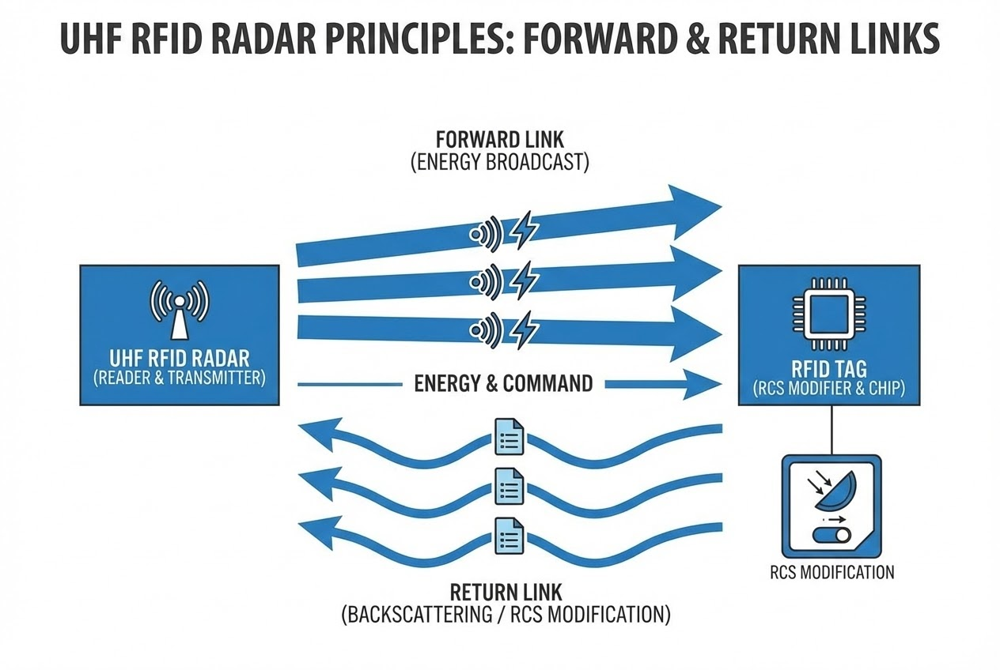

# บทนำ
เวลาที่เราเห็นกล่องสินค้าหรือพาเลทนับร้อยชิ้นถูกสแกนข้อมูลเข้าสู่ระบบคอมพิวเตอร์อย่างถูกต้องแม่นยำจากระยะไกลนับสิบเมตร โดยที่ป้ายแท็กเหล่านั้น "ไม่มีแม้แต่แบตเตอรี่" มันมักจะดูเหมือนเวทมนตร์เสมอครับ 

แต่ในมุมมองของวิศวกร คำตอบที่อยู่เบื้องหลังความมหัศจรรย์นี้คือการประยุกต์ใช้หลักการ **"แบบเรดาร์" (Radar-type radio wave exchange)** ซึ่งถือเป็นกุญแจดอกสำคัญที่สุดที่อธิบายปรากฏการณ์นี้ วันนี้เราจะมาเจาะลึกกันแบบ Deep Dive ว่า หลักการของเรดาร์ทางทหาร ถูกย่อส่วนมาอยู่ในสติกเกอร์เล็กๆ และสื่อสารกับระบบ Software ของเราได้อย่างไร

## ทฤษฎีที่เกี่ยวข้อง (Concept)

### 1. กฎเหล็กแบบเรดาร์: "Reader Talk First" (RTF)
ในระบบเรดาร์ที่เราคุ้นเคย สถานีฐานจะต้องส่งคลื่นแม่เหล็กไฟฟ้าออกไปในอากาศเพื่อค้นหาเป้าหมายก่อนเสมอ ระบบ UHF RFID ก็ทำงานภายใต้กฎเดียวกันนี้เป๊ะครับ 

ในการสื่อสารเฟสแรกที่เรียกว่า **"Forward link"** เครื่องอ่านจะทำหน้าที่ส่งคลื่นความถี่พาหะ (Carrier frequency) ออกไปเพื่อ "อาบ" หรือสาดพลังงานใส่ป้ายแท็กที่อยู่ในรัศมี แท็กแบบ Passive จะใช้เสาอากาศของมันดักจับพลังงานนี้เพื่อนำมาปลุกวงจรไมโครชิปให้ตื่นขึ้น การออกแบบให้เครื่องอ่านเป็นผู้ส่งพลังงานก่อน ถือเป็นความชาญฉลาดที่ทำให้เราสามารถตัดชิ้นส่วนแบตเตอรี่ออกจากป้ายแท็กได้โดยสิ้นเชิง

### 2. ศิลปะแห่งการสะท้อนกลับ (Backscattering)
เมื่อเป้าหมายอย่างเครื่องบินถูกคลื่นเรดาร์กระทบ มันจะสะท้อนคลื่นนั้นกลับไปยังสถานีฐานเพื่อให้รู้ตำแหน่ง แท็ก RFID ก็ใช้หลักการ **"การกระเจิงกลับ" (Backscattering)** ในลักษณะเดียวกัน

ในช่วงเฟสที่สองที่เรียกว่า **"Return link"** เครื่องอ่านจะยังคงปล่อยคลื่นวิทยุออกมาอย่างต่อเนื่อง แต่ตัวแท็กไม่ได้พยายามสร้างคลื่นวิทยุส่งกลับไปเอง (เพราะการสร้างคลื่นต้องใช้พลังงานสูงมาก) แต่มันใช้หลักการ "สะท้อน" คลื่นที่เครื่องอ่านส่งมานั้นให้กระดอนกลับไปหาเครื่องอ่านแทน เสมือนเทคนิคศิลปะการต่อสู้ที่ยืมพลังของคู่ต่อสู้มาใช้

> "เทคโนโลยี UHF RFID แบบพาสซีฟ... ช่วยให้สามารถระบุตัวตนของวัตถุหรือบุคคลได้โดยอัตโนมัติในระยะไกลสูงสุดถึง 10 เมตร โดยไม่จำเป็นต้องอยู่ในแนวสายตาโดยตรง อาศัยหลักการแลกเปลี่ยนคลื่นวิทยุในรูปแบบเดียวกับเรดาร์"

### 3. ปรับเปลี่ยนพื้นที่หน้าตัดเรดาร์ (RCS)
การสะท้อนคลื่นเฉยๆ จะส่งข้อมูลที่เป็นรหัส 0 และ 1 กลับไปได้อย่างไร? ความลับอยู่ตรงการเปลี่ยนแปลงสิ่งที่เรียกว่า **"พื้นที่หน้าตัดเรดาร์" (Radar Cross Section หรือ RCS)** เมื่อชิปบนแท็กต้องการส่งข้อมูลกลับ มันจะทำการสับเปลี่ยนค่าความต้านทาน (Impedance) ที่โหลดของเสาอากาศอย่างรวดเร็ว การเปลี่ยนแปลงความต้านทานนี้ทำให้เกิด "ความไม่เข้ากัน" (Mismatch) ส่งผลให้สถานะการดูดซับและการสะท้อนพลังงานเปลี่ยนไปเปลี่ยนมา คล้ายกับคุณยืนอยู่บนยอดเขาและใช้ "กระจกเงา" พลิกไปมาเพื่อสะท้อนแสงอาทิตย์ให้กะพริบเป็นรหัสมอร์สนั่นเอง



## สิ่งที่ต้องเตรียม (Prerequisites) สำหรับงาน Dev
หากคุณกำลังจะพัฒนาระบบที่ต้องคุยกับ RFID Reader นี่คือ Stack เบื้องต้น:
1. **Hardware:** UHF RFID Reader (เช่น Impinj, Zebra), Passive Tags
2. **Software/Library:** C# .NET Core, Octane SDK หรือ LLRP (Low Level Reader Protocol) Library

## ขั้นตอนการทำงาน (Step-by-Step) ทางฝั่ง Software

เพื่อให้เห็นภาพว่า Software สั่งการกลไกเรดาร์นี้อย่างไร นี่คือตัวอย่างการสั่งให้ Reader เริ่ม "สาดพลังงาน" (Forward Link) เพื่อค้นหาแท็กด้วย C#:

```csharp
// Code ตัวอย่างการเชื่อมต่อและสั่งอ่านผ่าน LLRP (Concept)
using Org.Llrp.LTK.LLRPV1;
using Org.Llrp.LTK.LLRPV1.DataType;

public void StartRadarScan(string readerIp) {
    // 1. สร้างการเชื่อมต่อไปยัง Reader
    LLRPClient reader = new LLRPClient();
    reader.Open(readerIp, 5084, out string errorMessage);

    if (!string.IsNullOrEmpty(errorMessage)) {
        Console.WriteLine($"Connection Error: {errorMessage}");
        return;
    }

    // 2. กำหนดค่า Antenna Power (ความแรงในการสาดพลังงาน Forward Link)
    // การตั้งค่าพลังงานที่เหมาะสมจะช่วยให้แท็กสะท้อน RCS กลับมาได้ชัดเจน
    SetReaderConfig msg = new SetReaderConfig();
    // ... (ตั้งค่า TxPower, Receive Sensitivity) ...

    // 3. เริ่มการส่งคลื่นเพื่อทำ Backscattering
    ROSPEC rospec = EnableROSpec(); // สร้างคำสั่งเปิดเสาอากาศ
    reader.SendMessage(rospec, out errorMessage);

    Console.WriteLine("Reader is now transmitting power and listening for Backscatter signals...");
}

```

> **Pro Tip / ข้อควรระวัง:**
> **ระวังตัวกลางที่บิดเบือนค่า RCS (Radar Cross Section)**
> เนื่องจากแท็กอาศัยหลักการสะท้อนคลื่น หากคุณนำแท็กไปติดบน **"พื้นผิวโลหะ" (Metal)** โลหะจะสะท้อนคลื่นวิทยุแข่งกับแท็ก ทำให้เครื่องอ่านแยกแยะสัญญาณกะพริบไม่ได้ (Detuning) และหากติดบน **"ของเหลว/น้ำ" (Liquid)** น้ำจะดูดซับพลังงานคลื่นวิทยุไปจนหมด ทำให้แท็กไม่มีพลังงานพอที่จะสะท้อนกลับ ต้องเลือกใช้แท็กชนิดพิเศษ (Anti-metal tag) สำหรับหน้างานเหล่านี้เสมอ!

## สรุป

คำตอบสั้นๆ เทคโนโลยีนี้ทำงาน "แบบเรดาร์" ซ่อนสถาปัตยกรรมทางวิศวกรรมที่ยิ่งใหญ่ไว้เบื้องหลัง การทำความเข้าใจหลักการ Backscattering และการปรับพื้นที่หน้าตัดเรดาร์ (RCS) จะช่วยให้ Engineer เข้าใจว่าทำไมการจูนเสาอากาศและสภาพแวดล้อมหน้างาน ถึงมีผลกับระยะการอ่านแท็กอย่างมาก

เมื่อชิปไร้แบตเตอรี่ขนาดเท่าเม็ดทรายสามารถใช้หลักการเรดาร์ในการสื่อสารข้ามอากาศได้ไกลนับสิบเมตรแล้ว การออกแบบซอฟต์แวร์ที่แข็งแกร่งเพื่อรับมือกับ Data มหาศาลที่สะท้อนกลับมา จึงเป็นความท้าทายต่อไปของชาว Developer อย่างเราครับ

---

**ติดปัญหาเรื่อง Coding หรือ System Automation?**
พูดคุยกับทีม Dev ของเราได้ที่ Line: wisit.p