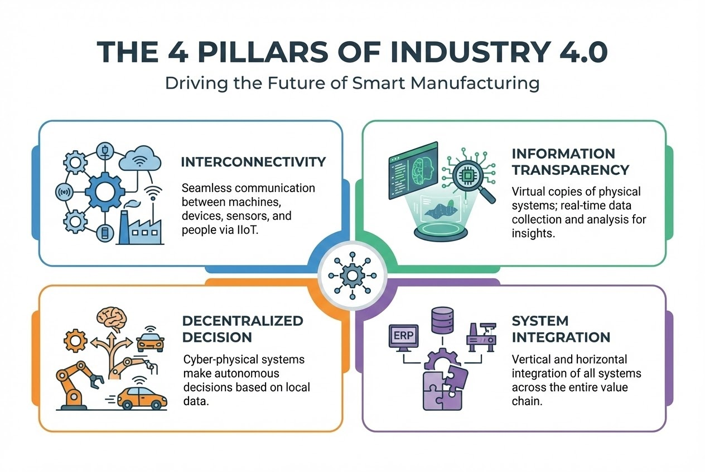

# บทนำ

ในฐานะ Senior System Analyst ผมมักถูกถามบ่อยๆ ว่า "แค่ซื้อหุ่นยนต์มาลง เรียกว่าเป็นโรงงาน 4.0 หรือยัง?" คำตอบคือ **"ยังครับ"** โรงงาน 4.0 (Smart Factory) ไม่ได้หมายถึงแค่การมีระบบอัตโนมัติ (นั่นคือยุค 3.0) แต่หัวใจสำคัญคือ **"การเชื่อมโยง (Connectivity)"** และ **"ข้อมูล (Data)"** ที่ทำให้โลกทางกายภาพ (Physical) และโลกดิจิทัล (Cyber) หลอมรวมกันเป็นหนึ่งเดียว หรือที่เราเรียกว่า **Cyber-Physical Systems (CPS)**

หากคุณเดินเข้าไปในโรงงาน แล้วอยากรู้ว่าที่นี่เป็น 4.0 หรือยัง ให้เช็คจาก **4 องค์ประกอบหลัก** นี้ครับ:

## 1. การเชื่อมโยงทุกสรรพสิ่ง (Interconnectivity & IIoT)
โรงงาน 4.0 อุปกรณ์ทุกชิ้นต้อง "คุยกันรู้เรื่อง" ไม่ได้ทำงานแบบโดดเดี่ยว (Standalone)

* **ลักษณะ:** เครื่องจักร (Machine), เซนเซอร์ (Sensor), และตัวสินค้า (Product) ถูกเชื่อมต่อเข้าด้วยกันผ่านเครือข่ายอินเทอร์เน็ตอุตสาหกรรม (IIoT)
* **ตัวอย่าง:** เครื่องจักร A สามารถส่งข้อมูลบอกเครื่องจักร B ว่า "ผลิตเสร็จแล้วนะ เตรียมรับของต่อได้เลย" หรือสินค้าที่มี RFID บอกเครื่องจักรว่า "ฉันคือสินค้ารุ่น X ช่วยพ่นสีแดงให้หน่อย" โดยไม่ต้องใช้คนกดปุ่ม

## 2. ความโปร่งใสของข้อมูลแบบ Real-time (Information Transparency)
ไม่ใช่แค่เก็บข้อมูล แต่ต้องเห็น "เงา" ของโรงงานในโลกดิจิทัล

*คำอธิบาย: ภาพแสดงการเชื่อมโยงข้อมูลจาก Sensor สู่ Cloud แบบ Real-time*

* **ลักษณะ:** มีการสร้าง **Digital Twin** หรือแบบจำลองเสมือน ข้อมูลสถานะการผลิต หรืออุณหภูมิเครื่องจักร ต้องดูได้ทันที (Real-time) ผ่าน Dashboard ไม่ใช่รอรายงานกระดาษตอนสิ้นวัน
* **ตัวอย่าง:** ผู้บริหารสามารถมอนิเตอร์ Downtime และรู้สาเหตุทันทีจากการวิเคราะห์ข้อมูลผ่านระบบ Cloud

## 3. ระบบช่วยตัดสินใจและทำงานอัตโนมัติ (Decentralized Decision)
เปลี่ยนจาก "คนสั่งเครื่อง" เป็น "เครื่องคิดเองได้" ในเรื่องพื้นฐาน

* **ลักษณะ:** ระบบ CPS สามารถตัดสินใจเองได้ เช่น ปรับความเร็วการผลิตอัตโนมัติ หรือระบบ **Predictive Maintenance** ที่แจ้งเตือนซ่อมบำรุงล่วงหน้าก่อนที่เครื่องจะพังจริง
* **ตัวอย่าง:** เมื่อเซนเซอร์ตรวจพบแรงสั่นสะเทือนผิดปกติ ระบบจะสั่งจองอะไหล่และแจ้งช่างซ่อมบำรุงโดยอัตโนมัติ

## 4. การบูรณาการข้อมูล (Vertical & Horizontal Integration)
นี่คือจุดที่ยากที่สุดแต่สำคัญที่สุดของ 4.0

* **Vertical Integration (แนวดิ่ง):** ข้อมูลเชื่อมต่อกันตั้งแต่ระดับ Sensor/PLC -> SCADA/MES -> ERP (ฝ่ายขายรับออเดอร์ -> เครื่องจักรผลิตเอง -> ตัดสต็อกอัตโนมัติ)
* **Horizontal Integration (แนวราบ):** เชื่อมโยงข้อมูลทั้ง Supply Chain ตั้งแต่ Supplier จนถึงลูกค้า

---

## 📋 Checklist: โรงงานของคุณอยู่ระดับไหน?

| คุณลักษณะ | Industry 3.0 (Automation) | Industry 4.0 (Smart Factory) |
| :--- | :--- | :--- |
| **การควบคุม** | คนคุมเครื่อง หรือ PLC สั่งการตายตัว | ระบบ CPS ตัดสินใจเองได้ตามสถานการณ์ |
| **ข้อมูล** | จดบันทึก / สรุปผลตอนจบวัน | Real-time ไหลขึ้น Cloud วิเคราะห์ด้วย AI |
| **การซ่อมบำรุง** | ซ่อมเมื่อพัง หรือซ่อมตามรอบ (PM) | ซ่อมก่อนพัง (Predictive Maintenance) |
| **การผลิต** | ผลิตจำนวนมากแบบเดิมซ้ำๆ (Mass) | ผลิตตามสั่งรายชิ้นได้ (Mass Customization) |
| **การเชื่อมต่อ** | เครื่องจักรแยกกันทำงาน (Islands) | ทุกระบบเชื่อมต่อกันหมด (Ecosystem) |

## สรุป
โรงงานที่จะเรียกว่า 4.0 ได้ ต้องมี **"ระบบประสาท" (IIoT)** ที่เชื่อมโยงอวัยวะทุกส่วนเข้าด้วยกัน และมี **"สมอง" (AI/MES)** ที่ประมวลผลข้อมูล Real-time เพื่อสั่งการและปรับตัวได้เองครับ

---

**ติดปัญหาเรื่องการเชื่อมต่อข้อมูลเครื่องจักร หรือระบบ Smart Factory?**
พูดคุยกับทีม Dev ของเราได้ที่ Line: [wisit.p](https://line.me/ti/p/~wisit.p)