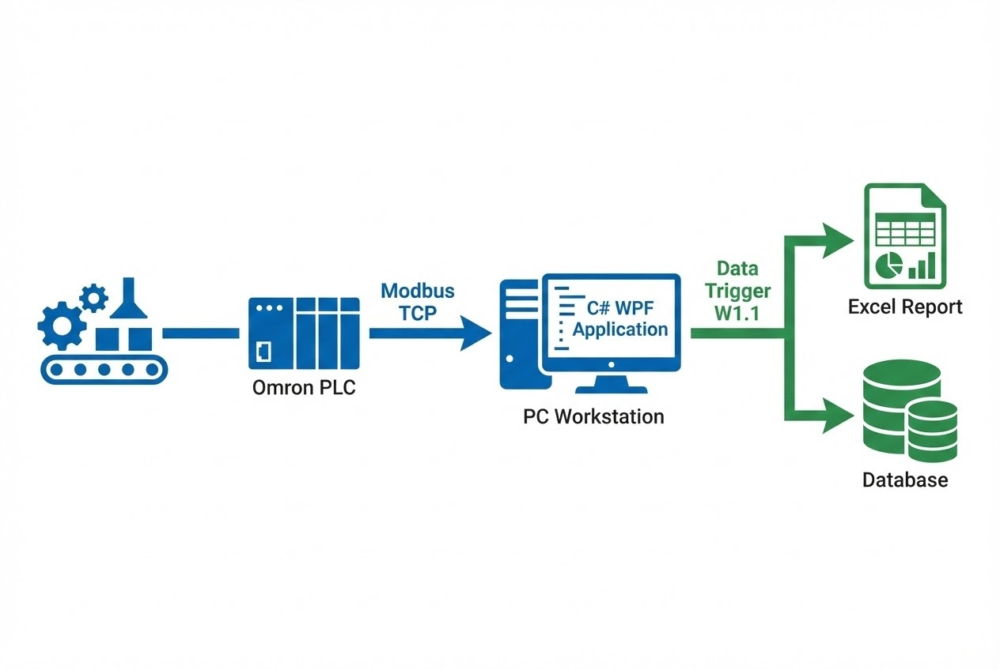

# เปลี่ยน Data Silo ให้เป็น Real-time Insight

**โจทย์ที่ได้รับ:**
หน้างานผลิตมีปัญหาเรื่องการจดบันทึกข้อมูล QC (Quality Control) ด้วยมือ ซึ่งทำให้เกิดความผิดพลาดและข้อมูลไม่เป็นปัจจุบัน ลูกค้าต้องการระบบที่สามารถดึงค่าสำคัญ 3 ตัว ได้แก่ **น้ำหนัก (Weight), ความหนา (Thickness), และความยาว (Length)** จากเครื่องจักรลงคอมพิวเตอร์โดยอัตโนมัติทันทีที่ผลิตเสร็จ

**ความท้าทาย:**
* **Synchronization:** ต้องดึงข้อมูลให้ตรงจังหวะที่เครื่องจักรทำงานจบ Process พอดี (ไม่ดึงก่อนหรือหลัง)
* **Production Control:** พนักงานต้องการตัวช่วยนับจำนวนชิ้นงาน (Counter) และแจ้งเตือนเมื่อผลิตครบตามยอดสั่งผลิต (Target)

## แนวทางการแก้ปัญหาของเรา
เราพัฒนาซอฟต์แวร์ **3-in-1 Data Logger** ด้วยภาษา **C# (WPF)** เพื่อเชื่อมต่อกับ PLC ผ่านระบบ LAN (Modbus TCP) โดยโปรแกรมจะทำหน้าที่เหมือน "เลขา" ที่คอยเฝ้าดูสัญญาณจากเครื่องจักรตลอดเวลา

### ฟีเจอร์เด่น (System Highlights)
1.  **Automated Logging:** ทันทีที่ PLC ส่งสัญญาณ Trigger (Address W1.1) โปรแกรมจะดึงค่า Data Register (D20, D22, D24) มาบันทึกลงตารางทันที โดยที่พนักงานไม่ต้องกดปุ่มใดๆ
2.  **Target Counter Alert:** ระบบมีช่องให้กรอกค่าเป้าหมาย (SV) และแสดงค่ายอดผลิตจริง (PV) คู่กัน (เช่น 19 / 21) เมื่อผลิตครบ โปรแกรมจะแจ้งเตือนพนักงานให้ทราบทันที
3.  **Data Maintenance:**
    * **Export:** ส่งออกข้อมูลเป็น Excel ตามช่วงเวลาที่ต้องการได้ เพื่อทำรายงานส่งลูกค้า
    * **Auto Cleanup:** ระบบช่วยลบข้อมูลที่เก่าเกิน 3 เดือนให้อัตโนมัติ เพื่อป้องกันคอมพิวเตอร์ช้าหรือฮาร์ดดิสก์เต็ม

### เทคโนโลยีที่ใช้ (Tech Stack)
* **Modbus TCP Protocol:** มาตรฐานสากลในการคุยกับ PLC (รองรับ Omron, Mitsubishi, Siemens)
* **C# WPF:** สร้างหน้าจอ UI ที่ทันสมัย ใช้งานง่าย และทำงานรวดเร็ว
* **Background Scheduler:** สำหรับงานดูแลรักษาฐานข้อมูลอัตโนมัติ

## ผลลัพธ์ที่ได้ (Business Impact)
* ✅ **Zero Error:** ข้อมูล QC ถูกต้อง 100% เพราะมาจาก Sensor โดยตรง ไม่ผ่านการจดมือ
* ✅ **Traceability:** สามารถตรวจสอบย้อนหลังได้ว่าสินค้าชิ้นไหน ผลิตเมื่อไหร่ และมีค่าพารามิเตอร์เป็นเท่าใด
* ✅ **Paperless:** ลดการใช้กระดาษหน้างาน และลดเวลาในการคีย์ข้อมูลซ้ำซ้อน

> **เกร็ดความรู้จากหน้างาน:**
> การเชื่อมต่อ PLC ผ่าน Modbus TCP สิ่งสำคัญคือการจัดการ **Data Type** ให้ตรงกัน (เช่น INT16 vs FLOAT) ในโปรเจกต์นี้เราต้องนำค่า Raw Data มาหาร 100 เพื่อให้ได้ทศนิยม 2 ตำแหน่งตามความจริงหน้างาน (เช่น ค่ามา 235 = 2.35 mm)

---
**ต้องการระบบเก็บข้อมูลเครื่องจักรแบบอัตโนมัติ?**
ติดต่อเรา: wisit.paewkratok@gmail.com | Line: wisit.p