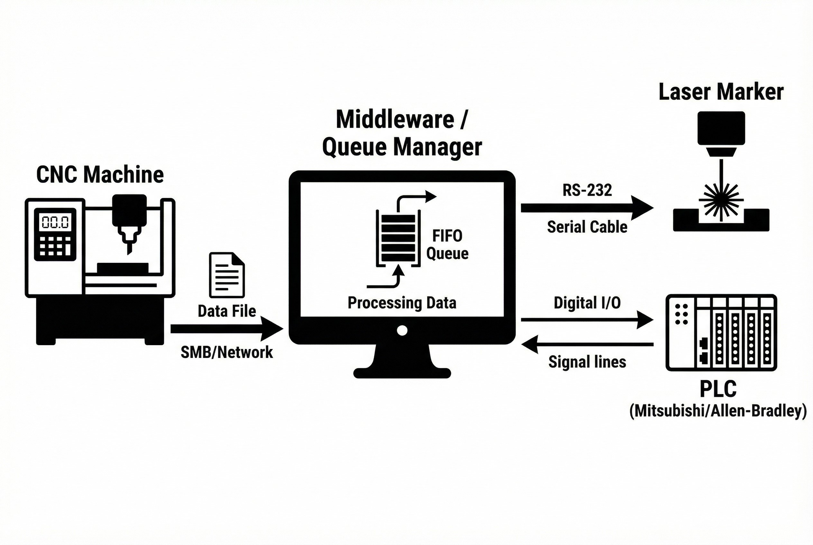

# ระบบควบคุมการส่งข้อมูลอัตโนมัติ (Auto Transfer Laser Mark)

**โจทย์ที่ได้รับ:**
ในกระบวนการผลิตชิ้นส่วนความแม่นยำสูง (Machining) พนักงานหน้างานต้องคอยเดินก๊อปปี้ไฟล์ข้อมูลจากเครื่อง CNC เพื่อนำมาป้อนใส่เครื่อง Laser Marker ด้วยตนเอง (Manual Entry) ปัญหานี้ไม่เพียงทำให้เสียเวลาการผลิต แต่ยังเป็นช่องโหว่ให้เกิด **Human Error** เช่น การพิมพ์ Serial Number ผิด หรือการจับคู่ชิ้นงานผิดฝาผิดตัว

**ความท้าทาย:**
ความยากของงานนี้คือการทำ **System Integration** ระหว่างเครื่องจักรที่ "คุยคนละภาษา":
* **CNC:** ส่งข้อมูลเป็นไฟล์ผ่านระบบ Network (IT Protocol)
* **Laser Marker:** รับคำสั่งผ่านสาย Serial RS-232 (Legacy Protocol)
* **PLC:** ควบคุมจังหวะการทำงานด้วยสัญญาณไฟฟ้า (OT Signal) จาก PLC หลายยี่ห้อ (Mitsubishi, Allen-Bradley)

## แนวทางการแก้ปัญหาของเรา
เราพัฒนาระบบซอฟต์แวร์ **"Middleware"** เพื่อทำหน้าที่เป็นสะพานเชื่อม (Bridge) และผู้จัดการจราจรข้อมูล (Traffic Controller) โดยระบบจะทำงานแทนคน 100% ดังนี้:

### 1. โลจิสติกส์ของข้อมูล (Information Logistics)
เราไม่ได้แค่ส่งข้อมูล แต่เราบริหาร "คิว" ด้วยระบบ **FIFO (First In, First Out)** เหมือนการเข้าคิวของสินค้าบนสายพานจริง เพื่อให้มั่นใจว่าข้อมูลที่ส่งไปยิงเลเซอร์ จะตรงกับชิ้นงานที่ไหลมาถึงจุด Marking พอดีเป๊ะ

### 2. ระบบป้องกันความผิดพลาด (Digital Poka-yoke)
ระบบทำหน้าที่เป็น Digital Poka-yoke ตัดวงจรความผิดพลาดจากคน:
* **Auto Fetch:** ดึงไฟล์จาก CNC ทันทีที่จบกระบวนการ (ผ่าน SMB/CIFS)
* **Handshake:** รอสัญญาณ Trigger ที่ถูกต้องจาก PLC ก่อนสั่งพิมพ์ ป้องกันการยิงงานซ้ำหรือยิงผิดจังหวะ

### เทคโนโลยีที่ใช้ (Tech Stack)
* **C# (.NET):** พัฒนาตัวจัดการคิว (Queue Manager) และตรรกะการแปลงข้อมูล
* **Serial Comm (RS-232):** สื่อสารโดยตรงกับเครื่อง Laser Marker
* **Multi-Brand PLC:** รองรับการเชื่อมต่อสัญญาณจากทั้ง Mitsubishi FX3U และ Allen-Bradley

## ผลลัพธ์ที่ได้ (Business Impact)
* ✅ **Zero Human Error:** ข้อมูลบนชิ้นงานถูกต้องตรงตามไฟล์ต้นฉบับ 100%
* ✅ **Workflow Automation:** ลดภาระงานเอกสารและการเดินไฟล์ของพนักงาน
* ✅ **Traceability:** ยกระดับระบบตรวจสอบย้อนกลับให้มีความน่าเชื่อถือสูงสุด

> **เกร็ดความรู้จากหน้างาน:**
> "ในการทำระบบ Automation ข้อมูล (Data) สำคัญพอๆ กับสินค้า ระบบที่ดีต้องมี 'Grid View' หรือหน้าจอที่ให้หัวหน้างานสามารถเข้ามาแทรกคิว (Intervention) หรือจัดการลำดับงานได้ในกรณีฉุกเฉิน ไม่ใช่แค่ปล่อยให้ระบบรันแบบมองไม่เห็น (Black Box)"

---
**ต้องการที่ปรึกษาระบบเชื่อมต่อเครื่องจักร (Machine Integration)?**
ติดต่อเรา: wisit.paewkratok@gmail.com | Line: wisit.p