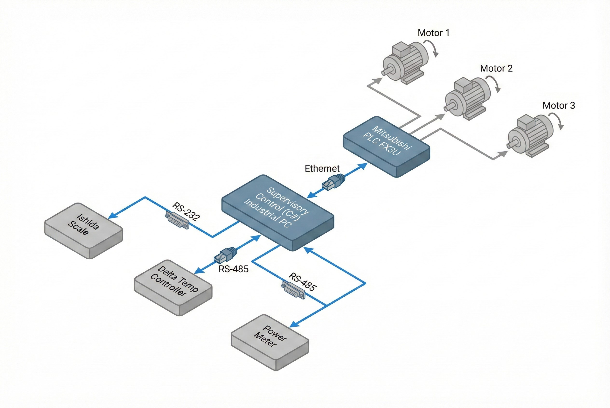

# Digitalization of Batch Process in Rubber Industry

**Problem Statement:**
In traditional rubber mixing, reliance on standalone PLCs often limits the complexity of recipe management and data storage. The client needed to upgrade a **Banbury Mixer 75L** to handle complex step sequences based on Time and Temperature, while ensuring 100% data traceability for quality assurance (QA).

**The Challenge:**
The project required high-level interoperability. We had to centralize data from diverse legacy devices speaking different protocols (Ishida Scales, Delta Temperature Controllers, Ammeters) into a single control interface, all while maintaining millisecond-level stability for motor control.

## Our Solution: Hybrid PC-Based Supervisory Control

We moved beyond the traditional "PLC-only" approach by implementing a **Hybrid Architecture**.
* **The Brain (PC):** A custom C# application handles complex recipe logic, massive data logging, and the HMI.
* **The Muscle (PLC):** A Mitsubishi FX3U PLC handles critical I/O operations and safety interlocks.

### Key Technologies Implemented

| Technology | Role in System |
| :--- | :--- |
| **C# (.NET/WPF)** | Supervisory control, Recipe Management, and Advanced UI/UX. |
| **Mitsubishi FX3U** | Real-time I/O control for motors and hydraulics. |
| **Protocol Gateway** | Unified RS-232, RS-485 (Modbus), and Ethernet into one system. |
| **SQL Database** | Storing batch history for claims and traceability. |

## Business Results

* **100% Traceability:** Detailed logs of temperature, current, and mixing time for every batch, ready for QA claims analysis.
* **Hardware Agnostic:** Successfully integrated Ishida Scales and Delta Controllers without replacing functional legacy hardware.
* **Remote Monitoring:** Decoupled architecture allowed managers to monitor production status from the office via LAN, separating the Operation from Monitoring.

> **Expert Insight:**
> By offloading "Data Heavy" tasks to a PC and keeping "Action Heavy" tasks on the PLC, we bypass the memory limitations of standard PLCs, enabling unlimited recipe storage and complex reporting features.

---
**Ready to upgrade your legacy machines?**
Contact us at: wisit.paewkratok@gmail.com