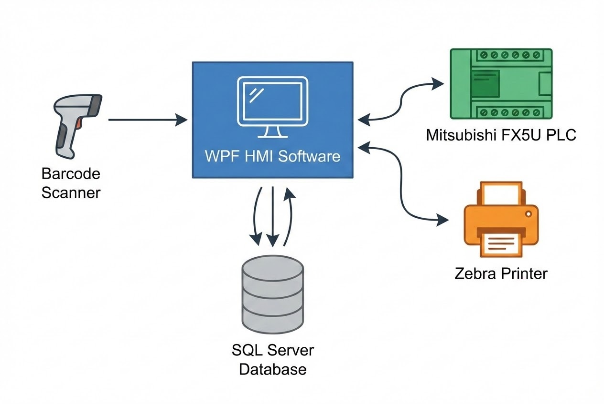

# ระบบ HMI ควบคุมเครื่องตัดอัตโนมัติ (CC05 SmartLink)

**โจทย์ที่ได้รับ:**
โรงงานต้องการระบบ HMI เพื่อควบคุมเครื่องตัด (CC05 Cutting Machine) ที่สามารถทำงานร่วมกับการสแกนบาร์โค้ดเพื่อดึงข้อมูลจากระบบฐานข้อมูลส่วนกลาง และต้องการให้ระบบจัดการสั่งการเครื่องจักรพร้อมพิมพ์ฉลากสินค้าได้ทันทีเมื่อกระบวนการเสร็จสิ้น

**ความท้าทาย:**
* การเชื่อมต่อและสั่งการ Mitsubishi FX5U PLC โดยตรงผ่าน TCP/IP LAN โดยไม่ต้องพึ่งพา OPC Server จากผู้ให้บริการภายนอกเพื่อประหยัดต้นทุน
* การสั่งพิมพ์ฉลาก (Label Printing) ไปยังเครื่องพิมพ์ Zebra โดยตรงแบบไม่ต้องผ่าน Windows Print Drivers เพื่อให้พิมพ์ได้รวดเร็วทันทีที่ได้รับสัญญาณจาก PLC
* การทำงานแบบ Offline สำหรับฟังก์ชันประวัติย้อนหลังและการสั่งพิมพ์ซ้ำ (Reprint) ในกรณีที่เกิดปัญหา

## แนวทางการแก้ปัญหา (Solution)
ทีม WP Solution ได้พัฒนา **CC05 SmartLink** ซึ่งเป็นแอปพลิเคชัน C# .NET 8 WPF ที่ทำหน้าที่เป็น Middleware HMI แบบครบวงจร โดยระบบจะเริ่มทำงานเมื่อพนักงานสแกนบาร์โค้ด Control Number หรือ Order Number จากนั้นจะดึงข้อมูลพารามิเตอร์การผลิต (เช่น ความยาวตัด, รหัสโปรเจกต์, รุ่น) จาก SQL Server เมื่อผู้ใช้สั่งรันเครื่อง ระบบจะสื่อสารกับ PLC จนกระทั่งได้รับสถานะ "Machine Complete" และทำการส่งคำสั่งพิมพ์ฉลาก ZPL ออกมาทันที

### เทคโนโลยีที่ใช้
* **C# .NET 8 & WPF (MVVM):** พัฒนาหน้าจอผู้ใช้งานด้วยเทคโนโลยีล่าสุด พร้อมโครงสร้าง MVVM ผ่าน CommunityToolkit.Mvvm
* **Mitsubishi MC Protocol (3E Frame):** สร้าง Custom Driver เพื่อเชื่อมต่อและอ่าน/เขียนข้อมูล Data Registers (D) และ Internal Relays (M) ของ PLC FX5U ผ่าน SLMP อย่างรวดเร็ว
* **Raw ZPL II API:** สั่งพิมพ์งานโดยตรงผ่าน USB Spooler API ทำให้สามารถสร้างและพิมพ์ฉลาก Zebra ได้แบบไดนามิก
* **SQL Server & SQLite:** ใช้ SQL Server สำหรับข้อมูลการผลิตหลัก (ใช้งานผ่าน Dapper) และใช้ SQLite สำหรับจัดเก็บข้อมูลผู้ใช้งานและ Log การทำงานในเครื่อง เพื่อรองรับการพิมพ์ซ้ำแบบ Offline

## ผลลัพธ์ที่ได้ (Business Impact)
* ✅ ลดข้อผิดพลาดในการป้อนข้อมูลด้วยระบบ Barcode-Driven Workflow
* ✅ ลดต้นทุนลิขสิทธิ์ซอฟต์แวร์ด้วยการสื่อสารแบบ Direct PLC Integration โดยไม่ใช้ OPC Server
* ✅ มีระบบประวัติย้อนหลัง (Offline History) ที่สามารถฟิลเตอร์ตามวันที่และสั่ง Reprint ฉลากพร้อมข้อมูลพนักงาน (Operator ID) เดิมได้ทันที
* ✅ มีระบบป้องกัน (Fail-Safe & Error Handling) ที่จะแจ้งเตือนเต็มหน้าจอเมื่อขาดการเชื่อมต่อ ป้องกันไม่ให้เครื่องตัดทำงานด้วยค่าความยาวที่ไม่ถูกต้อง

> **เกร็ดความรู้จากหน้างาน:**
> การพัฒนาระบบสื่อสารด้วย Mitsubishi MC Protocol (3E Frame) ด้วยตัวเองบน C# นอกเหนือจากการช่วยประหยัดค่าไลเซนส์ของ OPC Server แล้ว ยังทำให้เราสามารถควบคุม Timing และ Handshake ระหว่างสถานะ M100 (Auto CutType) ของ PLC กับระบบพิมพ์ฉลากได้อย่างแม่นยำระดับมิลลิวินาที

---
**ต้องการที่ปรึกษาระบบ Automation?**
ติดต่อเรา: wisit.paewkratok@gmail.com | Line: https://line.me/ti/p/~wisit.p