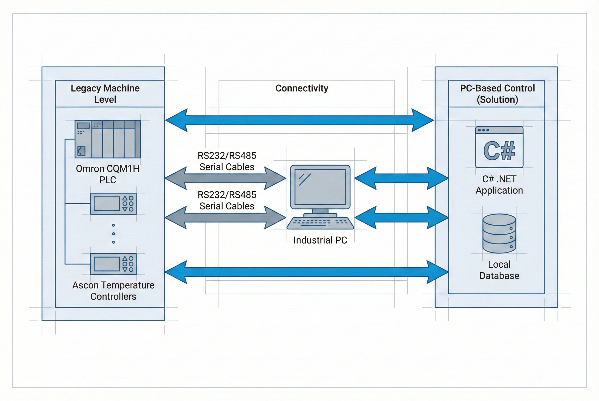

# Modernization: ระบบควบคุมเตาเผาเซรามิก (Kiln Control Retrofit)

**โจทย์ที่ได้รับ:**
โรงงานผลิตกระเบื้องเซรามิกชั้นนำเจอปัญหาความเสี่ยงจากอุปกรณ์ควบคุมที่ตกรุ่น (Obsolete) โดยเฉพาะหน้าจอทัชสกรีนยี่ห้อ **UniOP** ที่เลิกผลิตไปแล้ว ทำให้หาอะไหล่ทดแทนไม่ได้ นอกจากนี้ ระบบเดิมยังมีหน่วยความจำจำกัด ไม่สามารถเพิ่มสูตรการผลิต (Recipe) ใหม่ๆ ได้ และไม่มีระบบบันทึกข้อมูลย้อนหลัง ทำให้วิเคราะห์ปัญหาหน้างานได้ยาก

**ความท้าทาย:**
* **ข้อจำกัดด้าน Hardware:** เครื่องจักรเดิมถูกควบคุมด้วย **PLC Omron รุ่นเก่า (CQM1H/C200H)** และตัวคุมอุณหภูมิ **Ascon** ซึ่งการรื้อเปลี่ยน PLC ทั้งหมดต้องใช้งบประมาณสูงและใช้เวลานาน
* **Protocol ยุคเก่า:** ต้องเขียนโปรแกรมให้คอมพิวเตอร์สมัยใหม่ สามารถ "คุย" กับ PLC และ Controller รุ่นเก่าผ่าน Serial Port (RS232/485) ให้ได้อย่างสมบูรณ์

## แนวทางการแก้ปัญหาของเรา
เรานำเสนอโซลูชัน **PC-Based Control** โดยเปลี่ยนจากจอ HMI แบบเดิม มาเป็น Industrial PC ที่รันซอฟต์แวร์ที่พัฒนาขึ้นโดยเฉพาะ (Custom Software) เปลี่ยนสถานะจาก "หน้าจอกดปุ่ม" ให้กลายเป็น **Mini-SCADA** ที่ทรงพลัง

### สิ่งที่เราพัฒนา (Implementation Details)

1.  **เชื่อมต่อข้ามยุค (Interoperability):**
    ทีมงานพัฒนา Driver ด้วยภาษา **C# (.NET)** เพื่อสื่อสารกับอุปกรณ์เดิมโดยตรง:
    * **Omron PLC:** เชื่อมต่อผ่าน **Host Link Protocol** เพื่ออ่าน/เขียนค่า Register
    * **Ascon Controller:** เชื่อมต่อเพื่อดึงค่าอุณหภูมิและสั่งงานหัวเผา (Burner)
    สิ่งนี้ช่วยให้ลูกค้า **"ไม่ต้องทิ้ง PLC เดิม"** ประหยัดงบประมาณการลงทุนได้มหาศาล

2.  **ปลดล็อกขีดจำกัดข้อมูล (Data-Driven):**
    * **Unlimited Recipes:** ย้ายฐานข้อมูลสูตรการผลิตมาเก็บบน PC ทำให้เพิ่มสูตรได้ไม่จำกัด รองรับสินค้าใหม่ๆ ได้ทันที
    * **Data Logging & Analytics:** บันทึกค่าอุณหภูมิ, การใช้เชื้อเพลิง (Consumption Tracking) และประวัติ Alarm ย้อนหลัง เพื่อใช้ในการวิเคราะห์ประสิทธิภาพการผลิต

3.  **ศูนย์รวมการควบคุม (Centralized Control):**
    ออกแบบ UI/UX ใหม่ ให้เป็นศูนย์กลางการควบคุม (Single Point of Control) สามารถปรับจูน Speed พัดลม และ Monitor สถานะเตาเผาทุกโซนได้จากหน้าจอเดียว

### เทคโนโลยีที่ใช้ (Tech Stack)
* **Software Core:** C# .NET (WPF) สำหรับหน้าจอควบคุมที่มีความเสถียรสูง
* **Communication:** Serial Communication (RS232/RS485), Host Link Protocol
* **Database:** SQL LocalDB สำหรับเก็บ Recipe และ Log Data
* **Hardware:** Industrial Panel PC ทนต่อสภาพแวดล้อมโรงงาน

## ผลลัพธ์ที่ได้ (Business Impact)
* ✅ **Reduced Downtime Risk:** หมดกังวลเรื่องหาอะไหล่จอ UniOP ไม่ได้ เพราะใช้ PC มาตรฐานทั่วไปทดแทนได้ทันที
* ✅ **Improved Efficiency:** ฝ่ายผลิตสามารถวิเคราะห์การใช้พลังงานและสาเหตุเครื่องหยุดจาก Alarm History ได้อย่างแม่นยำ
* ✅ **Cost Saving:** สามารถ Modernize ระบบได้โดยไม่ต้องรื้อถอน PLC เดิม ประหยัดงบกว่า 60% เมื่อเทียบกับการทำระบบใหม่ทั้งหมด

> **เกร็ดความรู้จากหน้างาน:**
> "ในงาน Retrofit หัวใจสำคัญคือการ 'ฟัง' ภาษาของเครื่องจักรเก่าให้รู้เรื่อง การเขียน Custom Driver เพื่อคุยกับ Protocol เก่าๆ อย่าง Host Link ช่วยให้เราเชื่อมต่อโลก OT ยุคเก่า เข้ากับโลก IT ยุคใหม่ได้โดยไม่กระทบกระบวนการผลิตเดิม"

---
**ต้องการอัปเกรดเครื่องจักรเก่าให้ทันสมัย?**
ปรึกษาทีมวิศวกร WP Solution: wisit.paewkratok@gmail.com | Line: wisit.p