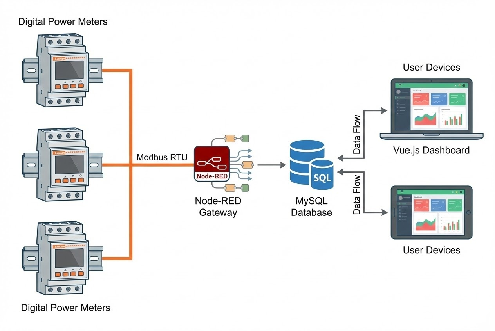

# เปลี่ยนข้อมูลค่าไฟ ให้เป็นกำไรของโรงงาน

**โจทย์ที่ได้รับ:**
ค่าพลังงานไฟฟ้าเป็นต้นทุนแฝงที่ควบคุมยากที่สุดในโรงงาน ผู้บริหารและฝ่ายวิศวกรรมต้องการระบบที่สามารถ "มองเห็น" การใช้ไฟฟ้าของเครื่องจักรแต่ละไลน์การผลิตได้แบบ Real-time เพื่อนำไปวิเคราะห์จุดรั่วไหลและวางแผนประหยัดพลังงาน แทนการเดินจดมิเตอร์แบบเดิม[cite: 24].

**ความท้าทาย:**
* **Data Complexity:** ต้องดึงข้อมูลจาก Digital Power Meter จำนวนมาก ผ่าน Protocol Modbus RTU ทุกๆ 1 นาที[cite: 239].
* **Data Integrity:** ข้อมูลต้องห้ามหาย เพื่อให้การคำนวณค่าไฟ (Billing) แม่นยำที่สุด
* **User Experience:** หน้าจอต้องดูง่าย เข้าถึงได้ผ่าน Web Browser โดยไม่ต้องลงโปรแกรม[cite: 26].

## แนวทางการแก้ปัญหาของเรา
เราพัฒนาแพลตฟอร์ม **SSC Factory Insight** โดยใช้เทคโนโลยี **Web Application (Vue.js + Quasar)** ทำงานร่วมกับ **Node-RED** ที่ทำหน้าที่เป็นสมองกลในการรวบรวมข้อมูลจากมิเตอร์และคำนวณค่าทางไฟฟ้าต่างๆ.

### ฟีเจอร์เด่น (System Highlights)
1.  **Real-time Monitoring:** แสดงค่าทางไฟฟ้าละเอียดระดับวินาที ทั้ง แรงดัน (V), กระแส (A), กำลังไฟฟ้า (kW) และ Power Factor ช่วยให้รู้ทันทีเมื่อเครื่องจักรทำงานหนักผิดปกติ [cite: 61-66].
2.  **Harmonic Analysis (THD):** ตรวจสอบสัญญาณรบกวน (THD%) ในระบบไฟฟ้า ซึ่งเป็นสาเหตุให้อุปกรณ์อิเล็กทรอนิกส์เสียหาย[cite: 67].
3.  **Cost Calculation:** ระบบคำนวณค่าไฟเป็น "จำนวนเงิน (บาท)" ให้ทันที ทั้งแบบรายวัน รายสัปดาห์ และรายเดือน ทำให้รู้ต้นทุนการผลิตที่แท้จริง[cite: 87, 191].
4.  **Custom Reporting:** ผู้ใช้งานสามารถเลือกช่วงเวลา (Date Range) เพื่อดูข้อมูลย้อนหลังและกด **Export** ออกมาเป็นไฟล์ Excel/CSV เพื่อทำรายงานส่งผู้บริหารได้ง่ายๆ[cite: 196, 230].

### เทคโนโลยีที่ใช้ (Tech Stack)
* **Frontend:** Vue.js 3 & Quasar Framework (Modern UI, Responsive)
* **Backend Logic:** Node-RED (Flow-based programming)
* **Database:** MySQL (เก็บข้อมูล Raw Data และ Aggregated Data) [cite: 241]

## ผลลัพธ์ที่ได้ (Business Impact)
* ✅ **Visibility:** ผู้บริหารเห็นภาพรวมการใช้พลังงานทั้งโรงงานในหน้าจอเดียว (Dashboard)[cite: 26].
* ✅ **Cost Saving:** วิเคราะห์ช่วงเวลาที่ใช้ไฟสูงสุด (Peak Load) เพื่อบริหารจัดการการเดินเครื่องจักรใหม่ ลดค่า Demand Charge
* ✅ **Accessibility:** เข้าดูข้อมูลได้จากทุกที่ผ่าน Tablet หรือ Laptop โดยผ่านระบบเครือข่ายภายใน[cite: 26].

> **เกร็ดความรู้จากหน้างาน:**
> เพื่อป้องกันปัญหา "ข้อมูลหลุด" (Data Gap) จากความไม่เสถียรของ Network เราได้เขียน Logic พิเศษใน Node-RED (`aggregateBackfillSequential.js`) ให้ทำการ "ซ่อมแซมข้อมูล" โดยอัตโนมัติ เพื่อให้กราฟและรายงานมีความต่อเนื่องสมบูรณ์ที่สุด.

---
**ต้องการลดต้นทุนพลังงานด้วยระบบ IoT?**
ติดต่อเรา: wisit.paewkratok@gmail.com | โทร: 081-075-5815 