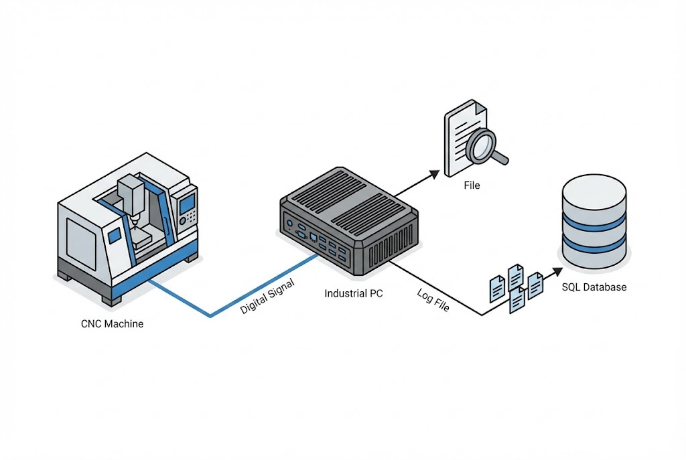

# Gearset Matching Data Collection System

**Problem Statement:**
A Tier-1 automotive manufacturer in Pluak Daeng, Rayong, faced a traceability challenge with their **Oerlikon T60** (Bevel Gear Testing) machines. The machine performs critical matching tests for Ring and Pinion gears, but the test results were stored locally in proprietary text files.

**The Challenge:**
* **Closed System:** The machine runs on legacy software. Modifying the internal code to send data to a database was deemed too risky and would void the manufacturer's warranty.
* **Data Silo:** Quality engineers had to manually check files, leading to data gaps and lack of real-time traceability in the central ERP/MES.

## Our Solution: The "Sidecar" Integration Pattern

We implemented a **Non-Intrusive Data Collection System**. Instead of hacking the machine's software, we treated the machine as a "Black Box" and monitored its outputs externally.

### How It Works (Step-by-Step)

1.  **Identity Verification:** The operator scans the Barcode/QR Code of the Ring and Pinion gears using a handheld scanner connected to our custom Industrial PC (IPC).
2.  **Validation:** Our system checks the **MSSQL Server** to ensure these parts have passed previous processes (Op-Check).
3.  **Testing & Triggering:** The Oerlikon T60 runs its standard test cycle.
    * *Key Technique:* We installed a **DAQ Card (Data Acquisition)** to intercept the machine's "Test Complete" signal (24V I/O) physically.
4.  **Data Extraction:** Once the DAQ receives the signal, our software:
    * Maps the network drive to the machine’s path (`\\xxx\TEST_xxxx\Protocols\*.prt`).
    * Locates the latest generated Log file (`.prt`).
    * Parses the text file to extract specific parameters (Backlash, noise levels, contact patterns).
5.  **Data Archiving:** The extracted data is paired with the scanned Serial Numbers and saved directly to the central **MSSQL Server**.

### Key Technologies Implemented

| Technology | Role in System |
| :--- | :--- |
| **C# (.NET WPF)** | Main application for UI, logic, and file parsing. |
| **DAQ (IO Card)** | Hardware trigger to synchronize data reading with machine cycle. |
| **File I/O Parsing** | Logic to read and extract data from unstructured legacy log files (`.prt`). |
| **MSSQL Server** | Centralized storage for traceability and integration with upper systems. |

## Business Results

* **100% Traceability:** Every gear set produced is now automatically logged with its quality parameters.
* **Zero Downtime Risk:** Because we didn't touch the Oerlikon's internal software, the production line remained stable with no risk of software corruption.
* **Automated Workflow:** Eliminated manual data entry, reducing human error to 0%.

> **Expert Insight:**
> When dealing with expensive, proprietary machinery (like CNCs or Testers), avoid modifying the internal PLC/PC logic if possible. Using an external "Listener" approach (monitoring Files, I/O signals, or screen scraping) is often safer, faster, and cheaper.

---
**Need to extract data from your legacy machines?**
Contact us at: wisit.paewkratok@gmail.com