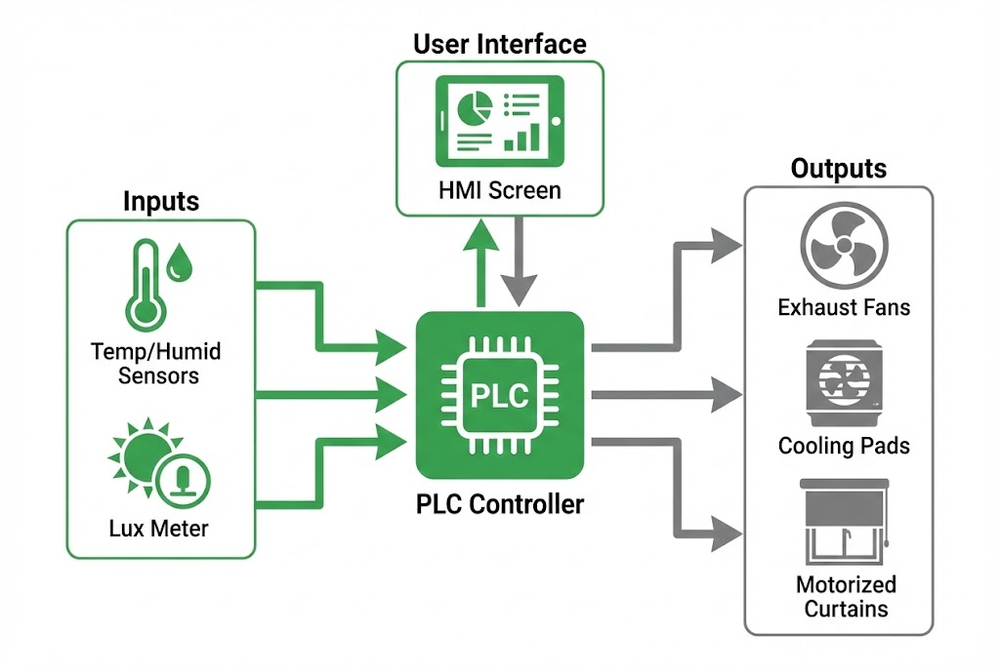

# ระบบสมาร์ทฟาร์มสำหรับกัญชง (Industrial Grade)

**โจทย์ที่ได้รับ:**
การปลูกกัญชง (Hemp) เพื่อการพาณิชย์มีความละเอียดอ่อนสูงมาก โดยเฉพาะในช่วงทำดอก (Flowering) ลูกค้าต้องการระบบ Automation เพื่อเข้ามาดูแลโรงเรือนขนาดใหญ่จำนวน **4 โรงเรือน** (จากทั้งหมด 8 โรงเรือน) เพื่อลดความผิดพลาดจากคน (Human Error)

**ความท้าทาย:**
* **โรคพืชและความชื้น:** กัญชงกลัวความชื้นสูงในช่วงทำดอก ซึ่งจะทำให้เกิดเชื้อรา (Mold) ในช่อดอกได้ง่าย
* **การคุมแสง (Photoperiod):** พืชต้องการช่วงมืด/สว่างที่แม่นยำเพื่อกระตุ้นการออกดอก
* **การระบายอากาศ:** ต้องจัดการพัดลมหลายประเภท (พัดลมดูด, พัดลมกวนอากาศ, พัดลมเป่าใบ) ให้ทำงานสอดคล้องกัน

## แนวทางการแก้ปัญหาของเรา
เราพัฒนาระบบควบคุมแบบรวมศูนย์ (Central Control Unit) โดยใช้ **PLC เกรดอุตสาหกรรม** ทำงานร่วมกับเซนเซอร์วัดสภาพอากาศ เพื่อควบคุมอุปกรณ์ทุกตัวในโรงเรือนโดยอัตโนมัติ ไม่ต้องคอยเดินเปิด-ปิดเอง

### ฟีเจอร์เด่น (System Highlights)
1.  **ระบบควบคุมความชื้นอัจฉริยะ (Smart Evap Logic):**
    * สั่งทำงานปั๊มน้ำ Cooling Pad เมื่ออากาศร้อน
    * **Critical Feature:** ระบบจะ **"ตัดการทำงานปั๊มทันที"** หากค่าความชื้น (Humidity) สูงเกินค่าความปลอดภัยที่ตั้งไว้ เพื่อป้องกันการเกิดเชื้อรา แม้อุณหภูมิจะยังสูงอยู่ก็ตาม
2.  **การจัดการแสงและม่าน (Light & Curtain):**
    * **Top Shading:** ม่านพรางแสงด้านบนทำงานอัตโนมัติเมื่อแดดจัด (วัดค่า Lux) ช่วยลดอุณหภูมิสะสม
    * **Side Blackout:** ม่านทึบแสงด้านข้างทำงานตามเวลา (Clock/Timer) เพื่อคุมรอบแสงทำดอกให้แม่นยำ
3.  **Dashboard ควบคุมง่าย:**
    * หน้าจอ HMI แสดงค่าอุณหภูมิ ความชื้น แสงสว่าง แบบ Real-time
    * กราฟิกแสดงสถานะพัดลมและม่านว่ากำลังเปิดหรือปิดอยู่ ดูง่ายเพียงกวาดตา

### เทคโนโลยีที่ใช้ (Tech Stack)
* **PLC Control:** ประมวลผล Logic การทำงานที่มีความเสถียรสูง ทนต่อสภาพอากาศในฟาร์ม
* **Industrial Sensors:** เซนเซอร์วัดอุณหภูมิและความชื้นความแม่นยำสูง
* **Timer Logic:** ระบบตั้งเวลาสำหรับพัดลมเป่าใบ (Leaf Blowing) และระบบม่าน

## ผลลัพธ์ที่ได้ (Business Impact)
* ✅ **Quality Yield:** ได้ผลผลิตที่มีคุณภาพสม่ำเสมอ ลดความเสียหายจากเชื้อรา
* ✅ **Labor Saving:** ลดภาระคนงานในการเปิด-ปิดม่านและพัดลม วันละหลายรอบ
* ✅ **Data Driven:** เกษตรกรสามารถดูค่า Sensor ย้อนหลังเพื่อวิเคราะห์การเติบโตของพืชได้

> **เกร็ดความรู้จากหน้างาน:**
> ระบบของเรามีฟังก์ชัน **Manual Test & Sensor Calibration** ช่วยให้ผู้ดูแลสามารถชดเชยค่า (Offset) อุณหภูมิให้ตรงกับเทอร์โมมิเตอร์มาตรฐานได้ และสามารถสั่ง Force Output เพื่อทดสอบอุปกรณ์ก่อนเริ่มรอบปลูกใหม่ได้ทันที

---
**ต้องการเปลี่ยนโรงเรือนธรรมดาให้เป็น Smart Farm?**
ติดต่อเรา: wisit.paewkratok@gmail.com | Line: wisit.p