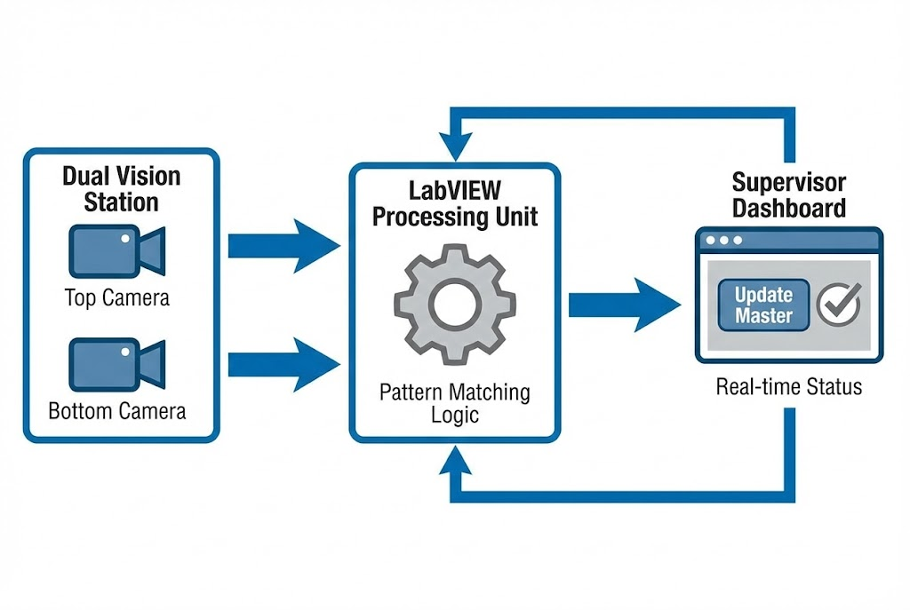

# ระบบ Vision Inspection ที่ "ยืดหยุ่น" ตามหน้างานจริง

**โจทย์ที่ได้รับ:**
การตรวจสอบตัวอักษรที่ปั๊มลงบนชิ้นงานโลหะ (Stamped Characters) มีความยากเฉพาะตัว คือ "ความไม่สม่ำเสมอ" หัวตอก (Die) ที่ใช้ปั๊มมีการสึกหรอตามกาลเวลา หรือแรงกดของเครื่องจักรที่เปลี่ยนไป ทำให้ตัวอักษรในแต่ละ Lot การผลิตมีความหนา-บาง ไม่เท่ากัน

**ความท้าทาย:**
ระบบ Vision แบบเก่าใช้ **Master Template** ที่ตายตัว เมื่อชิ้นงานจริงเริ่มเปลี่ยนสภาพไปเพียงเล็กน้อย (แต่ยังใช้งานได้) เครื่องจะมองว่าเป็นของเสีย (NG) ทันที ทำให้เกิด **False Reject** เครื่องหยุดบ่อย และต้องรอ Engineer มาแก้ Code หน้าเครื่อง ซึ่งเสียเวลาการผลิตมหาศาล

## แนวทางการแก้ปัญหาของเรา
เราพัฒนาระบบตรวจสอบด้วย **LabVIEW** โดยเพิ่มฟีเจอร์สำคัญคือ **"Supervisor Calibration Mode"** เพื่อมอบอำนาจการตัดสินใจให้หัวหน้างาน

หัวหน้างานสามารถพิจารณาชิ้นงานจริงหน้าไลน์ หากคนมองว่า "OK" แต่เครื่องมองว่า "NG" หัวหน้างานสามารถกดสั่งให้เครื่อง **"จำค่าใหม่ (Retrain Master)"** ได้ทันทีผ่านเมนูพิเศษ โดยไม่ต้องต่อคอมพิวเตอร์เพื่อแก้โปรแกรม

### ฟีเจอร์เด่น (System Highlights)
1.  **Dynamic ROI & Template:** เมนู "Calibrate & Setting" ออกแบบมาให้ใช้งานง่าย ผู้ใช้สามารถลากกรอบพื้นที่ตรวจสอบ (ROI) ใหม่ และกดบันทึก Template ได้เองเมื่อมีการเปลี่ยน Model หรือเปลี่ยนหัวตอก.
2.  **Dual View Inspection:** ใช้กล้อง 2 ตัว ตรวจสอบทั้ง **Top View** และ **Bottom View** พร้อมกัน เพื่อความรวดเร็วและครอบคลุม.
3.  **Hybrid Controller:** ใช้ PC ประมวลผลภาพ แต่ใช้ **Arduino** เป็นตัวสั่งงาน Solenoid Valve และรับค่าจาก Sensor/Button ช่วยลดต้นทุน Hardware ได้กว่า 50% เมื่อเทียบกับการใช้ PLC.

### เทคโนโลยีที่ใช้ (Tech Stack)
* **LabVIEW & NI Vision:** ใช้ State Machine Design Pattern เพื่อความเสถียรในการคุม Sequence การทำงาน.
* **Image Processing:** ใช้เทคนิค Pattern Matching และ Edge Detection ขั้นสูง
* **Pneumatic Control:** ระบบควบคุมกระบอกลมดึงชิ้นงานเข้า-ออก (Move In/Out) อัตโนมัติ.

## ผลลัพธ์ที่ได้ (Business Impact)
* ✅ **Zero Waiting Time:** ไม่ต้องรอ Engineer มาแก้ Threshold เครื่องสามารถรันต่อได้ทันทีเมื่อเจอปัญหาชิ้นงานเปลี่ยนสภาพ
* ✅ **High Accuracy:** การให้หัวหน้างาน Update Master ตามสภาพจริง ช่วยให้เกณฑ์การตัดสินใจ (Criteria) สอดคล้องกับคุณภาพงานใน Lot นั้นๆ ที่สุด
* ✅ **Traceability:** ระบบบันทึกภาพทั้ง Pass และ Fail ไว้ตรวจสอบย้อนหลังได้ทุกชิ้น.

> **เกร็ดความรู้จากหน้างาน:**
> ปัญหาของงานโลหะคือ "แสงสะท้อน" (Reflection) เราออกแบบ Sequence การเปิดไฟ LED ให้สัมพันธ์กับจังหวะชัตเตอร์ของกล้อง (Triggering) เพื่อให้ได้ภาพที่คมชัดที่สุดก่อนส่งไปประมวลผล

---
**ต้องการระบบ QC ที่ฉลาดและปรับตัวได้?**
ติดต่อเรา: wisit.paewkratok@gmail.com | Line: wisit.p