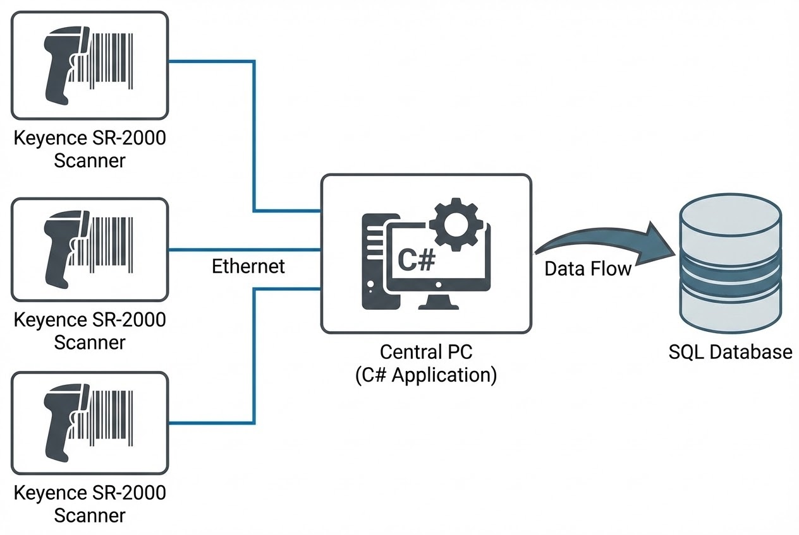

# Knuckle Production Data Link System

**The Challenge:**
An "Automotive Tier 1 Manufacturer" required an automated digitalization system to record Scan-In/Scan-Out times for Knuckle parts during the CNC process. All data needed to be stored in a central database for full traceability.

**Key Challenges:**
1. **Legacy System Integration:** The existing production line utilized Mitsubishi Q-Series (Q03/Q06) PLCs, which were difficult and costly to modify.
2. **Data Logic:** Clearly separating Left-side and Right-side production data, then synchronizing them at the final Visual Inspection stage.
3. **Efficiency:** Data transmission must be seamless without affecting the machine's cycle time.

## Solution
Our team implemented a **"Direct Integration via SDK"** strategy. We developed a custom **C# (.NET) Application** to communicate directly with three **Keyence SR-2000** scanners using Socket (TCP/IP) protocols. This "Non-Invasive" approach allowed us to extract production data without interfering with the client's original PLC logic.

### Technologies Used
* **Keyence SR-2000 Series:** High-performance scanners capable of reading 2D DataMatrix codes on metallic surfaces.
* **C# Application (Custom Dev):** Acts as a Data Gateway, collecting triggers and strings from scanners (In-Left, In-Right, Out-Visual).
* **SQL Server:** Centralized database for Time-stamping and Serial Number logging.
* **Keyence AutoID SDK:** Used for scanner control and displaying real-time images on the PC interface.

## Business Impact
* ✅ **100% Traceability:** Immediate access to the history of every part processed in the line.
* ✅ **Reduced Integration Cost:** Avoided expensive PLC programming modifications.
* ✅ **Real-time Monitoring:** Production managers can monitor throughput live via the PC dashboard.
* ✅ **Error Reduction:** Eliminated human error associated with manual data entry.

> **Engineer's Insight:**
> Connecting via the Keyence SDK provides more than just the barcode string. We also monitor the **Code Quality Score**, allowing us to alert the maintenance team if the marking pin is wearing out before it results in unreadable codes.

---
**Looking for Industrial Automation or Data Linkage Consulting?**
Contact us: wisit.paewkratok@gmail.com | Line: wisit.p