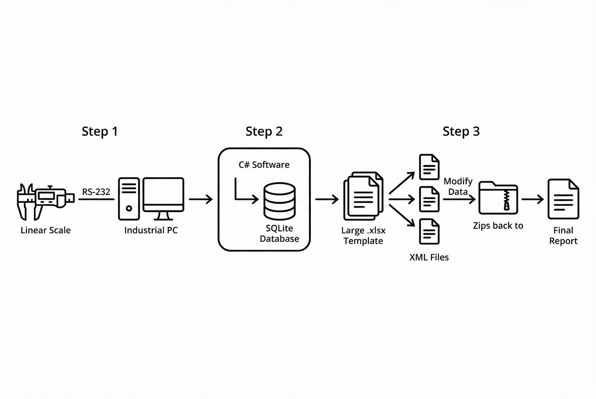

# Project Overview

**Problem Statement:**
In high-precision manufacturing, Quality Control (QC) relied on manual data recording from Linear Scales. This led to human errors (typos), lack of traceability, and slow reporting. Furthermore, the client used a **massive Excel template** filled with complex statistical formulas (CPK, Histogram) to generate reports.

**The Challenge:**
The critical technical bottleneck was the **Excel Report Generation**. Standard libraries (like Interop or standard OpenXML wrappers) failed or crashed because the client's template file was too large and complex. Opening the file to write data programmatically caused memory overflows and corrupted the complex formulas embedded in the file.

## Our Solution: The "XML Injection" Technique

We developed a custom **C# Application** that acts as a bridge between the physical measurement tool and the digital report.

1.  **Hardware Connectivity:** Connects directly to Linear Scales via **RS-232 Serial Port** to capture measurement values automatically.
2.  **Real-time Validation:** The system checks the value against Spec & Tolerance immediately (Pass/Fail) to prevent defect parts from moving forward.
3.  **High-Performance Excel Engine:** Instead of opening the Excel file normally, we implemented a **"Unzip-Modify-Zip" technique**:
    * The system treats the `.xlsx` file as a Zip archive.
    * It extracts the internal XML structure.
    * We directly inject data into the `sheet.xml` and `sharedStrings.xml` at the byte level.
    * The system repacks (Zips) the file back to `.xlsx`.
    * **Result:** Large files are processed in seconds with zero corruption to the original formulas/macros.

### Key Technologies Implemented
| Technology | Role in System |
| :--- | :--- |
| **C# (.NET)** | Core application logic and UI |
| **RS-232 / Serial Port** | Physical interface with Linear Scale |
| **SQLite** | Local database for data integrity and traceability |
| **Custom XML/Zip Engine** | Handling massive Excel templates without crashing |

## Business Results
* **100% Data Integrity:** Eliminated human error in data recording.
* **Complex Reporting:** Successfully automated reports on massive Excel templates containing CPK/Stats formulas.
* **Traceability:** Every measurement is timestamped and stored in a database before reporting.

> **Expert Insight:**
> For heavy Excel automation, avoid `Excel Interop` at all costs. Manipulating the underlying XML structure directly (OpenXML approach) is the only way to handle complex, formula-heavy templates reliably without memory leaks.

---
**Facing issues with Industrial Data Reporting?**
Contact us at: wisit.paewkratok@gmail.com