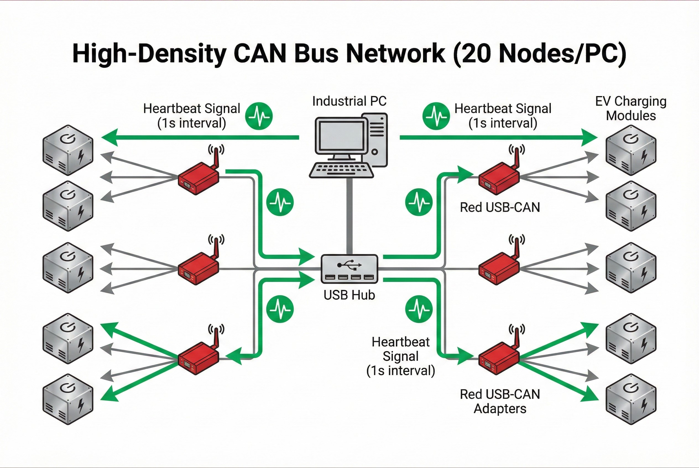

# ระบบควบคุมการทดสอบ Aging Test ความหนาแน่นสูง

**โจทย์ที่ได้รับ:**
ลูกค้าต้องการระบบทดสอบ Burn-in สำหรับโมดูลชาร์จรุ่น **MXR100030 (30kW)** และ **MXR100050 (50kW)** ในระดับ Mass Production โดย 1 คอมพิวเตอร์ต้องสามารถคุมเครื่องได้ถึง **20 เครื่องพร้อมกัน**

**ความท้าทาย: "กฎ 10 วินาที" (The 10s Watchdog)**
ความยากที่สุดของงานนี้ไม่ใช่แค่การอ่านค่า แต่คือการ **"เลี้ยงไฟ"**
* ตัวโมดูลมีระบบ Safety ภายใน: **หากไม่มีการสื่อสารวิ่งเข้ามาหาตัวมันภายใน 10 วินาที ระบบจะสั่ง Cut-off DC Output ทันที**
* การใช้ PC เครื่องเดียวคุยกับ 20 เครื่องที่มี Data วิ่งตลอดเวลา มีความเสี่ยงสูงมากที่จะเกิดคิวข้อมูลล้น (Buffer Overflow) จนส่ง Heartbeat ไปไม่ทัน ทำให้การทดสอบล่ม

## แนวทางการแก้ปัญหาของเรา
เราออกแบบสถาปัตยกรรม Network ใหม่ โดยไม่นำ 20 เครื่องมาต่อพ่วงกันในเส้นเดียว (Single Bus) แต่ใช้การกระจายโหลดผ่าน **USB Hub และ USB-CAN Adapters** หลายตัวทำงานขนานกัน

### กลยุทธ์ทางเทคนิค (Technical Implementation)
1.  **Topology Design:** จากภาพ Diagram เราใช้ USB Hub แยกสัญญาณไปยัง USB-CAN Adapter หลายตัว เพื่อลด Traffic ในแต่ละ Loop ให้น้อยลง
2.  **Dedicated Heartbeat Thread:** เขียนโปรแกรมแยก Thread พิเศษที่มี Priority สูงสุด ทำหน้าที่เดียวคือ "ส่งสัญญาณชีพ" ไปหาทั้ง 20 เครื่องวนไปเรื่อยๆ เพื่อ Reset Watchdog Timer ไม่ให้แตะ 10 วินาที โดยไม่สนใจว่าหน้าจอจะค้างหรือกำลังเขียน Log อยู่หรือไม่
3.  **Error Handling:** ระบบ Re-connect อัตโนมัติทันทีหากเจอ Noise ในระบบ CAN Bus เพื่อให้ทันภายในเวลาที่กำหนด

### ผลลัพธ์ที่ได้ (Business Impact)
* ✅ **Stable Operation:** สามารถรัน Aging Test ต่อเนื่องได้ยาวนานโดยไฟไม่ตัดจากปัญหา Communication Error
* ✅ **High Efficiency:** ลดจำนวน PC ที่ต้องใช้ในไลน์ผลิต ลงทุน 1 PC คุมได้ถึง 20 Unit (High Density)
* ✅ **Safety:** ระบบตรวจสอบสถานะของโมดูลทั้ง 20 ตัวแบบ Real-time หากตัวไหนอุณหภูมิเกินหรือ Error ระบบจะแจ้งเตือนทันที

> **เกร็ดความรู้จากหน้างาน:**
> ในระบบที่มีอุปกรณ์ CAN Bus จำนวนมาก (20 Nodes+) การจัดการ **Termination Resistor (120 Ohm)** ที่หัวและท้ายของแต่ละ Loop สำคัญมาก หากค่าความต้านทานรวมไม่ได้ตามมาตรฐาน สัญญาณจะสะท้อนและทำให้เกิด Timeout ได้ง่ายขึ้น ซึ่งเป็นสาเหตุหลักที่ทำให้ Watchdog ทำงานผิดพลาด

---
**ต้องการปรึกษาระบบควบคุมเครื่องจักรจำนวนมาก (Mass Control)?**
ติดต่อเรา: wisit.paewkratok@gmail.com | Line: wisit.p