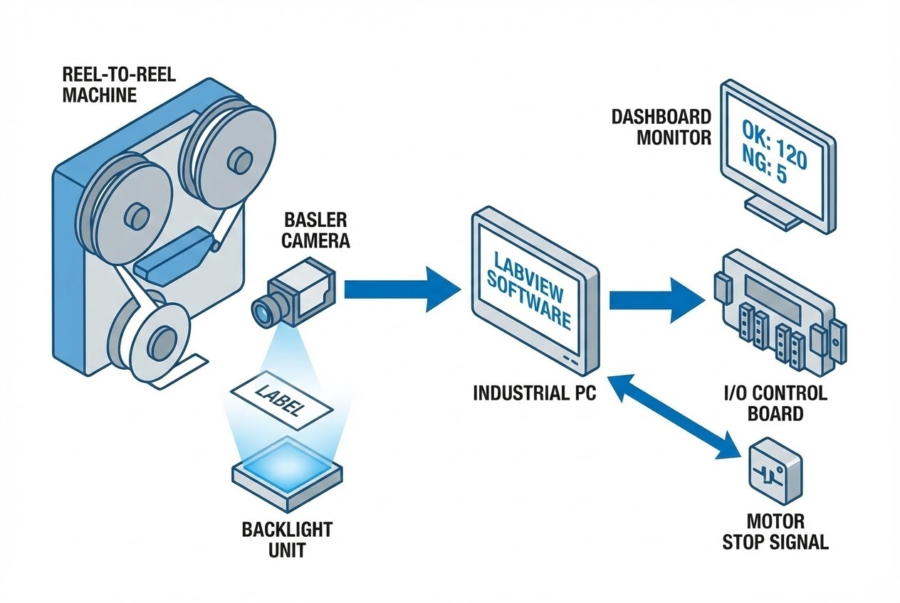

# High-Speed OCR & Barcode Verification

**Problem Statement:**
In the mass production of product labels, ensuring that the printed human-readable text (OCR) matches the machine-readable barcode is critical. Manual inspection on high-speed reel-to-reel machines is impossible, leading to risks of mixed data, missing prints, or unreadable codes reaching the end customer.

**The Challenge:**
The client needed a system capable of inspecting every single label on a moving roll. The challenge involved not just reading the data, but performing a **Dual Validation Cross-check**—verifying that the alphanumeric string (OCR) perfectly matches the decoded Barcode data in real-time, while also controlling the machine's motor to stop immediately upon detecting a defect.

## Our Solution: LabVIEW Vision Architecture

We engineered a robust Machine Vision solution integrated directly into the Reel-to-Reel machinery.

The system utilizes **LabVIEW** with the **NI Vision Development Module** to process images captured by a high-resolution **Basler Camera** (GigE/USB3). By implementing a specialized **Backlight Unit**, the system detects label opacity and shadows to trigger precise image acquisition.

### Key Technologies Implemented

| Technology | Role in System |
| :--- | :--- |
| **LabVIEW & NI-IMAQdx** | Core image processing engine for OCR and Barcode decoding. |
| **Basler acA1920-25gm** | High-speed industrial camera for capturing clear images on moving conveyors. |
| **Dual Validation Algorithm** | Logic that compares OCR results against Barcode content to prevent data mismatch. |
| **Industrial I/O Integration** | Direct hardware interface to control the feed motor (Start/Stop/Emergency) based on inspection results. |

## Business Results

* **100% Automated QC:** Eliminated manual sampling; every label is inspected for readability and accuracy.
* **Production Control:** Integrated order management allows operators to set target amounts, with the system auto-stopping when the order is complete.
* **Data Integrity:** Prevented "Mixing/Wrong Data" errors by cross-checking OCR numbers against Barcodes.

> **Expert Insight:**
> For transparent or semi-transparent labels, standard front-lighting often fails. We utilized a **Backlight technique** to create a silhouette effect, ensuring the camera triggers at the exact edge of the label regardless of the print design.

---
**Looking to automate your quality control?**
Contact us at: wisit.paewkratok@gmail.com