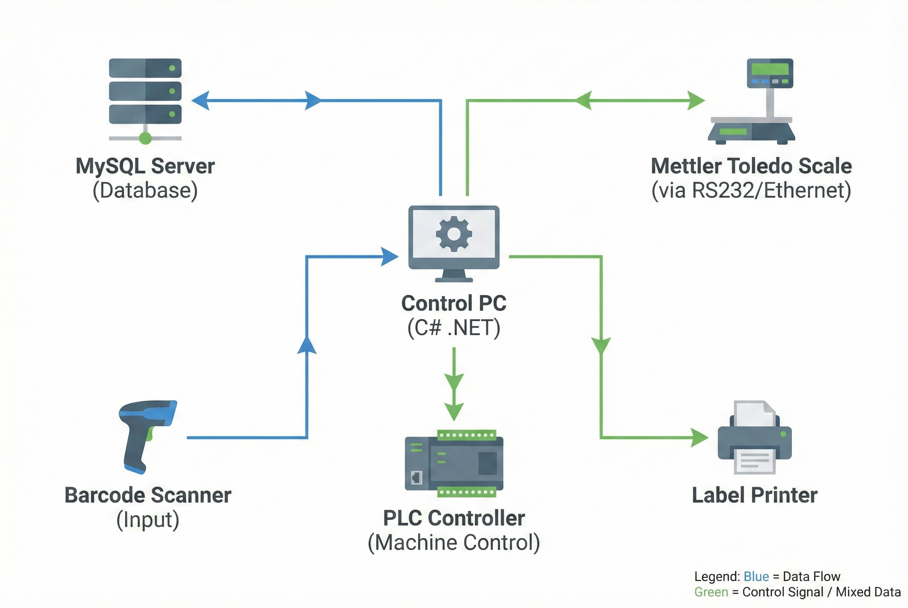

# ระบบควบคุมการชั่งและผสมสารเคมี (Rubber Production Control System)

**โจทย์ที่ได้รับ:**
โรงงานผลิตชิ้นส่วนยานยนต์ชั้นนำ (Rubber Parts) ประสบปัญหาในไลน์ผลิต Master Batch (MB) และ CMB เนื่องจากการชั่งสารเคมีแบบ Manual โดยพนักงานทำให้เกิด Human Error ผสมผิดสูตร ส่งผลให้ยางเสีย (Defect) และไม่สามารถตรวจสอบย้อนกลับ (Traceability) ได้อย่างมีประสิทธิภาพ

**ความท้าทาย:**
* **ความแม่นยำ:** ต้องเชื่อมต่อค่าจากเครื่องชั่งดิจิตอลโดยตรง เพื่อตัดปัญหาการจดค่าหรืออ่านค่าผิด
* **ความเสถียร:** ไลน์ผลิตต้องทำงานได้ตลอด 24 ชม. แม้ในขณะที่ Network หรือ Server ของโรงงานล่ม
* **การป้องกันความผิดพลาด:** ต้องมีระบบเช็ค Lot วัตถุดิบป้องกันการหยิบสารเคมีผิดถุง

## แนวทางการแก้ปัญหาของเรา
WP Solution พัฒนาระบบซอฟต์แวร์บริหารจัดการ (Shop Floor Control) ด้วย **C# .NET** ที่ทำหน้าที่คุมกฎระเบียบในการผลิต (Process Locking) เชื่อมต่อทั้งฐานข้อมูลและเครื่องจักรเข้าด้วยกัน

### ฟังก์ชันเด่นของระบบ
1.  **Precision Weighing System (ระบบควบคุมการชั่ง):**
    * เชื่อมต่อโดยตรงกับหัวอ่าน **Mettler Toledo IND890** เพื่อรับค่าน้ำหนัก Real-time
    * มีระบบ **Tolerance Check** หากน้ำหนักขาดหรือเกินกว่าค่าเผื่อที่กำหนด ระบบจะล็อคไม่ให้เทส่วนผสมลงเครื่อง
2.  **Robust Offline Mode (ระบบกันเน็ตล่ม):**
    * ใช้ **SQLite** เป็น Local Cache ที่เครื่องจักร หาก Server (MySQL) ล่ม พนักงานยังสามารถทำงานต่อได้โดยไม่สะดุด ข้อมูลจะถูกเก็บไว้ในเครื่องและ Sync กลับอัตโนมัติเมื่อเน็ตมา
3.  **Material Validation (ป้องกันหยิบผิด):**
    * บังคับสแกน Barcode วัตถุดิบก่อนเติมสารเคมีเข้า Tank หาก Lot หรือ Part Number ไม่ตรง ระบบจะแจ้งเตือนและล็อคการทำงานทันที

### เทคโนโลยีที่ใช้ (Tech Stack)
* **Application:** Windows Forms Application (C# .NET) เน้นความเสถียรและการเชื่อมต่อ Hardware
* **Database:** MySQL (Master) ทำงานร่วมกับ SQLite (Local Backup)
* **Connectivity:** เชื่อมต่อ PLC เพื่อสั่ง Start/Stop เครื่องผสม และดึงสถานะเครื่องจักร
* **Peripherals:** Barcode Scanner และเครื่องพิมพ์ Honeywell/Intermec สำหรับออก Label ระบุ Lot ยาง

## ผลลัพธ์ที่ได้ (Business Impact)
* ✅ **ลดของเสีย (Scrap Reduction):** ขจัดปัญหาการผสมผิดสูตร (Wrong Formula) ได้ 100% ผ่านระบบ Interlock
* ✅ **ตรวจสอบย้อนกลับได้ทันที:** ทราบได้ทันทีว่ายาง Lot นี้ ใช้สารเคมี Lot ไหน น้ำหนักเท่าไหร่ ใครเป็นคนชั่ง
* ✅ **ตัดสต็อกแม่นยำ:** ระบบตัดสต็อกสารเคมีทันทีที่ชั่งเสร็จ ลดภาระงานเอกสารหน้างาน

> **เกร็ดความรู้จากหน้างาน:**
> ในระบบการผลิตที่ซีเรียสเรื่องสูตรผสม (Formula) การใช้ Software ไป "คร่อม" หรือ Interlock กับ PLC เป็นวิธีที่ดีที่สุด เพราะช่วยการันตีว่าถ้าวัตถุดิบไม่ถูกต้อง เครื่องจักรจะไม่สามารถเดินเครื่องได้ (Machine Interlock) เป็นการใช้ Software ปิดช่องว่างของ Human Error ได้อย่างสมบูรณ์

---
**ต้องการที่ปรึกษาระบบ Automation ในไลน์ผลิต?**
ติดต่อเรา: wisit.paewkratok@gmail.com | Line: wisit.p