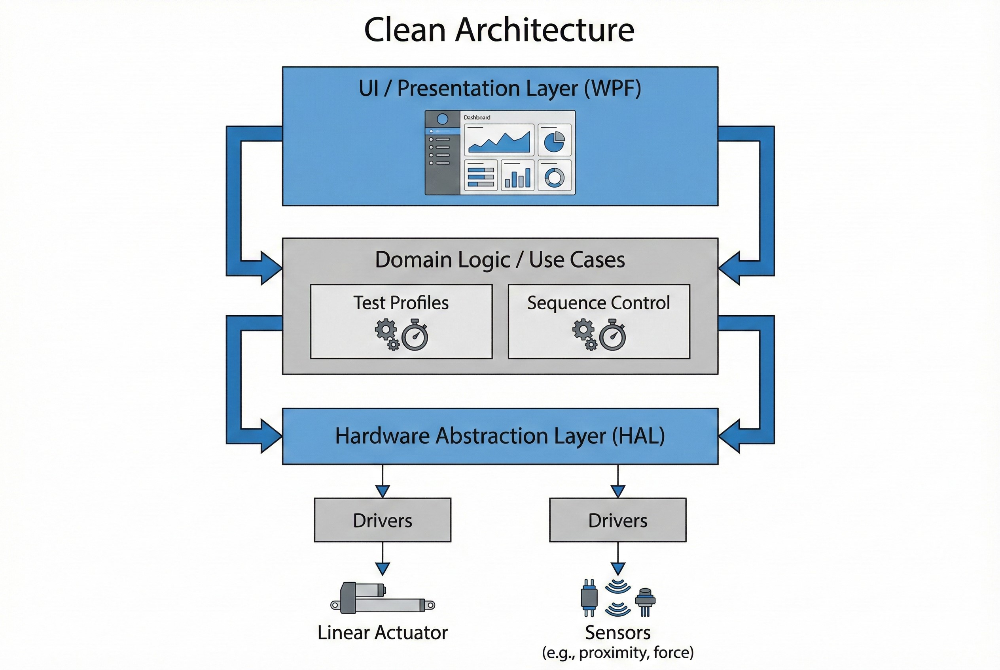

# ระบบควบคุมเครื่องทดสอบความทนทาน (Sliding Tester)

**โจทย์ที่ได้รับ:**
โรงงานผลิตชิ้นส่วนยานยนต์ต้องการยกระดับกระบวนการ QC (Quality Control) สำหรับการทดสอบความทนทาน (Endurance Test) จากเดิมที่ต้องใช้คนคอยคุมเครื่อง หรือใช้ซอฟต์แวร์เก่าที่ไม่เสถียร ให้กลายเป็นระบบอัตโนมัติที่เชื่อถือได้ 100% เพื่อรองรับมาตรฐานลูกค้า (เช่น นิชิกาว่า)

**ความท้าทาย:**
* **ความไม่แน่นอนของคน (Human Error):** การตั้งค่าความเร็วและระยะทางในการสไลด์แต่ละครั้งไม่เท่ากัน ทำให้ผลเทสไม่แม่นยำ
* **ซอฟต์แวร์ระบบเก่า (Legacy System):** ระบบเดิมเขียนด้วย WinForms แบบผูกติดกับ Hardware (Hard-coded) ทำให้เมื่ออุปกรณ์เสียหรือตกรุ่น ไม่สามารถหาอะไหล่มาเปลี่ยนแทนได้ง่ายๆ
* **การ Monitor หน้างาน:** Engineer ต้องมายืนเฝ้าเครื่องเพื่อนับรอบการทำงาน ทำให้เสียเวลาทำงานส่วนอื่น

## แนวทางการแก้ปัญหาของเรา
เราทำการ **Refactor** ระบบใหม่ทั้งหมด โดยเปลี่ยนจากโครงสร้างเดิมมาเป็น **C# (WPF)** บนสถาปัตยกรรมแบบ **Clean Architecture** เพื่อแยกส่วน Logic การทดสอบออกจาก Driver ของอุปกรณ์

### เทคโนโลยีที่ใช้ (Tech Stack)
* **C# (.NET / WPF):** พัฒนาหน้าจอควบคุมที่ทันสมัย ตอบสนองไว แสดงกราฟและสถานะได้แบบ Real-time
* **Clean Architecture & HAL:** ออกแบบ **Hardware Abstraction Layer** ทำให้ซอฟต์แวร์ "ไม่ยึดติดกับยี่ห้ออุปกรณ์" (Vendor Neutral) อนาคตเปลี่ยนยี่ห้อ Sensor ก็แค่แก้ Driver ไม่ต้องรื้อทั้งระบบ
* **Precision Motion Control:** ควบคุม Linear Actuator ด้วยคำสั่ง Move Absolute และ Jog ที่แม่นยำระดับมิลลิเมตร

## ฟีเจอร์เด่นเพื่อ Engineer หน้างาน
1.  **Automated Cycle Control:** ตั้งค่ารอบการทดสอบ (Cycle Loop) ได้อัตโนมัติ ระบบจะทำงานจนครบจำนวนแล้วหยุดเองพร้อมสรุปผล
2.  **Profile Management:** บันทึกสูตรการทดสอบ (Speed, Distance, Acceleration) ไว้เป็น Profile มาตรฐาน ใครมาคุมเครื่องก็ได้ค่าเดิมเสมอ
3.  **Real-time Visualization:** หน้าจอแสดงตำแหน่งแกนสไลด์ (Position) และสถานะ I/O ทันที ช่วยให้วิเคราะห์ปัญหาเครื่องจักรได้ง่ายขึ้น

## ผลลัพธ์ที่ได้ (Business Impact)
* ✅ **Standardization:** ขจัดความผันแปรที่เกิดจากมนุษย์ (Human Variation) ได้ 100%
* ✅ **Maintainability:** ลดความเสี่ยงเรื่องอะไหล่ขาดแคลน เพราะซอฟต์แวร์รองรับอุปกรณ์หลากหลายยี่ห้อ
* ✅ **Efficiency:** ลดภาระงานพนักงาน QC ให้ระบบทำงานแทนและแจ้งเตือนเมื่อเสร็จสิ้น

> **เกร็ดความรู้จากหน้างาน:**
> การทำเครื่องทดสอบ QC สิ่งที่สำคัญกว่า "ความเร็ว" คือ "ความนิ่ง" (Stability) การใช้ **Clean Architecture** ช่วยให้เรามั่นใจว่า Logic ในการวัดค่าจะยังคงถูกต้องเสมอ แม้ว่าเราจะอัปเกรด Windows หรือเปลี่ยน Hardware ใหม่ในอนาคต

---
**ต้องการที่ปรึกษาระบบ Automation หรือ Refactor ซอฟต์แวร์อุตสาหกรรม?**
ติดต่อเรา: wisit.paewkratok@gmail.com | Line: wisit.p
