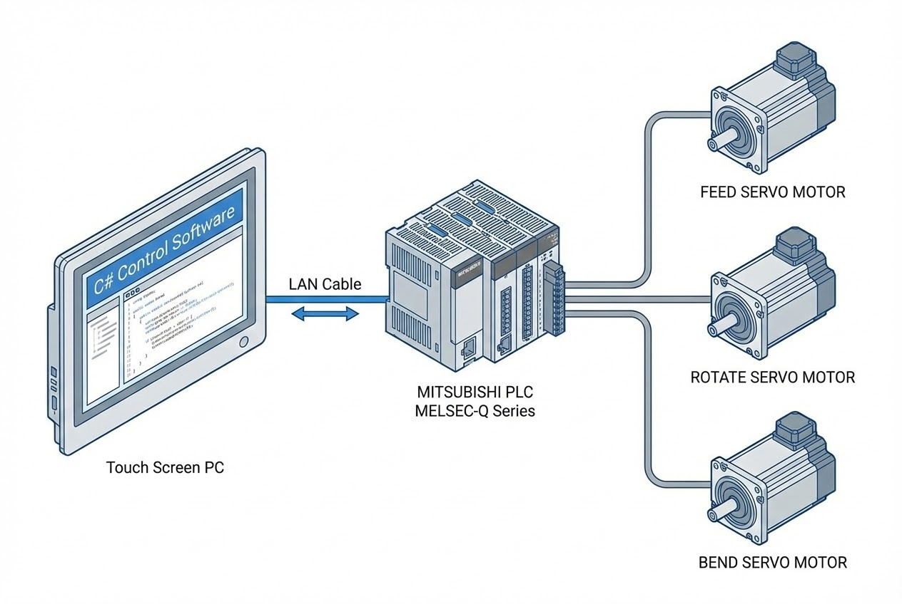

# CSIAPipeBender: High-Precision Tube Bending Controller

**Problem Statement:**
In traditional tube bending, operators often struggle with complex geometry calculations. converting a 3D drawing (XYZ coordinates) into machine actions (Length, Rotation, Angle) requires advanced mathematics. Additionally, physical factors like **Spring Back** (metal elasticity) and **Elongation** (stretching) often lead to inaccurate bends, requiring significant trial and error.

**The Challenge:**
* **Complex Math:** Manual calculation of bend sequences is prone to human error.
* **Material Behavior:** Different tube materials react differently; a standard fixed program cannot account for spring back variance without a smart compensation algorithm.

## Our Solution: PC-Based CNC Architecture

We developed **CSIAPipeBender**, a Windows-based HMI/Controller that acts as the "Brain" for the machine, while the Mitsubishi PLC acts as the "Muscle."

### Core Logic: XYZ to LRA Conversion
The heart of this system is a custom algorithm that allows operators to input coordinates directly from the blueprint.

1.  **Input:** User enters 3D Coordinates (X, Y, Z).
2.  **Process:** The C# Application calculates the vector transformation to derive:
    * **L (Length):** Feeding distance.
    * **R (Rotation):** Orientation of the tube.
    * **A (Angle):** The actual bend angle.
3.  **Compensation:** The system automatically applies offsets for **Spring Back** and **Elongation** based on material properties before sending commands to the PLC.

### Hardware & Integration
* **Controller:** Mitsubishi MELSEC iQ-R Series (R04CPU/R08CPU) – A high-performance PLC for rapid execution.
* **Motion Control:** RD75 Positioning Module controlling 3 Axis Servo Motors (Feed, Rotate, Bend).
* **Connectivity:** The PC communicates with the PLC via **Mitsubishi MX Component** (Ethernet/USB), ensuring reliable high-speed data exchange.

### Key Technologies Implemented
| Technology | Role in System |
| :--- | :--- |
| **C# (.NET WinForms)** | User Interface, Mathematical Engine, and Recipe Management (SQLite). |
| **Mitsubishi MX Component** | Middleware for PC-to-PLC communication. |
| **SQLite** | Local database for storing unlimited bending recipes. |

## Business Results
* **Simplified Operation:** Operators no longer need to be mathematicians. Input XYZ, and the machine does the rest.
* **High Precision:** Automated compensation reduces waste materials from trial bends.
* **Scalability:** The Recipe Management system supports unlimited part programs, ideal for high-mix, low-volume production.

> **Expert Insight:**
> Moving complex calculations (like XYZ-to-LRA) from the PLC to a PC (C#) allows for more sophisticated algorithms and a better UI, while keeping the PLC focused on what it does best: critical real-time motion control.

---
**Looking for a Custom CNC Solution?**
Contact us at: wisit.paewkratok@gmail.com