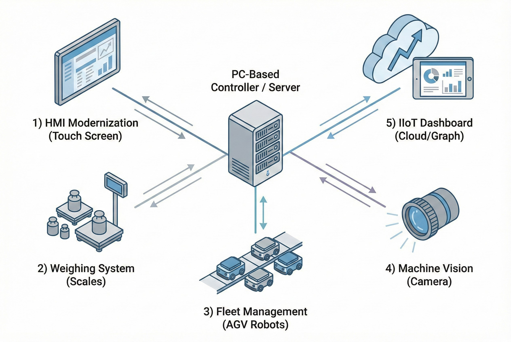

# Engineering Services

**Problem Statement:**
Many factories face limitations with legacy hardware, closed-loop systems (Black Box), and disconnected data islands. Standard PLCs often struggle with complex algorithms, data retention, and modern IT integration.

**The Challenge:**
Bridging the gap between **OT (Operational Technology)** and **IT (Information Technology)** requires deep expertise in both machinery and software architecture. Upgrading systems without disrupting production is critical.

## Our Core Solutions
We operate as a specialized **System Integrator (SI)** focusing on PC-Based Control and Industrial Software Architecture.

### 1. Machine Control & HMI Modernization
We unlock the potential of legacy machines by replacing outdated hardware with flexible PC-Based solutions.
* **HMI Retrofit:** Replace obsolete screens (e.g., UniOP) with **C# (.NET/WPF)** applications running on Industrial PCs. This allows for unlimited recipe storage and easier database connectivity.
* **Complex Motion Control:** Implement advanced algorithms, such as converting XYZ coordinates to LRA motor movements for **Tube Auto Bending Machines** or controlling **Banbury Mixers** with precision.

### 2. Process Control & Pokayoke Systems
Eliminate human error in critical production processes using software-driven logic.
* **Chemical Weighing & Formula Control:** Systems that enforce strict recipe adherence by interlocking with digital scales and PLCs. If the weight is incorrect, the process stops immediately.
* **Traceability:** Real-time material stock cutting and barcode scanning to ensure every lot is trackable.

### 3. AGV/AMR Fleet Management
We build the "Brain" for autonomous logistics.
* **Traffic Control System:** A centralized server managing multiple AGVs/AMRs to prevent collisions, manage queues, and optimize routes using **Path Finding Algorithms**.
* **Wireless Connectivity:** Command robots via **MQTT Protocol** over Wi-Fi for real-time task assignment in dynamic environments.

### 4. Machine Vision Inspection
Automated Quality Assurance (QA) replacing manual visual checks.
* **Visual Inspection:** Defect detection on metal parts or complex geometries using industrial cameras.
* **High-Speed OCR & Barcode:** Verifying product labels and reading codes on high-speed production lines to prevent mismatched products.

### 5. Data Logging & Industrial IoT
Connecting the factory floor to the boardroom.
* **Data Acquisition:** Extracting data from PLCs, Digital Meters, and CNCs to central servers.
* **Real-time Monitoring:** Web-based Dashboards (developed with **Node-RED, Vue.js**) for monitoring OEE, energy consumption (e.g., Crepper Motor Monitoring), and production status accessible from anywhere.

---
**Ready to modernize your factory?**
Contact us at: wisit.paewkratok@gmail.com